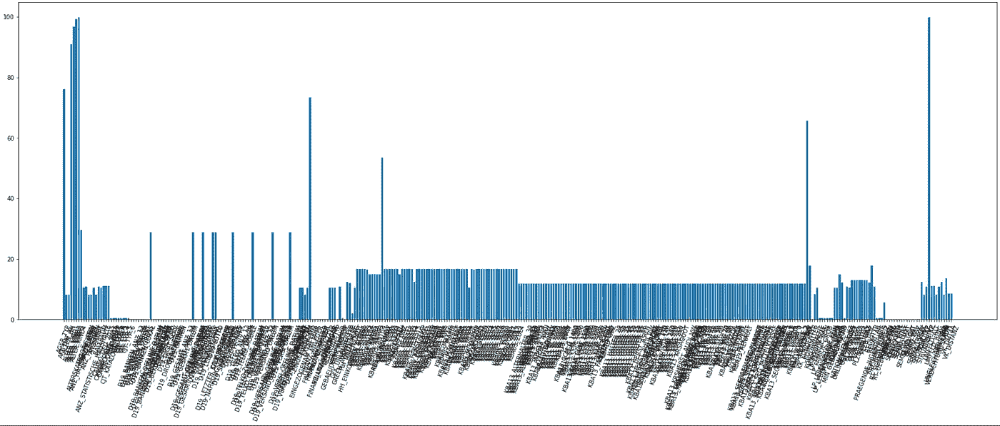
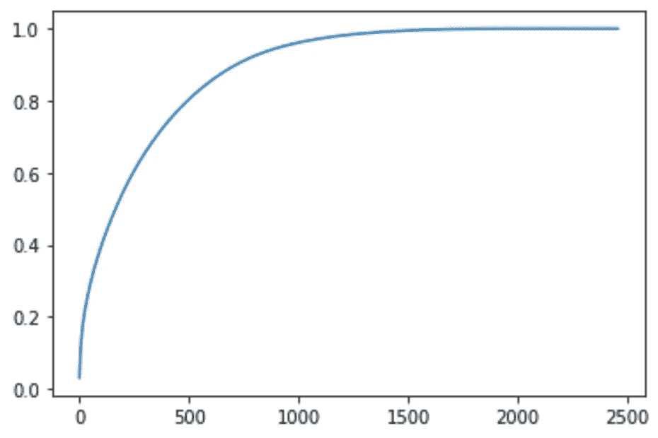
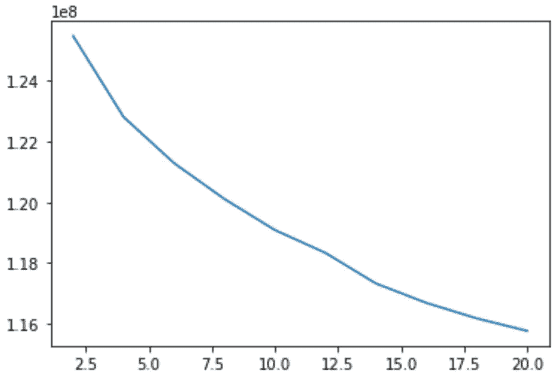
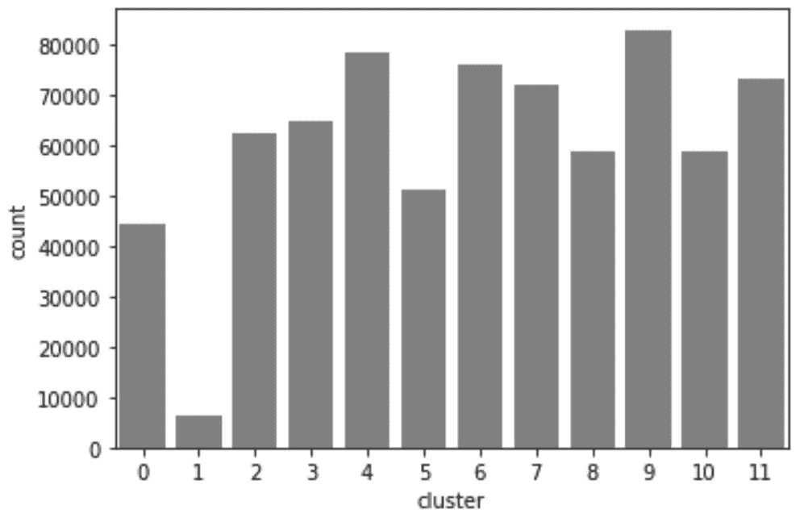
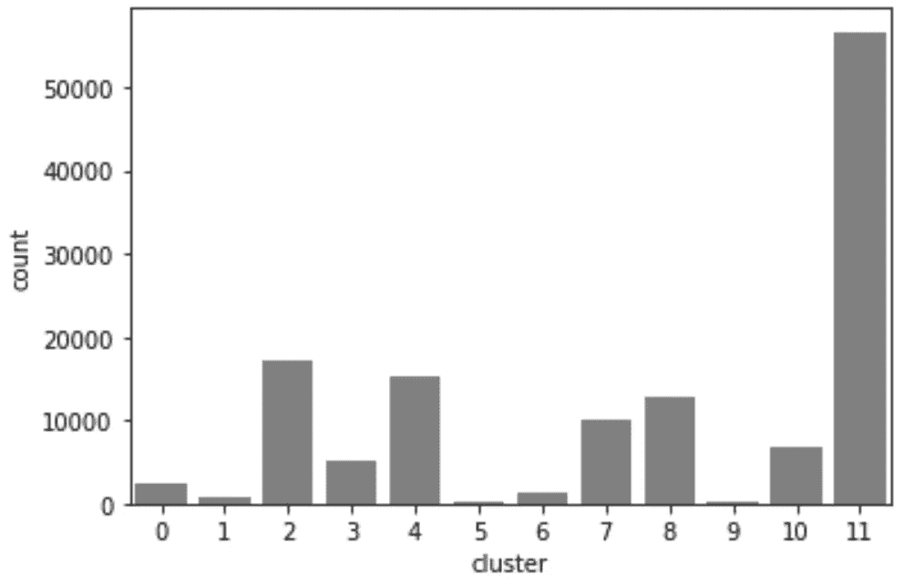

# 通过无监督和有监督的学习吸引客户

> 原文：<https://medium.com/analytics-vidhya/engaging-customers-through-unsupervised-and-supervised-learning-b2dfaf90f98f?source=collection_archive---------26----------------------->

## 使用无监督和有监督的方法在人口统计数据上吸引新客户和现有客户。

## 概观

本文将介绍两种选择邮件活动目标客户的方法:非监督方法和监督方法。使用 python 在 jupyter 笔记本中进行分析。

对于非监督方法，我有两个可用的数据集:德国的一般人口统计数据(891221 行，366 列)和包含客户人口统计数据的数据集(191652 行，368 列)。客户数据集包含人口统计数据集的所有列。我将训练一个 KNN 模型来识别德国的人群。之后，我将使用训练好的模型来识别客户数据中的分类。理想情况下，客户数据将由几个集群主导，然后可以在一般人群中定位。

对于监督方法，我有一个客户数据集，其中有一个额外的列，指示客户过去是否对某个活动做出过响应。

## 问题陈述

问题是双重的:一方面，数据集包含许多包含分类值的列和许多 nan。分类值需要被热编码，并在后面的步骤中通过主成分分析来减少。由于算法无法处理它们，因此需要移除、替换或估算 nan。

另一方面，分析的问题或目标是找到一个在客户中代表过多的人口统计组，并预测现有客户对活动的反应。

我希望客户的无监督聚类会有好的结果，因为数据集包含了关于客户的详细人口统计信息。然而，对于客户响应的监督预测，我只期望得到一般的分数，因为只有少数响应出现在训练数据中。

## 韵律学

我将专注于两个指标来评估无监督和有监督学习是否成功。对于非监督聚类，我希望人口统计数据中的聚类分布与客户数据中的显著不同。这将证明某些人口统计方面与对金融产品的兴趣相关，并因此有可能更准确地锁定新客户。

在客户反应的监督预测中，我将测量[接收器操作特性曲线下的面积](https://scikit-learn.org/stable/modules/generated/sklearn.metrics.roc_auc_score.html)，这是一个用于回忆处理概率的有用指标。我选择这个指标是因为我对尽可能多的正确预测(真阳性)感兴趣，并且不介意是否有假阳性。我不介意误报，因为邮寄几个不会回答的人成本比较低。这将有助于捕捉更多罕见的响应。

## 图书馆

我在项目中使用的库有:

```
import numpy as np
import pandas as pdimport matplotlib.pyplot as plt
import seaborn as snsfrom sklearn.model_selection import train_test_split
from sklearn.ensemble import RandomForestRegressor
from sklearn.model_selection import GridSearchCV
from sklearn.metrics import roc_auc_score
from sklearn.svm import SVR%matplotlib inline
```

由于每个数据科学项目都有 80%的准备工作，所以让我们从数据检查开始，然后展开讨论。


由[马库斯·温克勒](https://unsplash.com/@markuswinkler?utm_source=unsplash&utm_medium=referral&utm_content=creditCopyText)在 [Unsplash](https://unsplash.com/s/photos/magnifying--blue?utm_source=unsplash&utm_medium=referral&utm_content=creditCopyText) 上拍摄

# 数据检查

加载数据集后，最好通过各种函数全面了解您的数据，例如:

```
df.head()
df.tail()
df.shape # Not a function but an attribute!
df.describe() # if you have a lot of columns you want to pass the follwing arguments to get a detailed report
df.info(verbose = True, null_counts = True)
```

查看具有如下功能的单个列:

```
# shows the unique values and how often they appear
df.column_name.value_counts() 
```

我使用以下功能检查了所有色谱柱的不平衡情况:

```
def balance(df):
 data = []
 print(“Column balances printed in percent:”)
 for idx, column in enumerate(df.columns):
 bar_data = 100*df[column].value_counts()/df.shape[0]
 print(“{}: {}”.format(column, bar_data))
 data.append(bar_data)
 return data
```

大多数列的类别呈正态分布，但有些严重倾斜。例如，“阿格 _TYP”在 9 年级有 30 %的学生。

此外，建议进行一些目视检查，特别是确定数据集中有多少 NaN 值。

计算 NaN 值的百分比，方法是对列中的值进行计数，然后除以列的长度。任何值都计为 1，NaNs 计为 0。通过绘制百分比列表与列名的关系，可以得到下图。

```
nan_values = []for column in df.columns:
   n_nan = (len(df[column]) - df[column].count())/ len(df[column])
   n_nan *= 100 #show values in percent
   nan_values.append(n_nan)

plt.figure(figsize = (30,10))
plt.bar(df.columns[:], nan_values[:])
plt.xticks(rotation = 70);
```



这是一个调查数据状态的图，所以记住它需要提供信息，但不要太漂亮，这一点很重要。重点是我想知道我在处理多少个 NaN 值。条形图很好地显示了我有几个可以删除的主要是 nan 的列。

对于有 15%-20%缺失数据的许多列，需要花费更多的时间进行决策。有三种可能的选择:

*   估算缺失值:查看[这篇文章](https://towardsdatascience.com/pandas-tricks-for-imputing-missing-data-63da3d14c0d6)了解不同的策略。
*   检查缺少值的行，如果 NaN 值集中在 10%的行中，则删除它们。
*   对于数字列，用 0 替换它们，对于分类列，用 one-hot 编码它们。

在我的例子中，我选择了丢弃缺失值超过 10%的行和对分类 NaNs 进行一次性编码的混合方法。我将在下一部分讨论这个问题。

# 数据争论


在 [Unsplash](https://unsplash.com/s/photos/lego-white?utm_source=unsplash&utm_medium=referral&utm_content=creditCopyText) 上由 [Elodie Oudot](https://unsplash.com/@elodieoudot?utm_source=unsplash&utm_medium=referral&utm_content=creditCopyText) 拍摄的照片

## 与 NaNs 打交道

数据争论就是组织混乱，并将其转换成一种格式，以便我们的模型进行训练。

首先，我开始处理我在检查部分确定的 NaN 值。

我创建了一个包含每行缺失值计数的列，然后在数据框中查询该列中的数字。因为我有超过 200 个专栏，所以 20 个大概不到 10%。

```
# count how many values are missing per row
 df[“missing”] = df.apply(lambda x: (df.shape[1] — x.count()), axis = 1)
 # keep only rows with less than 20 values missing
 df_full = df.query(“missing < 20”)
```

## 独热编码

机器学习算法无法处理分类值。因此，我需要创建虚拟变量，这也被称为一次性编码。Pandas 让一键编码变得非常简单:

```
df_dum = pd.get_dummies(df_full, columns = dummy_cols, drop_first = True, dummy_na = True)
```

*   dummy_cols 是包含分类值的列的列表
*   drop_first 意味着如果一个列中有四个唯一的类别，它将创建三个虚拟列，因此它们是相互独立的
*   dummy_na = True 为所有 nan 创建虚拟列

## 特征缩放

少数数值列需要重新调整，因此具有大值的列不会对算法产生不适当的影响。这由以下人员完成

```
from sklearn.preprocessing import StandardScaler
scaler = StandardScaler()
df[scale_cols] = scaler.fit_transform(df[scale_cols])
```

“scale_cols”是数字列的列表。

## 降维

拥有一个包含许多分类列的数据集，然后对它们进行一次性编码会产生大量的列。主成分分析(PCA)有助于显著减少列数。目标是保留足够的列来解释数据中 90%以上的可变性。

下面的代码将有助于确定实现这一目的的主要组件的数量:

```
from sklearn.decomposition import PCA
pca = PCA()df_pca = pca.fit_transform(df)cumm_values = []
former = 0# variable that makes sure the success print is only printed once
first = Truefor idx,value in enumerate(pca.explained_variance_ratio_):
 cumm_values.append(value+former)
 former += value
 if former >= 0.9 and first:
 print(“{:.2f} % variance explained with {} components”.format(former*100, idx))
 first = Falseplt.plot(cumm_values);
```

除了 2458 列中的 728 列对于 90%的可变性是足够的信息之外，我们还得到了下面的图表，它显示了附加组件的递减效用。



现在数据集可以用于机器学习算法了！将所有的数据清理步骤放在一个清理函数中是一个很好的做法，因为您将不得不对其他两个数据集执行相同的步骤。

# 无监督机器学习


照片由 [Alex Block](https://unsplash.com/@alexblock?utm_source=unsplash&utm_medium=referral&utm_content=creditCopyText) 在 [Unsplash](https://unsplash.com/s/photos/sort?utm_source=unsplash&utm_medium=referral&utm_content=creditCopyText) 上拍摄

为了识别人口统计数据集中的聚类，我使用了 KMeans。一个重要的决定是我们应该为算法选择多少个聚类。这可以通过以下方式实现

```
from sklearn.cluster import KMeansclusters = [2,4,6,8,10,12,14,16,18,20]# Over a number of different cluster counts…
kmeans_score = []
for idx,n_cluster in enumerate(clusters):
 print(“Fitting kmeans with {} clusters”.format(n_cluster))
 # run k-means clustering on the data and…
 kmeans = KMeans(n_clusters=n_cluster, random_state=0).fit(df_pca)
 print(“Calculating the score…”)
 # compute the average within-cluster distances.
 kmeans_score.append(np.abs(kmeans.score(df_pca)))
```

这将产生一个显示聚类数误差的图。理想的聚类数量位于“肘部”，在这里曲线的梯度变得明显更平坦。然而，正如你在下面看到的，在这种情况下没有明显的“肘”。我选择了 12 个集群，因为梯度在这一点上相对平坦。



人口统计数据的结果聚类可以通过首先在 12 个聚类上再次训练然后在数据上预测来确定:

```
kmeans = KMeans(n_clusters=12, random_state=0).fit(df_pca)
preds = kmeans.predict(df_pca)
df[“cluster”] = preds
```

并且可视化为

```
sns.countplot(x = “cluster”,data = df, color = “grey” )
```



然后，可以对客户数据使用经过训练的 KMeans 模型来预测其中的分类。**确保对该数据集应用相同的数据争论步骤！**

```
customer_preds = kmeans.predict(customer_pca)
customer_df["cluster"] = customer_preds
# Visualize the clusters in the customer dataset
sns.countplot(x = "cluster", data = customer_df, color = "grey")
```

这将导致以下集群分布:



与德国的一般人口相比，客户主要集中在第 5 类。第 11 组中有中等数量，第 2、4 和 8 组中有少量。对于获取新客户，建议关注这些集群。

## 集群的含义

随着所有的数据转换，在这一点上不可能理解谁是客户获取的目标。但是，可以通过以下方式恢复所做的转换并深入了解集群

```
cluster_centers = kmeans.cluster_centers_
cc = pca.inverse_transform(cluster_centers)
# -1 because we do not want the last "cluster column"
cc_org = pd.DataFrame(cc, columns = customer_df.columns[:-1])
```

现在，使用反向 PCA，检索每个聚类的 10 个最有影响力的列

```
cc_org.iloc[11:12,:].T.sort_values(by = 11, ascending = False)[:10]
```

11 是群集 11。

# 监督学习


由[米哈尔·洛姆扎](https://unsplash.com/@loomzing?utm_source=unsplash&utm_medium=referral&utm_content=creditCopyText)在 [Unsplash](https://unsplash.com/s/photos/glass-sphere?utm_source=unsplash&utm_medium=referral&utm_content=creditCopyText) 上拍摄的照片

## 预测客户反应

对于最后一部分，我将利用第三个数据集和客户人口统计数据，包括客户是否对之前的活动作出回应的特征。

响应特征严重倾斜，有 42430 名客户没有响应，只有 532 名客户响应。

可以应用与无监督学习任务中相同的数据争论步骤。要开始训练一个模型，我们需要通过以下方式来分割训练和测试数据

```
# splitting for training and testing
X_train, X_test, y_train, y_test = train_test_split(X, y, test_size=0.1, random_state=42)
```

因为我将使用包含交叉验证的 GridSearchCV，所以我只需要一小部分数据来测试模型。我训练的第一个模型是随机森林回归，因为我想要一个答案的概率，而不仅仅是 1 或 0 的分类。

## 随机森林回归量

一个随机森林回归器需要相当长的时间来训练，所以在这个时候，我只搜索了四个不同的参数。

```
# set up model
reg = RandomForestRegressor()# set up parameters for grid search
parameters = {‘n_estimators’:[20, 80], 
                 ‘max_depth’:[20, 30]}
reg = GridSearchCV(reg, parameters, verbose = 10, scoring = “roc_auc”, cv = 5)
reg.fit(X_train, y_train)
```

我们不是通过准确性，而是通过回忆来判断结果。更有价值的是确定每个将回答活动的客户(真阳性)，并得到几个不会回答的错误客户(假阳性)。当我们预测概率时， [roc_auc_score](https://scikit-learn.org/stable/modules/generated/sklearn.metrics.roc_auc_score.html) 用于衡量绩效。

```
rfg_test_preds = reg.predict(X_test)roc_auc_score(y_test, rfg_test_preds)
>>>0.5895173685828465
```

调整前 ROC 得分:0.5563

调整后的 ROC 得分:0.5895

最佳超参数为:

```
{'bootstrap': True,
 'ccp_alpha': 0.0,
 'criterion': 'mse',
 'max_depth': 20,
 'max_features': 'auto',
 'max_leaf_nodes': None,
 'max_samples': None,
 'min_impurity_decrease': 0.0,
 'min_impurity_split': None,
 'min_samples_leaf': 1,
 'min_samples_split': 2,
 'min_weight_fraction_leaf': 0.0,
 'n_estimators': 20,
 'n_jobs': None,
 'oob_score': False,
 'random_state': None,
 'verbose': 0,
 'warm_start': False}
```

只有很少的客户回答使预测变得非常棘手，并导致低分数。

## 支持向量回归机

支持向量回归机具有训练速度明显更快的优点，因此可以在搜索中包括更多的参数。它也是用 GridSearchCV 和

```
# set up model
svc = SVR()# set up parameters for grid search
parameters = {‘C’:[0.1, 0.5, 1.5, 5], 
 ‘degree’:[3, 4, 5],
 ‘kernel’: [“poly”, “rbf”]}
reg_svc = GridSearchCV(svc, parameters, verbose = 10, scoring = “roc_auc”, cv = 5)
reg_svc.fit(X_train, y_train)# evaluating performance
svc_test_preds = reg.predict(X_test)
roc_auc_score(y_test, svc_test_preds)
>>> 0.6117327595040477
```

调整前 ROC 得分:0.59885

调整后的 ROC 得分:0.6248

(交叉验证的平均值，因为测试集非常小)

最佳参数为:

```
{'C': 5,
 'cache_size': 200,
 'coef0': 0.0,
 'degree': 3,
 'epsilon': 0.1,
 'gamma': 'scale',
 'kernel': 'rbf',
 'max_iter': -1,
 'shrinking': True,
 'tol': 0.001,
 'verbose': False}
```

支持向量回归机不仅训练速度更快，而且产生更好的结果。但是，结果仍然不在理想范围内。

## 模型评估和验证

C 的大值表明，当分类错误受到严重惩罚时，可以获得最好的结果，并且 rbf 核通常对于具有多个维度的复杂问题表现良好。

在训练中，交叉验证用于确保结果稳定，模型不会过度拟合:

```
[CV] C=5, degree=3, kernel=rbf 
[CV] ...... C=5, degree=3, kernel=rbf, score=0.643, total=  46.6s
[CV] C=5, degree=3, kernel=rbf 
[CV] ...... C=5, degree=3, kernel=rbf, score=0.584, total=  47.0s
[CV] C=5, degree=3, kernel=rbf 
[CV] ...... C=5, degree=3, kernel=rbf, score=0.627, total=  47.6s
[CV] C=5, degree=3, kernel=rbf 
[CV] ...... C=5, degree=3, kernel=rbf, score=0.609, total=  43.7s
[CV] C=5, degree=3, kernel=rbf 
[CV] ...... C=5, degree=3, kernel=rbf, score=0.613, total=  47.5s
```

## 挑战

培训需要大量的时间，这使得迭代不同的方法非常困难。总响应量低使得很难识别数据中的模式，并且很难用监督学习算法获得好的结果。

# 正当理由；辩解

客户的非监督聚类工作得非常好，因为我能够提取客户所属的一个主要聚类，与一般人群进行比较。这将使公司能够很好地瞄准新客户，并推动转换率上升。

监督预测哪些客户会对活动作出反应，结果一般，但与向所有现有客户发送邮件相比，这已经大大提高了转化率。因此，这是朝着正确方向迈出的良好的第一步。

# 结论

不出所料，数据争论耗费了大量时间。尤其困难的是处理大量的分类列和存在的许多 NaN 值。通过一键编码和随后的 PCA 降维，最终可能得到中等数量的列。

人口数据的无监督聚类和识别客户数据中的聚类是识别新的潜在客户以获取的好方法。它可以显著影响销售部门的转化率并降低成本。

客户反应的监督预测对于利用现有客户群中的潜力是极好的；然而，它只能提供平庸的结果。

# 丰富

更多的时间可以花在两个监督预测的参数搜索上，或者实现可以提供更好结果的神经网络。因为对随机森林回归器和支持向量回归器的两次网格搜索已经花费了很长时间，所以这次我没有包括更多的参数。