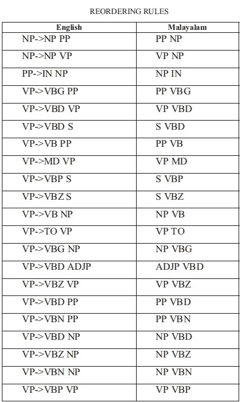
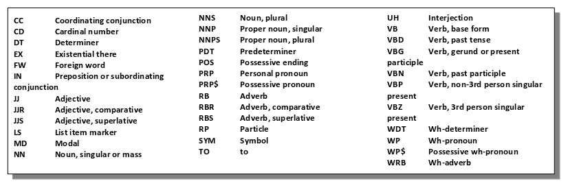
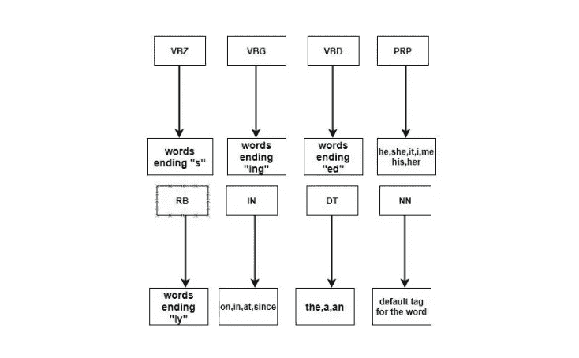
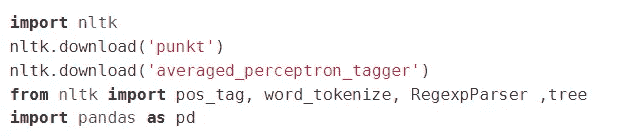
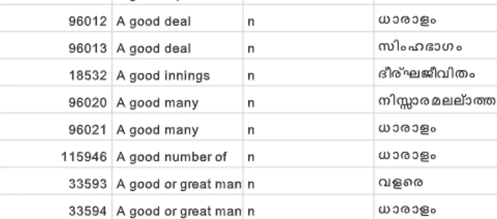
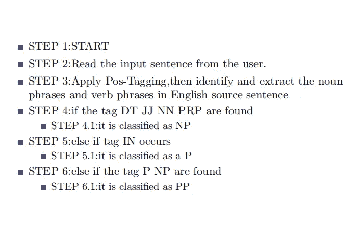
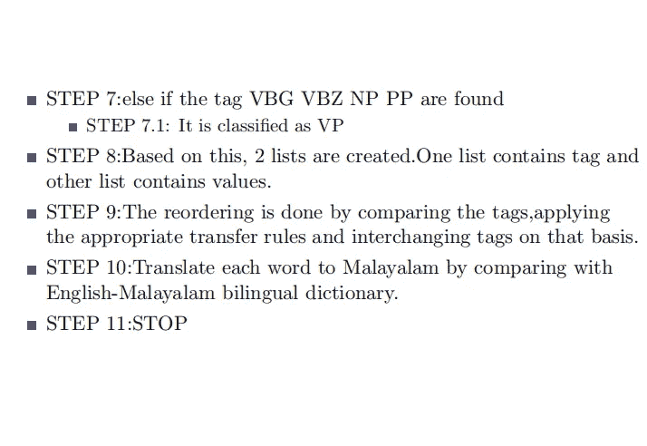
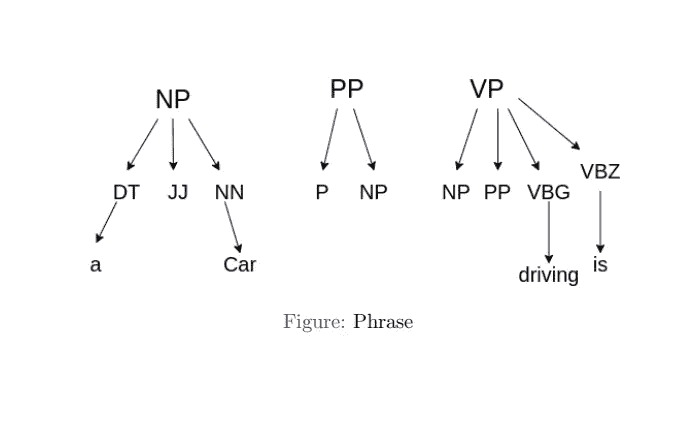
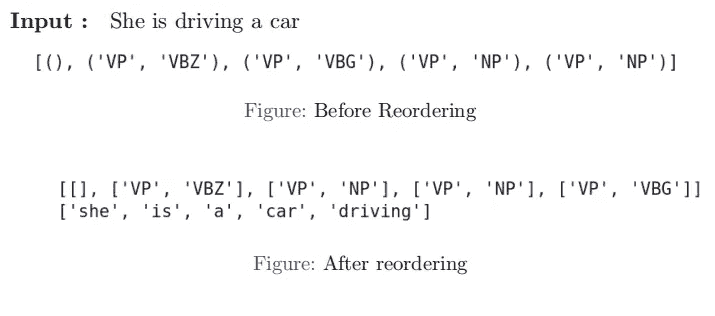
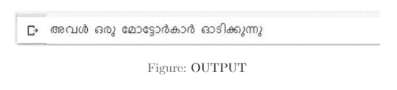

# 使用 PYTHON 进行英语到马拉雅拉姆语的机器翻译

> 原文：<https://medium.com/analytics-vidhya/english-to-malayalam-machine-translation-using-python-e61f3c76deee?source=collection_archive---------5----------------------->

鸣谢:Navaneeth Krishnan S—[https://commons . wikimedia . org/wiki/File:Malayalam _ Letters _-_ Word _ cloud . SVG](https://commons.wikimedia.org/wiki/File:Malayalam_Letters_-_Word_Cloud.svg)

> 这篇文章是基于我和我的朋友纳希德 M.A，保罗埃利亚斯和 Shiv Shankar 纳特一起做的一个项目。

今天，互联网支持多种语言。因此，机器翻译的概念确实已经成为连接说不同语言的人的一个重要因素。在这篇文章中，我们将看看使用转换规则将英语翻译成马拉雅拉姆语的过程。

**什么是机器翻译？**

*机器翻译*可以定义为软件将一种语言的文本或语音转换成另一种语言的过程。换句话说，这是一门研究如何设计将文本从一种自然语言翻译成另一种自然语言的系统的学科。机器翻译帮助来自不同地方的人在没有人类翻译的帮助下理解一种未知的语言。

**为什么要机器翻译？**

与人工翻译相比，机器翻译要便宜得多。他们可以在很短的时间内筛选大量的数据。计算机程序可以在短时间内持续翻译大量数据。如果这些是手动完成的，可能需要几周甚至几个月才能完成。

> “没有翻译，我将被限制在自己国家的边境。翻译是我最重要的盟友。他把我介绍给世界。”
> –伊塔洛·卡尔维诺

**机器翻译中的转换规则**

迁移规则可以定义为一组语言规则*和*，它们被定义为源语言结构和目标语言结构之间的对应关系。利用转换规则是机器翻译最常用的方法之一。

MT 使用转移规则可以分为三个步骤:

*   分析源语言文本以确定其语法结构
*   将结果结构转换为适合生成目标语言文本的结构
*   输出文本的生成

在这个项目中，我们使用马拉雅拉姆语传输规则。为了构建具有良好语法结构的马拉雅拉姆语句子，必须遵循以下一组规则:

图片来源:Anitha T Nair，Sumam Mary Idicula，978–1–4673–2149–5/12/31.00 IEEE 2012

上表中提到的所有“代码”代表不同的词类。

图片来源:[https://pythonspot.com/nltk-speech-tagging/](https://pythonspot.com/nltk-speech-tagging/)

为了获得精确的结果，在这个程序中使用了各种传递规则。NP(名词短语)和 VP(动词短语)被认为是父标签。

以下是已实施的一些转移规则:

*   如果父标签 VP 包含子标签 VBZ NP，它被重新排序为 NP VBZ
*   如果父标签 NP 包含子标签 NP PP，则重新排序为 PP NP
*   如果父标签 NP 包含子标签 NP VP，它被重新排序为 VP NP
*   如果父标签 VP 包含子标签 VBG NP，则它被重新排序为 NP VBG

输入文本的词性标注

**导入的包**

**使用的数据集**

Olam 英语-马拉雅拉姆语数据集已用于此项目。这是一个不断发展的、免费的、开放的、众包的英语-马拉雅拉姆语词典，拥有超过 200，000 个词条。该数据集由英语单词、它们的马拉雅拉姆语定义和词性/词形标签组成。

链接到数据集:【https://olam.in/open/enml/ 

Olam 数据集

**算法**

**样本输出**

考虑输入文本“*她正在驾驶汽车*

最初，对每个单词进行词性标注，如下所示。

输入文本的词性标注

单词的重新排序

在应用迁移规则和翻译单词之后，我们得到输出。

输出文本

> 在机器翻译任务中，输入已经由某种语言的符号序列组成，计算机程序必须将其转换成另一种语言的符号序列。
> 
> —第 98 页，[深度学习](http://amzn.to/2xBEsBJ)，2016。

**MT 使用转移规则的优势**

与其他传统翻译方法相比，使用转换规则的机器翻译有其优势。其中包括:

*   该方法考虑了翻译的马拉雅拉姆语句子的语法结构。
*   与基于规则的机器翻译(RBMT)相比，这种方法产生更有意义的输出。
*   使用词性标签，我们可以识别每个单词在句子中代表的词性。

**MT 使用转移规则的缺点**

这种机器翻译的方法也有它的缺点。其中包括:

*   为了提高准确率，我们需要添加大量的规则。
*   在某些情况下，在没有考虑句子的上下文的情况下，将 POS 标签分配给单词。这可能会影响输出的准确性。
*   编写转账规则需要很多时间。此外，良好的语言知识是必要的。一个人需要精通这门语言才能推断出迁移规则。
*   无法准确翻译讽刺和习语。在这种情况下，要考虑输入的字面意思。不考虑诸如"*小菜一碟*"和"*泄露秘密*"等习语的非字面意义和表达意义。

**结论**

总而言之，机器翻译是自动将一种语言的源文本转换成另一种语言的文本的任务。在这种情况下，我们使用转换规则将英语转换成马拉雅拉姆语来实现机器翻译。这种方法甚至可以应用于其他语言。多年来，MT 系统的精度一直在不断提高。现在，我们有人工智能翻译模型，能够以非常快的速度产生高度准确的结果。

我们只能好奇 MT 的未来会如何。无论结果如何，它无疑将继续在语言行业产生重大影响。

**参考文献**

*   Remya Rajan，Remya Sivan，Remya Ravindran，K . P Soman——基于规则的英语到马拉雅拉姆语的机器翻译，计算、控制和电信技术进展国际会议，2009 年
*   Marta R. Costa-Jussa，Mireia Farrus，Jose b . Marino ;, Jose a . r . Fonollosa，基于规则和统计的加泰罗尼亚-西班牙语机器翻译系统的研究和比较，计算和信息学，第 31 卷，2012 年
*   阿尼塔·T·奈尔，苏玛姆·玛丽·伊迪库拉，2012 年 12 月 5 日至 31 日
*   词性标注:基于规则，哈里斯堡科技大学
*   [https://en . Wikipedia . org/wiki/Transfer-based _ machine _ translation](https://en.wikipedia.org/wiki/Transfer-based_machine_translation)