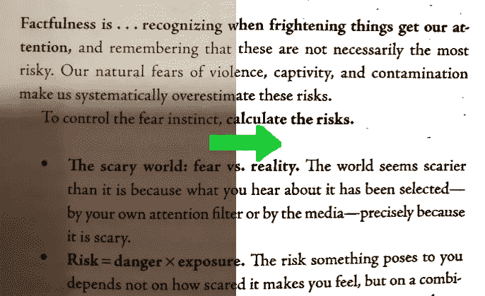
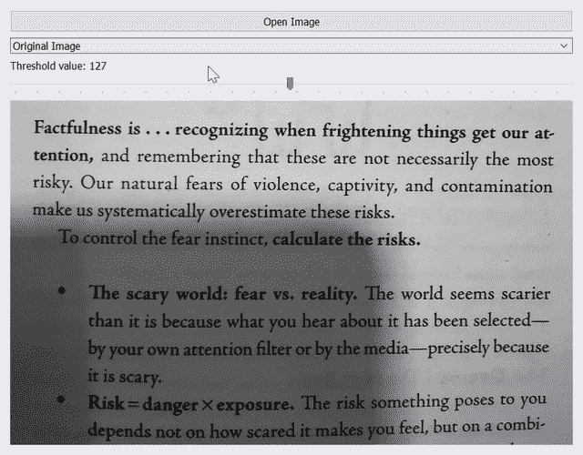
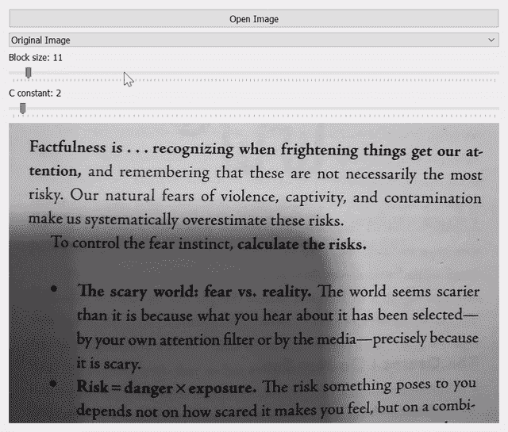
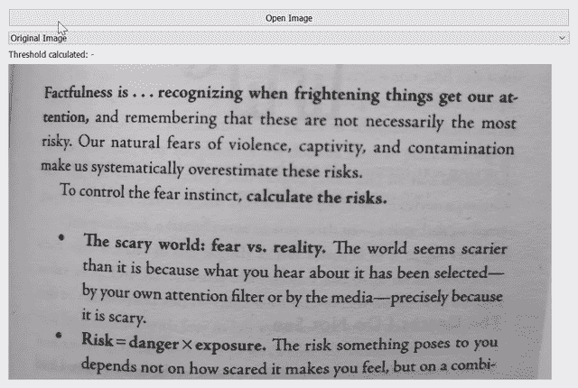
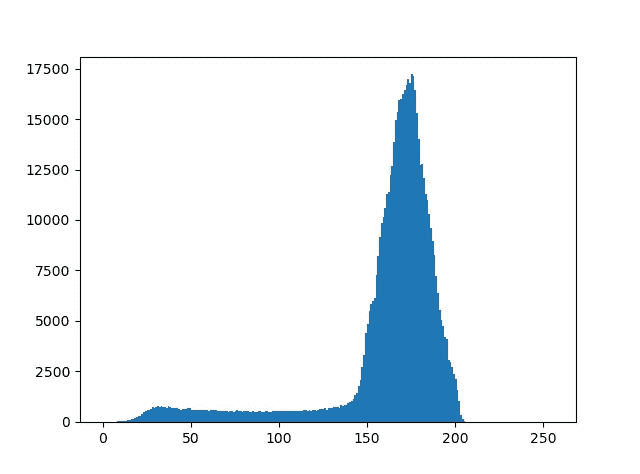

# 使用 Python 和 OpenCV 增强文档扫描

> 原文：<https://medium.com/analytics-vidhya/enhance-a-document-scan-using-python-and-opencv-9934a0c2da3d?source=collection_archive---------7----------------------->

## 深入文档扫描应用程序的幕后，通过示例学习图像阈值处理。

文档扫描和光学字符识别(OCR)是计算机视觉领域中一些最古老的问题。在这篇文章中，我们将关注如何创建一个低质量的书籍页面图像的易读版本。这个例子将概述本文中涉及的图像阈值方法之间的差异。

# 简单阈值处理

二进制阈值在行动！

也称为全局阈值处理，简单阈值处理有一个非常直接的方法:对每个像素应用相同的阈值。如果像素值小于阈值，则设置为 0，否则设置为最大值。OpenCV 的阈值方法需要四个参数:

1.  图像的灰度版本
2.  阈值
3.  如果输入像素超过阈值(白色为 255)，则指定最大值
4.  阈值类型(参见 Github 上的示例代码文档)

它将返回一个由阈值(在本例中为 127)和阈值二进制图像组成的元组:

虽然二进制阈值处理简单有效，但它有几个缺点。首先，您必须手动选择阈值。对于重复使用二进制阈值的应用，这种方法不是很适合。第二，如果背景的亮度不均匀，则容易出现问题。在我们的例子中，这是由拍照手机的阴影造成的。那么简单的二进制阈值处理将总是产生非最佳的结果:如果阈值太低，字母变细，如果阈值太高，背景的部分将被分割成黑色。

# 自适应阈值

为了解决后一个问题，我们需要估计与每个像素附近的字母相比，背景有多亮，而不考虑图像给定部分的光照条件。

自适应阈值:微调块大小和常数参数产生最佳结果！

这正是 cv2.adaptiveThreshold 所做的。对于每个像素，它通过使用大小为 block_size x block_size 的窗口来查看其周围的邻域。如果像素值比其邻域的高斯加权平均值至少大整数值 c 的余量，则它被设置为最大值。

# 大津二值化

Otsu 的二值化方法是一种全局阈值化方法，它从灰度图像亮度直方图中自动确定其阈值。它通过最小化加权的类内方差、分割前景和背景来做到这一点。

Otsu 的方法计算出阈值为 118 时，加权类内方差最小。

当照明条件在整个画面中是均匀的时，Otsu 的方法会发光，因此不需要自适应阈值。注意，这里使用的图片不包含阴影。

如果您想绘制直方图来亲自检查，请使用以下代码片段:

# 下一步是什么？

如果你想概括这篇文章，看看 YouTube 视频

也可以在 GitHub 上查看[代码。](https://github.com/joschuck/OpenCV-with-Python-Series)

关于更详细的方法描述，请看一下[官方 OpenCV 文档](https://docs.opencv.org/4.3.0/d7/d4d/tutorial_py_thresholding.html)。