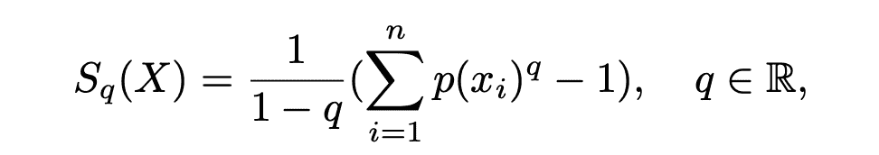

# 利用 Tsallis 熵提高决策树的准确性

> 原文：<https://medium.com/analytics-vidhya/enhance-decision-tree-accuracy-with-tsallis-entropy-c131801dec94?source=collection_archive---------20----------------------->

我们已经用决策树解决回归和分类问题很长时间了。在训练过程中，在从训练数据中随机选择样本和特征之后，树的生长取决于分割标准。我们一直使用基尼指数或香农熵作为围绕决策树开发的技术的划分标准。以及跨时间和领域的广为接受的决策标准。

有人提出，在基尼系数和香农熵之间进行选择不会产生显著的不同。在实践中，我们选择基尼指数而不是沙能熵，只是为了避免对数计算。

决策树最有条理的部分是拆分节点。我们可以理解我们为拆分选择的度量的重要性。基尼系数已经解决了大多数问题，但是增加几个精确度又有什么坏处呢？

与基尼系数和香农熵最接近的替代品是查利斯熵。事实上，Tsallis 不是替代，而是基尼系数和熵的母体。让我们看看如何-

# 察利斯熵

Tsallis 熵的公式如下，其中 p(xi)是类的概率。Tsallis 熵的调谐参数用 q 表示。

现在回答我们之前提出的公开问题，Tsallis 是基尼指数和香农熵的母指数。

Tsallis 熵是基尼指数和熵的广义参数形式。如果我们让 q 值接近 1，它导致香农熵，如下所述

如果 q 值为 2，则该表达式表示如下所示的基尼指数

虽然基尼系数和香农熵似乎是察利斯熵的特例，但有细微的差别。这些措施的附加性质有所不同。基尼系数和香农熵在本质上是相加的，如下式所示。

而如下所述，Tsallis 熵本质上是伪可加的

由于 q 属于实值域，因此找到模型的最优 q 依赖于多次迭代。没有找到给出最大精度的最佳 q 值的标准方法。一般来说，精确度和复杂度图是跨越不同的 q 值创建的，以找到最佳值。这是妨碍采用 Tsallis 熵的部分，它的计算范围很广。

既然现在我们已经开发了多种方法来使这种迭代过程变得更快，我们就可以进一步调整 Tsallis 熵。