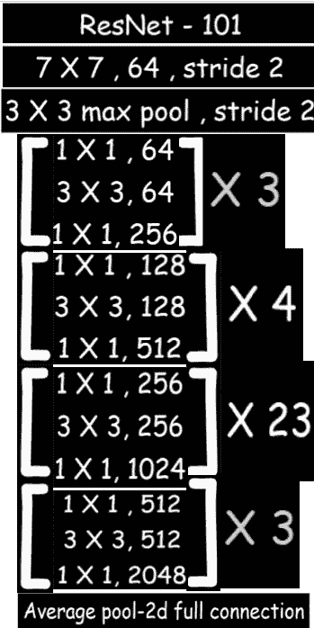
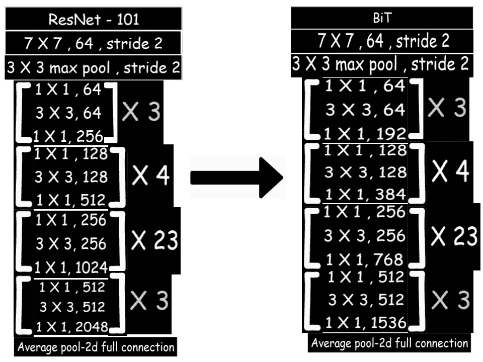

# 通过将 ResNet 体系结构转换为大转换体系结构来增强学习

> 原文：<https://medium.com/analytics-vidhya/enhance-learning-by-transfering-resnet-architecture-into-big-transform-architecture-44603f537fcf?source=collection_archive---------7----------------------->

我写这篇博客的主要目的是为了简化对这篇 [**论文**](https://arxiv.org/pdf/1912.11370.pdf) 的理解，这篇论文提到通过改变 ResNet-101 架构的一些调谐旋钮(超参数)来增强其功能，使该模型对于新的图像数据集更加健壮和可伸缩。

ResNet-101 是在卷积神经网络和残差块的帮助下建立的迁移学习模型。ResNet 模型已经在一个巨大的图像数据集上进行了训练，因此我们可以使用它们来训练我们的数据集，只需更改其输入和输出参数。这里 101 表示用于其架构的 101 个深层神经层。ResNet-101 的示意图如下:

我们的新模型**位**(大转换)模型将看起来像→

从 ResNet-101 到 BiT 的架构变化

BiT 旨在简化和创建一个预先训练好的模型或传输管道，它使用最少数量的必要技巧，在广泛的流行分类任务中获得非常强的性能。

## 钻头型号类型:→

1.  BiT-L : →表示将在数据集 JFT-300M(包含 10 到 10 亿个图像数据集)上训练的**大变换大**
2.  BiT-M : →表示将在数据集 Imagenet-21K(包含 1400 万个图像数据集)上训练的**大变换介质**
3.  位-S : →表示将在数据集 ils vrc-2012(130 万图像数据集)上训练的**大变换小**

对于初学者，我想推荐使用像 CIFAR-10、CIFAR-100 或 Fashion-MNIST 这样的小图像数据集来制作钻头模型

## 如何生成位模型？: →

因此，首先我们需要理解 ResNet-101 模型的工作代码

在这里，这是一个我们可以理解 ResNet-101 模型的链接。 [**点击**](https://www.youtube.com/watch?v=lK5rm2_OPGo&t=1218s)

实现模型，然后开始对其进行以下更改→

# resnet 101 模型的每一批归一化层都将被替换为 [**分组归一化**](https://pytorch.org/docs/stable/nn.html#groupnorm) 增加了[**权重归一化**](https://github.com/KushajveerSingh/Deep-Learning-Notebooks/blob/master/Blog%20Posts%20Notebooks/Weight%20Standardization:%20A%20New%20Normalization%20in%20town/Weight%20Standardization%20on%20CIFAR-10.ipynb) ，这将提高其性能。

#在数据扩充中，我们将使用以下内容→

1.  如果图像尺寸小于 96 X 96，那么我们将连续调整图像尺寸并将其裁剪为 160 X 160 和 128 X 128，否则，如果图像尺寸大于 96 X 96，那么我们将调整图像尺寸并将其裁剪为 448 X 448 和 384 X 384
2.  如果数据集的大小超过 20K，则使用 [**MixUp**](https://forums.fast.ai/t/mixup-data-augmentation/22764) 数据扩充概念。
3.  使用批量 512。

# For **BiT-S 和 BiT-M**；使用**随机梯度下降作为优化器**，学习率将为 **0.003** ，通过在第 30、60 和 80 个时期以[衰减 **10** 的学习率来训练 **90 个时期**。](https://pytorch.org/docs/stable/optim.html#torch.optim.lr_scheduler.StepLR)

# For**BiT-L**；使用**随机梯度下降作为优化器**，学习率将为 **0.003** ，在第 23、30 和 37 个时期用[衰减 10 的学习率对其进行 **40 个时期**的训练。](https://pytorch.org/docs/stable/optim.html#torch.optim.lr_scheduler.StepLR)

#在 ResNet-101 中，剩余块被加宽了 4 倍，我们需要将其改变为 3 倍。

为了使 BiT 发挥作用，这些是我们需要进行的强制性变革。让我知道，如果我的读者有任何问题，评论或关注，直到那时享受学习。