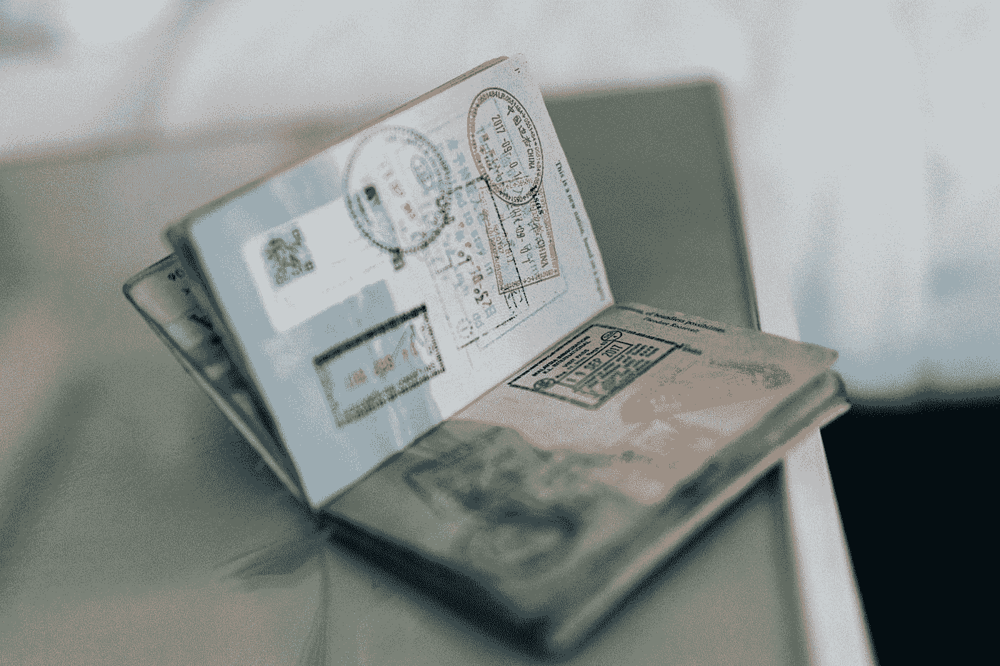

# 使用正则表达式和更多的实体提取…

> 原文：<https://medium.com/analytics-vidhya/enitity-extraction-using-regex-and-more-8bb7c4165f5c?source=collection_archive---------12----------------------->

## **结合不同的简单方法从 KYC 文档中提取信息**

合著者:[绍拉布·贾因](/@saurabh.vnit)

接吻——保持简单，笨蛋

在 [Unsplash](https://unsplash.com?utm_source=medium&utm_medium=referral) 上 [ConvertKit](https://unsplash.com/@convertkit?utm_source=medium&utm_medium=referral) 拍照

很少有问题不需要复杂的解决方案，可以采用一些简单的技术来解决它们。本文将讨论这样一种解决方案。

即使在数字化时代，许多行业仍然不得不使用纸质文件。银行和保险业仍然使用 KYC 文件的硬拷贝进行验证。尽管他们可以选择数字 KYC，但在发展中国家，如印度，实体拷贝对客户来说是方便的方式。公司不得不花费大量资源来提取/验证这些 KYC 文档。

从 KYC 文档中提取实体的方法有很多。我们用最少的资源开发了一个非常有效的解决方案。

**简介**

KYC 文件通常包含姓名、地址、出生日期、身份证号码等字段。我们使用正则表达式来提取这些实体。对于正则表达式来说，文档格式应该是静态的，因此 KYC 文档是一个很好的用例。

考虑评估的文件类型:

潘，阿达尔，护照，死亡证明

**接近**

我们使用以下三种方法来制定规则:

方法 1:作为必需实体的正则表达式模式

方法 2:正则表达式模式周围的文本作为必需的实体。

方法 3:将相对于另一个实体的文本作为必需的实体

**网格搜索**

为每种文档类型实施上述三种方法中的一部分或全部。

通过使用网格搜索技术，我们找到了最佳的方法序列。

**潘**

让我们以从 PAN 中提取实体为例。

需要提取的实体:PAN 编号、出生日期、名字、父亲的名字

PAN 编号-在浏览了数据集中的所有 PAN 文档(100)后，发现了以下方法/模式。

方法 1:

模式 1A: ([a-z]{5}\d{4}[a-z]{1}) —完美的 OCR，例如 BEDPM1537A

模式 1B: ([a-z]{5}\d{1，4}[a-z]{1，3}) —错误的 OCR，例如 BEDPM15BOA

方法 2:

模式 2A:(？:数字|数字卡)\ s *(a-z){ 5 } \ d { 4 }[a-z]{ 1 })—完美的 OCR，例如数字底座 1537A

模式 2B:(？:数字|数字卡)\ s *([a-zA-Z0–9]{ 8，13}) —错误的 OCR，例如数字 BEDPM15BOA

因为我们有 4 个模式，我们需要依次运行它们，一旦找到匹配的模式，我们就将其作为找到的实体返回。我们不应该将这些模式随机排列，因为这样会将不太可能出现的模式放在序列的顶部，这样会增加误报的几率。因此，为了找出最有可能出现在 PAN 文档中模式，我们使用网格搜索技术(通常在 ML 中用于找到最佳超参数)。

因为有 4 种模式，所以可能的序列总数是 4！=24.

对于 24 个序列中的每个序列:

计算准确度

以最高精度返回序列

因此，我们找到了最佳的模式序列——2A 模式、2B 模式、1A 模式、1B 模式

**出生日期**

方法 1:

模式 1A:([0–9]{ 2 }(\/|-)[0–9]{ 2 }(\/|-)[0–9]{ 4 })

模式 1B:([0–9-\/]+)

通过使用网格搜索，最佳模式序列—1A 模式、1B 模式

**祖宗的名字**

方法 2:

模式 2A:(？:父亲的|父亲)\s(？:Name)\ s([a-z]* \ s *[a-z]* \ s *[a-z]*)

方法三:父亲名字位于出生日期上方。

用上面的方法找到生日。

出生日期上面的文字是父亲的名字

通过使用网格搜索，最佳序列模式 2A，接近 3

**名**

方法 1:

模式 2A:(？:Name)\ s *([a-z]* \ s *[a-z]* \ s *[a-z]*)

途径三:姓名位于父亲姓名之上。

用上面的方法找到父亲的名字

父亲名字上面的文字是名字

通过使用网格搜索，最佳序列模式 2A，接近 3

**数据集**

每种文件类型 100 张图像

**实验**

1.  我们尝试了不同的 OCR 提供商，得到了以下结果。有趣的是，对于同一幅图像，OCR 引擎可能会产生完全不同的结果。
2.  我们发现 Google Vision 在以下情况下提供了最好的 OCR 结果，这些情况在印度 KYC 文档中很明显:

地区语言确定，垂直段落分隔。

1.  应用了不同的图像清洗技术，但是图像清洗管道不能适用于所有的图像质量。所以我们只用了图像增强处理/增加 DP 比率。

**使用的工具/包**

re '-正则表达式的 python 库

像 AWS Textract、Azure Vision、Google Vision 这样的云 OCR

**绩效评估，结果**

覆盖率=(正确+不正确)/预期总数

准确度=正确/总预期

平底锅

覆盖准确度

AWS Textract 96 81

蔚蓝视觉 96 93

谷歌视觉 98 94

阿德哈尔

覆盖准确度

AWS Textract 75 72

蔚蓝视觉 93 90

谷歌视觉 94 91

**用例**

处理 KYC 文件的银行、保险或类似行业。

类似的方法可以应用于文档结构是静态的、没有复杂的表格和表单(例如护照)的情况

**挑战**

1.  正则表达式依赖于 OCR 测试，同一文件的 OCR 输出在不同的 OCR 引擎之间不一致，因此相同的正则表达式不能在不同的 OCR 引擎之间使用。
2.  如果文档类型在模板中有许多变化，那么正则表达式在看不见的文档上失败。例如，死亡证明模板随着每个医院的变化而变化，因此正则表达式在我们的结果中显示出非常低的准确性。

应用通用图像清理过程将提高 OCR 质量，从而有助于提高准确性。

给定 KYC 文档的大数据集，可以使用使用图形卷积神经网络的基于深度学习的解决方案。

如果你喜欢这篇文章或有任何建议/意见，请在下面分享！

我们在 [LinkedIn](https://www.linkedin.com/in/sarang-mete-6797065a/) 上联系讨论吧