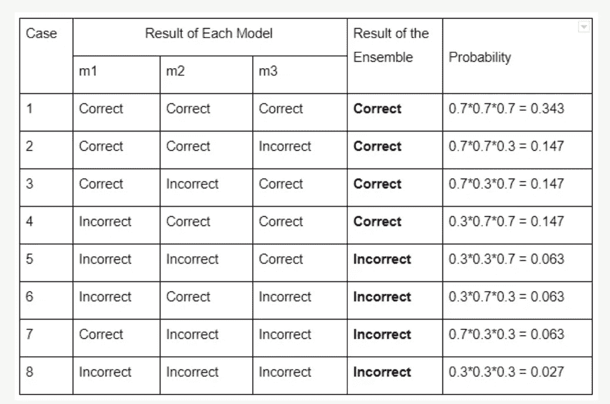
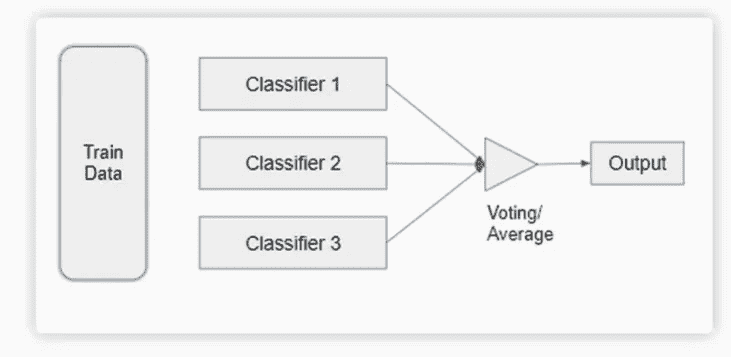
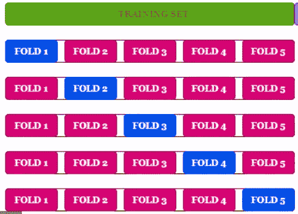
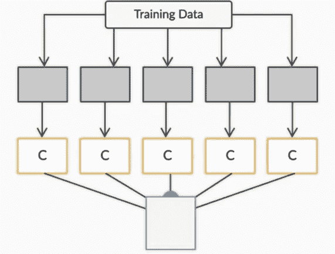
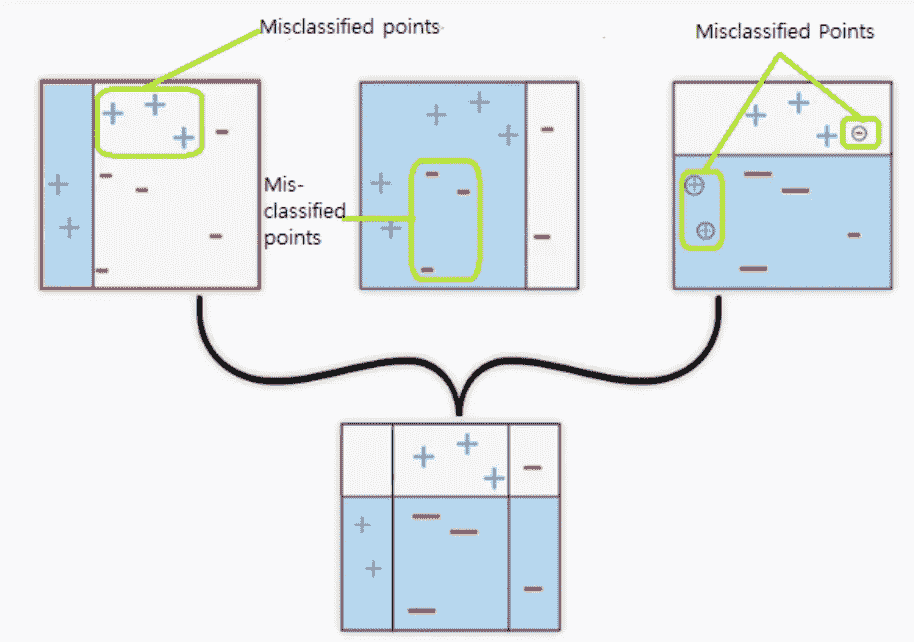

# 集成学习及其方法

> 原文：<https://medium.com/analytics-vidhya/ensemble-learning-and-their-methods-e9baa87d681f?source=collection_archive---------22----------------------->

图片来源:aitimejournal.com

系综这个词指的是一组物体，并把它们看作一个整体。相同的定义甚至适用于机器学习中的集成建模，其中一组模型被一起考虑以进行预测。一听到集合建模，我们就会想起一个流行的集合模型，叫做随机森林，它是基于 Bagging 集合技术的。在本文中，我们不会深入讨论随机森林，而是将重点放在围绕集成和流行的不同集成技术的主题上。

这是足够的小介绍。让我们开始看看合奏中涉及的主题。我们将首先理解个体模型为了形成集合而需要满足的标准或条件，在满足这些条件后，我们将讨论集合比任何个体模型表现得更好。

# 单个模型需要满足一定的条件或标准才能形成一个集合

可以通过使用执行相同分类或回归任务的不同种类的模型来形成集成，这意味着如果执行分类任务，我们可以考虑逻辑回归模型、决策树分类器、KNN 分类器、支持向量分类器等来形成集成。回归任务也是如此。但是为了使用不同或相同的单个模型形成集成，模型需要满足条件**多样性**和**可接受性**。

术语**多样性**意味着被考虑的个体模型必须是互补的，也就是说它们的优点和缺点必须互相抵消。用机器学习术语来说，如果一个特定的单个模型过度拟合，而另一个单个模型表现良好，那么表现良好的模型将抵消过度拟合的影响，作为一个整体，整体表现会更好。当模型之间存在差异时，每个模型做出的预测之间存在独立的性质，这意味着一个模型做出的预测不会受到另一个模型做出的预测的影响，反之亦然。此外，模型中的总体方差减小，结果，集合将不受过拟合问题的影响。

在听完关于多样性的整个故事之后，我们可能会对如何在模型之间实现多样性产生疑问。这可以通过执行以下一些实践来实现:

1.  考虑训练数据的子集，并在数据的每个子集或引导样本上建立不同的个体模型。
2.  通过使用不同的超参数组合进行调整，构建同一模型类的不同单个模型。
3.  考虑完全不同的模型来建立意义考虑逻辑回归、KNN、SVM、神经网络来执行分类任务。毫无疑问，回归任务也是如此。
4.  通过考虑不同的特征子集来构建单独的模型。
5.  最后一种方法是考虑不同的数据子集和不同的特征子集来构建单独的模型。

这些是用于形成集合的模型之间可以实现多样性的许多方法中的一些。

术语**可接受性**是指被认为形成集合的单个模型在执行任务时应该是彼此可接受的。用简单的统计学术语来说，单个模型做出正确预测的概率应该比任何随机模型都要好。同样的陈述可以被量化为单个模型正确预测的概率应该大于 0.5。

模型之间需要有**多样性**和**可接受性**的性质，否则集合模型的表现将类似于任何单个模型，这对于构建集合没有任何用处。让我给你一个简单的实际例子，让你相信多样性和可接受性的条件是组成一个有效和良好的团队的必要条件。在一个足球队中，应该有不同的球员，比如防守队员、进攻队员和守门员。考虑所有这些类型的球员将有助于球队表现得更好。如果所有的球员都被认为是后卫，那么一个足球队就无法形成。类似地，玩家可以互相接受完成一项赢得游戏的任务，并且每个玩家都应该比其他正常人表现得更好。我希望这个例子能给你一些关于多样性和可接受性的见解。

当单个模型满足上述两个条件时，它们可以形成一个系综。但此时你可能会问，如何保证满足这些条件并形成整体的单个模型会比其他单个模型表现得更好。这促使我们进行下一个讨论。

# 集合模型会比任何单个模型表现得更好吗？

这个问题可以通过在系综模型和有偏见的掷硬币之间画出平行线来更好地回答。你可能会奇怪，为什么我认为有偏见的硬币，而不是无偏的硬币。请记住，在构建集合时，我们已经考虑了统计上正确预测大于 0.5 的单个模型。此外，掷硬币活动是一个独立的事件活动，这意味着在第一轮中获得正面的概率不会影响在第二轮中获得反面的概率。这些原因让我们将合奏和抛硬币相提并论。

在深入研究集成模型和有偏硬币投掷之间的相似之处之前，我们需要了解集成模型如何在分类或回归任务中进行预测。在分类活动中，集成模型在考虑多数投票意义的情况下进行预测。如果集成中的一半模型预测特定的类别标签，则该类别标签将被认为是集成对特定测试数据点进行的最终预测。考虑多数票的策略被证明是一种有效的方法。这可以通过继续我们在系综和有偏硬币投掷之间的平行关系来证明。既然我们已经考虑了有偏向的硬币，让我们考虑正面的概率比反面的概率大得多。让我们将正面映射到集合做出的正确预测，将反面映射到集合做出的错误预测。现在，在投掷 N 次有偏向的硬币后，一半以上的机会得到反面的概率会非常小，而一半的机会得到正面的概率会更大。考虑到所做的映射，可以对我们的集合做出相同的结论，在超过一半的轨迹中得到尾部的概率低，这意味着集合中超过一半的模型做出错误预测的概率也低。类似地，在超过一半的试验中获得正面的概率将会很高，这意味着集合中超过一半的模型做出正确预测的概率将会很高。因此，将多数投票视为聚合技术将有助于集合做出比任何单个模型都更正确的预测。同样可以在回归任务中扩展，没有任何说法。

如果这一切对你没有任何意义，让我们用数字来理解同样的道理。考虑一个 P(正面)= 0.7，P(反面)= 0.3 的有偏硬币。考虑满足条件并形成系综的 3 个独立模型(m1、m2、m3)。让我们把正面和正确的预测对应起来，反面和错误的预测对应起来。遵循多数投票聚合技术进行最终预测，这意味着由一半或更多模型进行的预测将被视为最终预测。因此，在我们的示例中，由≥ 2 个模型做出的预测将被视为最终预测。在掷硬币三次后，可能的组合是:

整体模型抛硬币类比

现在让我们计算集合做出正确预测(p)和不正确预测(q)的概率，结果如下:

集合正确和不正确预测的概率

从上述结果中，我们可以看到，考虑多数投票聚合策略的集合做出正确预测的概率比任何单个模型做出正确预测的概率(0.70)多约 8%。这同样适用于集合作出错误预测的概率比任何单个模型作出错误预测的概率(0.3)少约 9%。因此，证明了集合模型比任何其他单个模型表现更好。

与任何单个模型相比，在集合中考虑更多的模型将在集合做出正确和不正确预测的概率上产生更多的差异。因此*被认为形成集合的模型数量越多，集合性能越好*。

理解了关于合奏的基本概念，现在是时候理解最流行的合奏技术了。

# 流行的集成建模技术

一些流行的合奏技巧有:

1.  投票/平均
2.  堆叠和混合
3.  制袋材料
4.  助推

让我们来讨论每一种方法。

# 投票/平均

在投票方法中，我们建立考虑满足条件的不同个体模型的集成，并且考虑对测试数据点的最终预测，因为多数投票意味着由集成提供的最终预测是由超过一半的模型做出的预测。执行分类活动时将使用投票策略。当执行回归任务时，集合的最终预测将被视为单个模型所做的所有预测的平均值。我们已经看到了为什么投票和平均会是集合预测的更好选择。当执行投票/平均集合技术时，需要记住的一个重要警告是，在该技术中，由每个单独模型做出的预测在做出最终预测时被给予同等的重要性或权重。但是这样做模型将不会以其最佳潜力执行，因为集合中的一些单个模型可能比其他模型执行得更好。为了克服这个缺点，我们可以开始给单个模型做出的预测分配权重。这个想法驱使我们去研究下一个流行的集合技术，叫做堆叠和混合。

投票和平均集成技术

# 堆叠和混合

就训练数据或为级别 2 模型采样的元特征而言，堆叠和混合技术之间存在细微的差异。在这种集合技术的方法中，我们开始通过人工分配或考虑 2 级模型来分配权重给由单个模型做出的预测。对级别 1 中使用的模型所做的预测进行采样，并作为训练数据提供给级别 2 中的模型。这样，第 2 级中存在的模型将根据第 1 级模型的输出进行训练，并通过将一些权重分配给第 1 级中的模型做出的预测来产生最终预测。如果这一切看起来让你难以理解，那就让我们来看看这个过程的图示。

堆叠和混合

仅考虑两个级别的模型没有限制。通过考虑更多数量的级别和级别内更多数量的模型，该过程可以变得更加复杂。但是考虑两个层次的模型就足够了，并且会产生更好的结果。

了解了堆叠和混合的高级流程后，让我们详细讨论混合后的堆叠方法。

**叠加**也叫“叠加泛化”。整个技术将与上面讨论的相同，只是对作为训练数据提供给第 2 级模型的元特征的采样进行了小的添加。不是直接考虑由级别 1 模型作出的预测作为用于级别 2 模型的元特征或训练数据，我们考虑交叉验证的样本预测作为用于级别 2 模型的训练数据，这意味着用于训练级别 1 模型的原始训练数据被分成具有 k 个级别的 k 个折叠，并且在每个第 k 个级别中，第 k 个折叠被认为是维持或验证集，并且第 k 个级别中的剩余(k-1)个折叠被用于训练级别 1 的不同模型。在(k-1)个褶皱上训练第 1 层的不同模型时，由第 k 层中第 k 个褶皱上的不同模型进行预测。所有 k 级都遵循同样的方法。同样地，由验证集上第一层中所有模型所做的预测会被视为第二层模型的训练资料。因此，2 级模型的训练数据的形状将是(M×M ),其中 M 指初始训练数据中的行数，M 指 1 级模型的数量。为了更好地理解，请参考下图，该图将主要训练数据分为 5 个层次的 5 个部分。

堆叠中的 k 倍交叉验证

在**混合**中，总体方法也保持不变，只是在二级模型的元特征或训练数据的采样上略有增加。在这种方法中，我们更喜欢在单个验证集上进行预测，而不是将 2 级模型的训练数据或元特征视为 k 重验证集预测。在单个验证集上做出的这些预测被提供作为 2 级模型的元特征。这样做所提供的元特征将受到限制，因此模型性能不会比堆叠更好。此外，训练数据的固定单次验证分割将耗尽用于训练 1 级模型的可用训练数据。因此，堆积法比混合法更可取。为了更好地理解，请参考下图，该图显示了将主要训练数据拆分为训练和验证或维持集的情况。

混合中的单一验证分割

# 制袋材料

Bagging 是一种流行的和强大的集成技术，用于减少模型中的方差。因此，它最好与高方差模型一起使用。它可以用于任何模型，但在用于高方差模型时是有意义的。随机森林是基于 Bagging 技术的一个流行且强大的集成模型。

它也被称为“引导聚合”，其中训练数据的不同引导样本被创建，这意味着训练数据被分成具有替换的不同数据子集。训练数据的不同子样本可能有也可能没有某些数据点重叠。在创建不同的随机引导样本时，属于具有相同超参数组合的相同模型类的不同模型被拟合到每个引导样本上。在这种集成技术中，只是相同模型类别和相同超参数调整的不同模型在不同的引导样本上被暴露或训练。一旦具有相同超参数组合的相同模型类的不同模型被拟合，如果执行分类任务，则最终预测被认为是多数票，或者如果执行回归任务，则预测的平均值被认为是最终预测。因此，它被称为“自举聚合”。

正如在引入模型之间的差异的方法中已经讨论的，我们在该方法中考虑训练数据的不同子集，以引入模型之间的差异，这也是通过在训练数据的不同子集上开发不同的预测来创建的。为了更好地理解这个过程，让我们看看这个过程的图示。

制袋材料

其中 C 表示相同模型类的不同模型，具有在训练数据的不同子集上训练的相同超参数组合。

了解了流程之后，让我们来看看流程的优缺点。

优点如下:

1.  它最适合于减少决策树、SVM、神经网络等模型中的高方差。
2.  整个过程可以是并行化的，这意味着构建过程可以在多个内核上执行，一个接一个地构建模型。由于建立的每个模型都是不同的，并且它们做出的预测彼此独立，因此该过程可以很好地并行化。
3.  由于构建过程可以并行化，因此整个过程很快。

现在我们来看看缺点:

1.  失去可解释性:因为我们正在建立一个集合模型，它是不同个体模型的集合，所以我们不能做出推论。考虑我们正在使用决策树的 Bagging 技术构建一个集成模型。在构建集成时，我们不能将决策树作为一个整体来看，尽管我们可以看单个的决策树，但是从集成中的单个决策树做出的解释不能对整个模型进行推广。如果是这种情况，那么我们就失去了模型之间的多样性，因为在这种情况下，所有模型的行为都是一样的。虽然我们不能使用集合进行任何推断，但是我们将知道特征的重要性，该重要性决定了哪些特征在对目标变量进行预测时提供了显著的贡献。
2.  特征优势:如果存在特征的任何优势，那么相同的特征将出现在所有节点分裂处，如果构建决策树模型，结果所有的模型将表现相同，因此我们再次损失了模型之间的多样性。

# 助推

Boosting 也是一种强大的集成技术。一些强大的升压算法包括:

1.  adaboost 算法
2.  梯度推进
3.  极端梯度推进又名 XG 推进和更多。

一旦将这些推进方法与任何模型相结合，这些模型将发挥其最佳潜力。这些助推方法加上任何经典的机器学习方法曾经在 Kaggle 比赛中名列前茅。我们不会讨论每一种助推技术，因为它们对应于一个完全不同的讨论，涉及完整的数学。如果你有兴趣具体了解 XG Boosting，一定要看看我关于 XG Boosting 的文章:[https://medium . com/@ varunimidi/XG-Boosting-algorithm-cf 99 fd8 f 7468？source = friends _ link&sk = 67da 9904 a 586270d 48662 c 669 c 751 cf 7](/@varunimmidi/xg-boosting-algorithm-cf99fd8f7468?source=friends_link&sk=67da9904a586270d48662c669c751cf7)详细讲解升压和 XG 升压所涉及的一切。

让我们将本文中的讨论限制在高级增强技术上。

在 Boosting 中，我们按顺序组合不同的弱学习器，使得序列中的前一个模型产生的错误被残端中的后一个模型克服。弱学习者的定义是一个模型，它只能识别数据中存在的主要模式，并且做出正确预测的概率大于 0.5。弱学习者的表现将是最小的，并且所有这些弱学习者按顺序组合以形成强学习者。特别考虑弱学习者的原因是因为所有这些弱学习者的组合不会使集合过拟合，并且需要最小的数据要求来训练任何弱学习者，并且训练过程也会很快。为了更好地理解这一过程，请看下图，在该图中建立了连续的模型，使得树桩中的每个后续模型克服了前一个模型产生的误差。

助推

终于，本文告一段落了！！

# 参考

1.  upGrad 学习平台。
2.  文中图片来源:upGrad 学习平台。