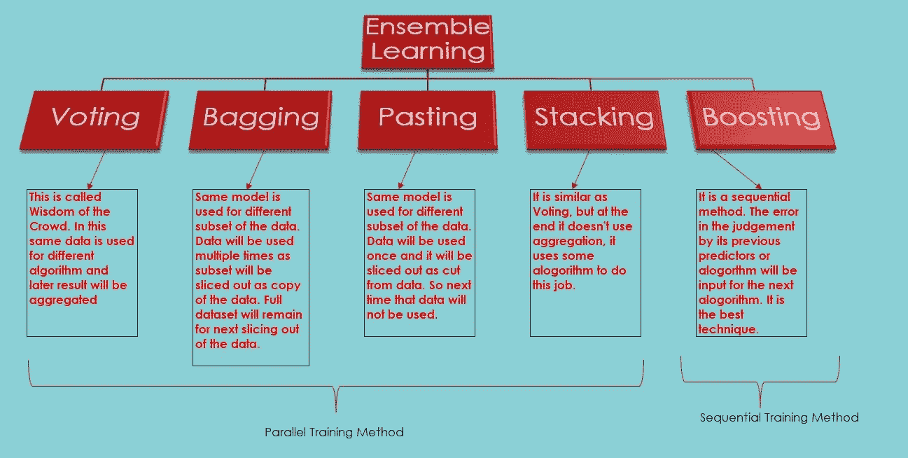
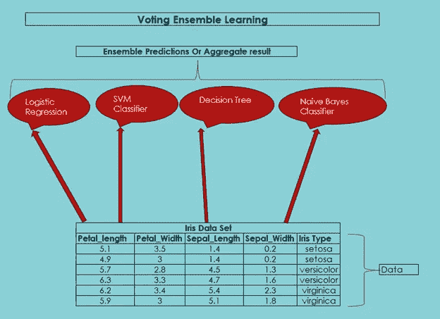
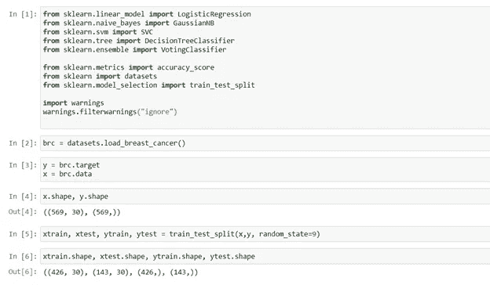
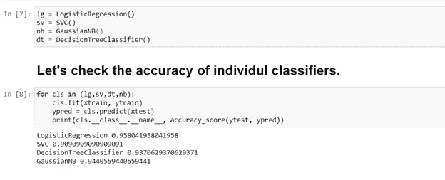
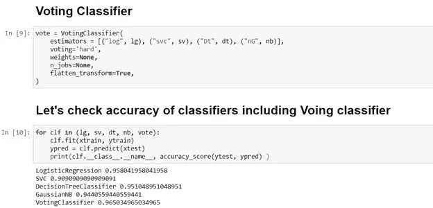
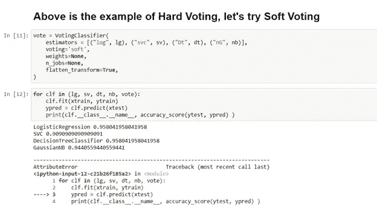
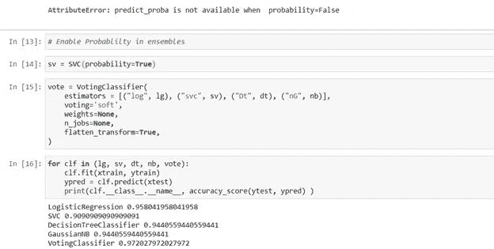

# 集成学习

> 原文：<https://medium.com/analytics-vidhya/ensemble-learning-b4ae1d3be46b?source=collection_archive---------15----------------------->

# **让我们让弱学习者成为强学习者**

先说一个小故事，你小时候一定听过。

从前，一位老人和他的三个儿子住在一个村子里。他们总是吵架。

几个月过去了，老人生病了。他告诉他的儿子们要保持团结，但他们不听他的。所以，他决定给他们上一堂实用的课，让他们永远不会忘记他们的差异，保持团结。

老人把他的儿子们叫来。他告诉他们:“我会给你们一捆棍子。分开每一根棍子，你将不得不把每一根棍子掰成两截。谁折断树枝快，谁就会得到更多的奖励。

儿子们同意了。老人给了他们每人一捆 10 根的棍子，并让他们把每根棍子掰成碎片。他们在几分钟内就把棍子打成了碎片，他们又开始争吵谁先来。

老人说:“亲爱的儿子们，游戏还没有结束。现在我会给你们每人另一捆棍子。你必须把棍子打成一捆，而不是一根根分开。”

儿子们同意了，并试着折断那捆棍子。尽管他们尽了最大的努力，他们还是没能弄断这个包裹。即使他们团结一致，也没能完成任务。

这就是组合的力量。同样的，如果你结合多种算法，它会比单个算法更好。即使在安全领域中，在不同的层上有不同的供应商也是优选的，这样即使一个供应商中存在漏洞，也不会影响到其他层，并且会导致网络的更强防御。

不同算法(或一组算法)或预测器的聚合结果通常比最佳单个预测器得到更好的预测，就像新闻频道做的投票后调查一样，他们询问不同地理位置的不同人对即将到来的结果的看法。他们询问不同的人意味着不同职业、不同性别、不同教育水平、不同年龄组等的人，因此组合或汇总的结果称为群体智慧，具有更好的准确性。一组预测器称为集合；因此，这种技术被称为集成学习，集成学习算法被称为集成方法。它对回归和分类都有效。集成的结果优于最好的单个预测器。

让我们再举一个例子，你可以训练一组决策树分类器，每个分类器在训练集的一个不同的随机子集上。要进行预测，您只需获得所有单个树的预测，然后预测获得最多投票的类。这样的决策树集合被称为**随机森林，**，尽管它很简单，但这是当今最强大的机器学习算法之一。

**合奏学习**

# 投票集成学习

假设你已经训练了几个分类器，每个都达到了 X%的准确率。你可能有一个逻辑回归分类器，一个 SVM 分类器，一个 K-最近邻分类器(正如我们所读到的不同的算法，如逻辑回归，SVM，线性回归，决策树，K-最近邻等。这些被称为弱学习者)。因此，如果我们结合这些算法的努力，它将成为强大的学习者。系综会达到(X+Y)%。但这取决于分类器之间的差异。这种多数投票分类器被称为硬投票分类器。有点令人惊讶的是，这种投票分类器通常比集成中的最佳分类器获得更高的准确度。

如果我们在分类器或回归器(预测器)之间具有多样性，投票集成学习将给出更高的准确性。当预测因子尽可能相互独立时，集合方法效果最好。获得不同分类器的一种方法是使用非常不同的算法来训练它们。这增加了他们犯不同类型错误的机会，提高了整体的准确性。

投票集成学习

如果所有分类器都能够估计类概率(即，它们有一个 predict_proba()方法)，那么您可以告诉 Scikit-Learn 预测具有最高类概率的类，在所有单个分类器上平均。这叫做**软投票**。它通常比硬投票获得更高的性能，因为它给予高度自信的投票更多的权重。你所需要做的就是用 voting="soft "替换 voting="hard "并确保所有的分类器都能估计类概率。

让我们运行代码并理解投票。我用的是 Jupyter 作为 IDE 和 Python 3.7.0 版本。我将使用投票分类，投票回归也将以同样的方式工作(代码链接在回归的最后给出)。我使用的是乳腺癌数据集，它有 569 个观察或实例，有 30 个不同的特征。数据被标记为数据，对于本教程，我不使用任何数据转换或数据清理或数据预处理。数据直接用于训练和测试分类器的准确性。

1.  让我们导入分类器，accuracy_score 用于检查准确性，datasets 用于导入乳腺癌数据集，imported train_test_split 用于将数据拆分为训练和测试数据集。导入警告以及忽略所有警告警报。

2.让我们调用分类器并检查准确性。

3.正如你所看到的，我们得到的最高准确率约为 95.80%。让我们调用投票分类器，再次检查所有分类器的准确性。

4.正如你所看到的，我们已经达到了 96.50%的准确率，这高于个人最好的分类器。以上是硬投票的例子。我们把投票方式改为“软投票”。正如你所看到的，我们得到了一个错误，因为所有的分类器都没有 predict_prob()作为默认值，我们需要启用它，然后我们将在投票方法中尝试软投票方法。

5.如你所见，软投票分类器的结果是 97.20%，这优于个人最佳以及硬投票分类器。