# 集成学习

> 原文：<https://medium.com/analytics-vidhya/ensemble-learning-bb08c6cf4b59?source=collection_archive---------13----------------------->

## 在机器学习中，群体的表现真的比个体好吗？


https://your story . com/journal/the-wisdom-of-the-crowds-can-it-beat-or-match-expe-ZL 424 v9h4k

在这篇文章中，我们将讨论一点关于集成学习。这种技术非常擅长为分类或回归任务建立模型。一般来说，集成学习技术的工作原理是假设将一些糟糕的机器学习算法结合在一起执行一项任务可能比使用单一算法更好。

作为一个例子，最强大的机器学习算法之一，随机森林，是由一堆决策树建立起来的。它包括训练一组决策树，每一个决策树都基于训练集的一个随机子集，对所有单个的树进行预测，并从中挑选出获得最多投票的类。

## **投票分类器**

这种技术被称为**硬投票**分类器，也可以用于其他类别的算法，如 SVM、逻辑回归等。此外，还有一种称为**软投票**分类器的技术，它包括从所有单个分类器的预测中平均选出具有最高分类概率的分类。

在 Python 中，投票分类器可以用下图中的代码实现。它使用决策树、支持向量机和逻辑回归来建立预测模型。用于本演示的数据集将使用函数 make_moons 从 sklearn.datasets 创建。

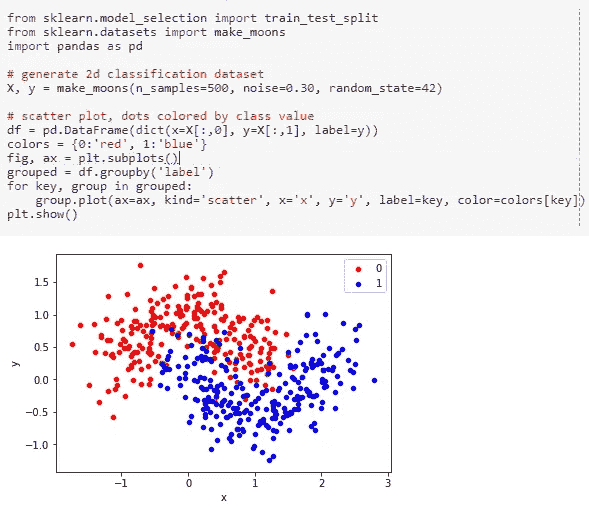

使用创建的数据集，我们将把它分成训练和测试数据集，然后我们实现分类器和硬投票集成，之后对其进行拟合和测试，如下所示:

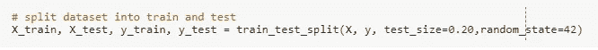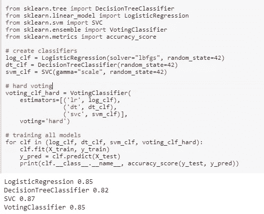

为了创建软投票分类器，必须设置 voting= "True "并且
使所有分类器估计类别概率，就像在 SVM 分类器中所做的那样:

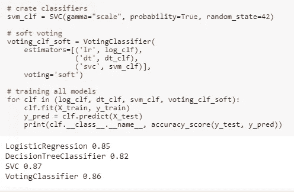

从结果中可以看出，软投票比硬投票的表现稍好，这种情况经常发生，因为软投票给予更有信心的投票更多的权重。

**装袋粘贴**

将一组不同的分类器组合成一组的另一种方式是对每个预测器使用相同的训练算法，然而，在训练集的随机样本上训练它们。在这种方法中，取样可以通过替换(**装袋**，或**引导聚集**)和不替换(**粘贴**)来完成。

替换采样意味着每次从训练集中取出一个样本进行训练时，它都会立即返回，以便可用于下一次采样。因此，同一个样本可以多次用于训练，因为它们是独立选择的(选择一个样本不影响选择另一个样本的概率)。另一方面，没有替换的采样意味着每次从用于训练的训练集中取出样本时，它不会回到袋子中，因此不再可用。因此，同一个样本只能用于一次训练，因为它们是独立选择的(选择一个样本增加了在下一轮采样中选择其他样本的可能性)。

在 Bagging 分类器中，用于训练这些方法的训练集的样本数量可以被设置为超参数，并且由于样本是随机选择的，因此在训练阶段可以忽略其中的一部分。但是，如果使用这些样本来测试算法而不需要使用测试集，它们可以用作算法准确性的度量。这被称为**外袋**评估，在机器学习竞赛中特别有用。

Sci-kit learn 提供了一种实现打包(bootstrap =“真”)和粘贴(bootstrap =“假”)的简单方法，从而可以轻松设置分类器(SVM、决策树、逻辑回归等)、想要训练多少个(n_estimators)、用于训练每个分类器的训练数据量(max_samples)以及是否想要进行开箱评估(oob_score)。

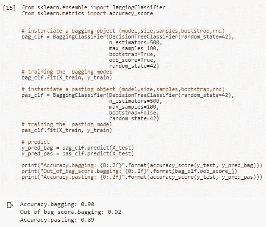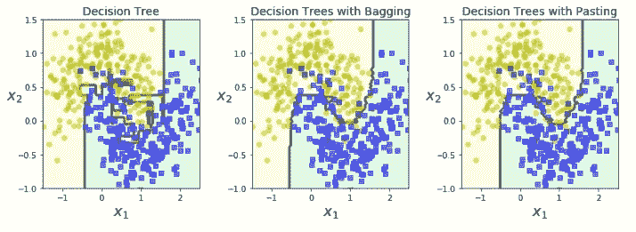

请注意，出袋得分高于装袋得分，表明该模型在看不见数据的情况下表现良好。此外，Bagging 比 Pasting 具有稍好的准确性，这是意料之中的，因为 bootstrapping 使算法训练的子集更加多样化，导致更高的偏差，但也导致相关性更低的预测器，这降低了总体方差。总的来说，装袋提供了比粘贴更好的模型，这也说明了为什么它经常被首选。此外，该图将单个决策树的边界与由 500 个决策树组成的打包和粘贴进行了比较。可以看出，两种模型都比决策树具有更平滑的边界，这意味着更好的泛化性能。

**随机森林**

如前所述，随机森林算法是决策树的集合。通常，它使用 Bagging 方法进行训练，max_samples 设置为 1.0，这意味着这些树将使用与训练集大小相同的样本进行训练。Sci-kit learn 提供了一个直接设置随机 Forrest 分类器(或回归器，取决于目标)的函数，而不是将其构建在 Bagging 方法中。

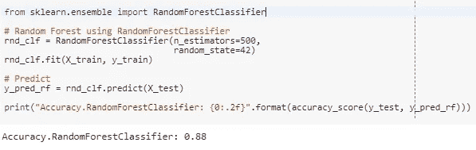

## 案例研究:使用 1994 年人口普查收入数据集比较装袋、粘贴和随机福利。

作为一个案例研究，我们将使用 1994 年的收入数据集，也称为成人数据集，来展示所提出的方法在现实世界数据中是如何工作的。它可以在加州大学欧文分校的网站下载。该数据集给出了人们的一些特征(如性别、教育水平、工作阶级、婚姻状况)，通常用于创建将人们分为高收入(年收入 5 万美元或以上)和低收入(年收入低于 5 万美元)的模型。

首先，让我们快速浏览一下数据集，以便理解每个特性的含义。

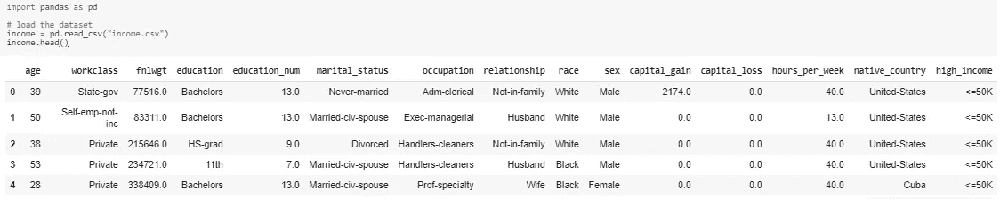

*   年龄(连续的):人的年龄。
*   工人阶级(分类的):工人阶级的范畴。(私营、自营企业、自营企业、联邦政府、地方政府、州政府、无薪、从未工作)。
*   教育(分类):教育资格的数字表示，范围从 1 到 16；(学士、一些学院、11 年级、HS-grad、Prof-school、Assoc-acdm、Assoc-voc、9 年级、7-8 年级、12 年级、硕士、1-4 年级、10 年级、博士、5-6 年级、学前班)；
*   婚姻状况(分类):个人的婚姻状况(已婚-同居-配偶、离婚、未婚、分居、丧偶、已婚-配偶不在、已婚-配偶)；
*   职业(分类):人的工作类型(技术支持、工艺修理、其他服务、销售、行政管理、专业教授、搬运工人、清洁工、机器操作员、检查员、行政文员、农业、渔业、运输、私人服务、保安服务、武装部队)；
*   关系(分类):人的关系状态(妻子、亲生子女、丈夫、非家庭成员、其他亲属、未婚)；
*   种族(分类):代表人的种族(白人、亚洲太平洋岛民、美洲印第安爱斯基摩人、其他人、黑人)；
*   性别(分类):人的性别；
*   Fnlwgt:代表最终权重，即响应单位所代表的目标人群中的单位数；
*   资本收益(连续):该人的总资本收益；
*   资本损失(连续):他们的资本损失；
*   每周小时数(连续):一周的总工作时间；
*   国家(分类):该人居住的国家；
*   收入标签(分类):这个标签将人们分为年收入低于 **5 万美元(假)**的人和年收入超过 **5 万美元(真)**的人。

使用相同的训练测试分割函数选择训练和测试数据，80%训练和 20%测试。为了给算法提供数据，我们必须做一些预处理步骤。首先，将分类数据转换为数字类别(特别注意 Country 列，该列被转换为 USA 和 NON_USA，因为原始数据集上有来自太多不同国家的人)并缩放连续数据。这是通过为每个任务使用一个管道来完成的，然后创建一个新的管道来合并它们的结果，从而产生一组数字特征:

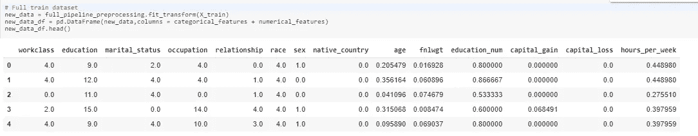

最终要素数据框

为了比较装袋、粘贴、随机森林和决策树的性能，我们使用 sci-kit learn 的 GridSearchCV 函数，创建一个强大的搜索空间，收集这三种具有不同超参数的算法:

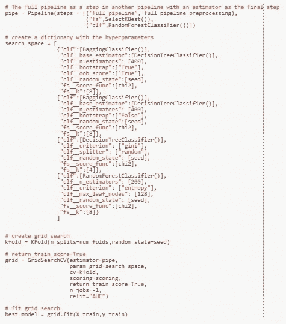

我们找到了每种方法的最佳结果，并将其收集在两个表中，一个是 AUC 得分，另一个是准确性得分:

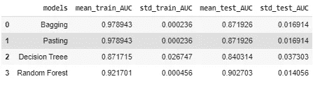

AUC 评分表

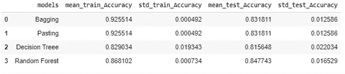

准确度得分表

从表中，人们可以得出结论，装袋和粘贴模型过度拟合，具有较低的偏差，但在训练和准确性得分方面有很大的差异。然而，即使他们过拟合，他们也有比决策树方法更好的结果。随机森林在它们之间表现更好，具有相似的训练和测试结果。

**特征重要性技术**

随机森林分类器也有一种易于实现的方法来测量模型结果中每个特征的重要性，给出使用该特征的树节点减少森林中所有树的杂质的平均程度。以下代码给出了每个功能的名称及其重要程度:

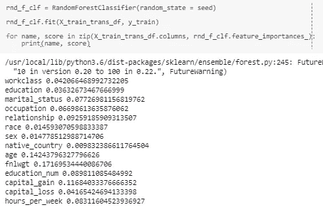

通过查看该列表，可以得出结论，特征 fnlwgt、年龄、资本收益、关系和教育数量是模型中最重要的 5 个特征，而母国、种族、性别、教育和资本损失是最不重要的。

为了比较这种特征重要性方法，我们在分类器上实现了 [Eli5](https://eli5.readthedocs.io/en/latest/overview.html) show_weights()函数。Eli5 是一个 Python 包，它处理分类器，目的是解释它的预测。

要安装 Eli5 软件包:

```
!pip install eli5
```

在同一个随机森林模型上使用它:

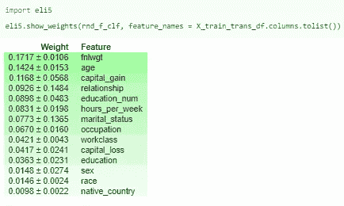

这两种方法显示了相似的要素重要性值，但是，Eli5 方法提供了更多信息，以重要性等级显示值，还提供了重要性的偏差，而不仅仅是 feature_importance_ method 的平均值。

**参考文献**

[](https://towardsdatascience.com/explainable-artificial-intelligence-part-3-hands-on-machine-learning-model-interpretation-e8ebe5afc608) [## 动手机器学习模型解释

### 解释机器学习模型的综合指南

towardsdatascience.com](https://towardsdatascience.com/explainable-artificial-intelligence-part-3-hands-on-machine-learning-model-interpretation-e8ebe5afc608)  [## 概述- ELI5 0.9.0 文档

### ELI5 在 Python 2.7 和 Python 3.4+中工作。目前它需要 scikit-learn 0.18+。您可以使用 pip:或…安装 ELI5

eli5.readthedocs.io](https://eli5.readthedocs.io/en/latest/overview.html) [](http://blog.datadive.net/interpreting-random-forests/) [## 解读随机森林

### 想象一下，一家信用卡公司使用随机森林构建了一个欺诈检测模型。该模型可以…

blog.datadive.net](http://blog.datadive.net/interpreting-random-forests/) 

[https://archive.ics.uci.edu/ml/index.php](https://archive.ics.uci.edu/ml/index.php)

[https://your story . com/journal/the-wisdom-of-the-crowds-can-it-beat-or-match-expe-ZL 424 v9h4k](https://yourstory.com/journal/the-wisdom-of-the-crowds-can-it-beat-or-match-expe-zl424v9h4k)