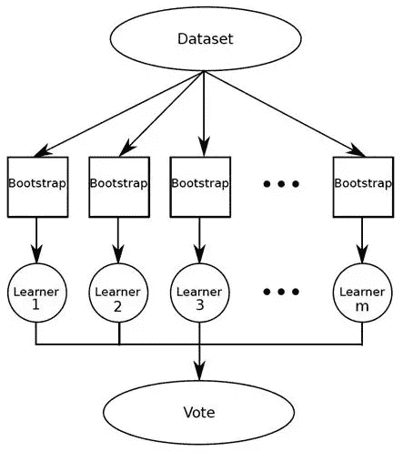
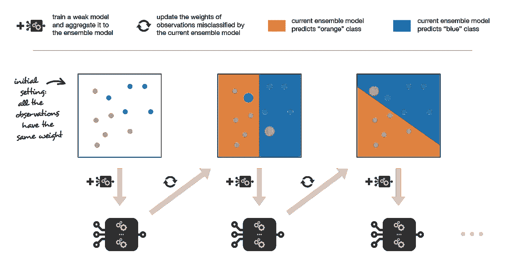

# 集成学习:数据科学

> 原文：<https://medium.com/analytics-vidhya/ensemble-learning-data-science-3b0a3832c479?source=collection_archive---------18----------------------->

# 什么是集成学习？

集成学习是一种技术或过程，其中生成并组合多个模型来解决特定的机器学习问题。您可以将它们视为元算法，将多个模型结合在一起，主要是为了提高模型的性能并减少结果的方差。

在任何回归或分类问题中，选择使用哪种模型都是极其重要的，选择取决于许多变量，如数据量、数据分布及其类型。

如果我们看看有监督的机器学习，一种算法从训练数据中创建一个模型，目标是在给定数据(X)的情况下最好地估计输出变量(y)。为了高度准确地预测这个输出变量，我们需要理解关于训练数据的特定算法的偏差-方差权衡。这些算法(基础模型)的**偏差-方差权衡**将告诉我们要执行什么类型的集成学习方法，因为一些方法将用于增加偏差，而其他方法将用于减少方差。因此，在我们进入不同的集成方法之前，我想先了解一下偏差和方差的含义，以了解它们的权衡如何影响我们选择的方法。

## 理解偏差-方差权衡:

偏差和方差是模型中两个最基本的特征，我们的想法是以这样一种方式调整我们的参数，即我们的偏差和方差达到平衡，以创建良好的预测性能。不同类型的数据需要不同类型的算法，这些独特的算法带来了不同的权衡。看待这种权衡的另一种方式是，我们希望我们的模型有足够的灵活性来解决新数据集的任何潜在复杂性，但又不至于使模型在训练和测试数据上的准确性降低。

来源:机器学习中的偏差-方差权衡。(2019 年 10 月 19 日)。检索自:[https://ai-pool . com/a/s/bias-variance-trade-off-in-machine-learning](https://ai-pool.com/a/s/bias-variance-tradeoff-in-machine-learning)

## 偏移误差

偏差误差是模型为使目标更容易预测而做出的假设，换句话说，它是我们的平均预测与实际正确值的接近程度。偏差误差越低，我们对训练和测试数据的预测就越准确，偏差误差越高，我们的预测就越不准确。(偏差是对数据的近似能力)。

*   **低偏差**意味着对目标函数形式的假设更少。
*   **高偏差**意味着更多关于目标函数形式的假设，或者换句话说，高偏差意味着模型**很少关注**训练数据**和**过度简化**模型。这将导致训练和测试数据中的高误差。如果试图拟合二次关系，线性回归模型会有很高的偏差。**

## 方差误差

方差误差是如果使用不同的训练数据，目标函数的估计将改变的量。我们应该预料到算法无论如何都会有一些变化，如果我们引入新的训练集，我们应该预料到变化，但理想情况下，我们不希望看到一个集与下一个集之间有太多的变化。如果我们看不到太多的变化，我们知道基础模型擅长挑选输入和输出变量之间隐藏的潜在映射。

具有**高方差**的算法受到训练数据集的强烈影响，并且在涉及新数据集时不会很好地推广。具有很大灵活性的算法也有很高的方差，这些往往是非线性算法，如决策树或 K-最近邻，而线性算法往往有很低的方差。(方差表示模型的稳定性)。

*   **低方差**表示对目标函数估计值的微小变化
*   **高方差**表示目标函数的估计值有较大变化。高方差模型会非常关注训练数据，并且不会对以前没有见过的数据进行很好的概括。

**低偏差算法**:树、K 近邻和支持向量机

**高偏差算法:**线性回归、线性判别分析、逻辑回归。

**低方差算法:**线性回归、线性判别分析和逻辑回归

**高方差算法**:决策树、K 近邻和支持向量机。

整体目标是实现低偏差和低方差。《出埃及记》线性算法具有低方差和高偏差，而非线性算法具有高方差和低偏差，反过来，两者将需要不同的集成方法来使预测值更加准确。这些不同的集成方法将有助于通过组合几个模型来改善误差结果。

## 整体方法:装袋、助推和堆叠

## 装袋:

Bagging 使用随机选择的训练数据子集来训练集合中的每个模型。通过在随机选择的子集上训练我们的模型，我们可以对原始集中的分布有一个很好的概括想法，从而创建强有力的预测。Bagging 使用并行集成方法，在随机选择的子集上相互独立地训练每个模型。这方面的一个例子是随机森林算法。装袋通常旨在减少差异。

来源:数据科学基础:集合学习者介绍。(2016).检索自:[https://www . kdnugges . com/2016/11/data-science-basics-intro-ensemble-learners . html](https://www.kdnuggets.com/2016/11/data-science-basics-intro-ensemble-learners.html)

## 增压:

Boosting 是一种将弱学习者组合成强学习者的顺序集成方法。它集合了多个模型，每个模型都弥补了上一个模型的不足。Boosting 将采用弱模型，如回归或基于树的模型，并对其进行改进。例如，XGBoost 是一种基于决策树的算法，它使用**梯度推进**来改进自身，其主要焦点是通过将精力放在最困难的观察上来减少偏差。

流行的助推技术:

1.  **AdaBoost** :专为分类问题设计的 AdaBoost。当训练决策树时，它从训练观察值并给每个观察值分配相等的权重开始。在对第一组进行评估后，它将提高难以分类的权重，降低容易分类的权重。它将重复这些过程，直到得到好的预测值。

资料来源:系综方法:装袋、助推和堆叠。(2019 . 4 . 22)检索自:[https://towards data science . com/ensemble-methods-bagging-boosting-and-stacking-c 9214 a 10 a 205](https://towardsdatascience.com/ensemble-methods-bagging-boosting-and-stacking-c9214a10a205)

1.  梯度增强:梯度增强不是集中在数据点上，而是通过使用其向量梯度来执行相同的调整损失函数的权重的方法。损失函数是表示模型系数与基础数据拟合程度(实际值与预测值之差)的一种度量。梯度增强适用于分类和回归。

## 堆叠:

堆叠将多个分类或回归模型与元分类器或元回归器结合起来。基础模型在完整的训练集上被训练，而元模型在作为特征的基础级模型的输出上被训练。

**要点:**

*   集成学习是一种技术或过程，其中生成并组合多个模型来解决特定的机器学习问题。
*   在任何回归或分类问题中，选择使用哪种模型都是极其重要的，选择取决于许多变量，如数据量、数据分布及其类型。
*   偏差和方差是模型中两个最基本的特征，我们的想法是以这样一种方式调整我们的参数，即我们的偏差和方差达到平衡，以创建良好的预测性能。
*   不同类型的数据需要不同类型的算法，这些独特的算法带来了不同的权衡。
*   线性算法方差小，偏差大，非线性算法方差大，偏差小。
*   Bagging 使用随机选择的训练数据子集来训练集合中的每个模型。
*   装袋通常旨在减少差异。
*   Boosting 是一种将弱学习者组合成强学习者的顺序集成方法。它集合了多个模型，每个模型都弥补了上一个模型的不足。
*   助推通常旨在减少偏差。

要了解选择哪种方法，重要的是要了解我们正在处理什么类型的数据，并了解不同回归和分类模型的缺点。一旦我们从这些模型中了解了偏差和方差的权衡，我们就可以开始选择一种能给出最佳结果的集成方法。

如果你喜欢这篇文章，请随意点击“鼓掌”按钮，不要害羞，伸出手在下面留下评论，我会尽我所能回答任何评论。