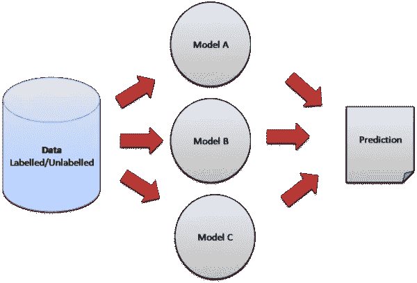

# 集成学习:在图像数据上实现的简单技术

> 原文：<https://medium.com/analytics-vidhya/ensemble-learning-simple-techniques-implemented-on-image-data-4885797e12a2?source=collection_archive---------27----------------------->



机器学习中的集成模型结合了来自多个模型的决策，以提高整体性能。这可以通过多种方式实现。这里我将实现两个简单的方法(对图像数据):

1.  **平均:**使用多个模型对每个数据点进行预测。所有模型预测的平均值用于进行最终预测
2.  **Max Voting:** 使用多个模型对每个数据点进行预测。每个模型的预测被认为是一次“投票”。我们从大多数模型中得到的预测被用作最终预测。

**在 MNIST 数据上的实现(python 3.6.9，keras 2.2.4)**

```
**#CNN models**from keras.callbacks import ModelCheckpoint
from keras.datasets import mnist
from keras.layers import Conv2D, MaxPooling2D, GlobalAveragePooling2D, Dropout, Activation, Average
from keras.losses import categorical_crossentropy
from keras.models import Model, Input
from keras.optimizers import Adam
from keras.utils import to_categoricalfrom tensorflow.python.framework.ops import Tensor
from scipy.stats import mode
from typing import List
import glob
import numpy as np
import os# data processing
def load_data():

    (x_train, y_train), (x_test, y_test) = mnist.load_data()
    x_train = x_train / 255.
    x_test = x_test / 255.
    y_train = to_categorical(y_train, num_classes=10)
    return x_train, x_test, y_train, y_testx_train, x_test, y_train, y_test = load_data()
x_train = x_train.reshape((x_train.shape[0], 28, 28, 1))
x_test = x_test.reshape((x_test.shape[0], 28, 28, 1))
input_shape = x_train[0].shape
model_input = Input(shape=input_shape)# models(3) building
def first(model_input: Tensor):

    x = Conv2D(96, kernel_size=(3, 3), activation='relu', padding = 'same')(model_input)
    x = Conv2D(96, (3, 3), activation='relu', padding = 'same')(x)
    x = Conv2D(96, (3, 3), activation='relu', padding = 'same')(x)
    x = MaxPooling2D(pool_size=(3, 3), strides = 2)(x)
    x = Conv2D(192, (3, 3), activation='relu', padding = 'same')(x)
    x = Conv2D(192, (3, 3), activation='relu', padding = 'same')(x)
    x = Conv2D(192, (3, 3), activation='relu', padding = 'same')(x)
    x = MaxPooling2D(pool_size=(3, 3), strides = 2)(x)
    x = Conv2D(192, (3, 3), activation='relu', padding = 'same')(x)
    x = Conv2D(192, (1, 1), activation='relu')(x)
    x = Conv2D(10, (1, 1))(x)
    x = GlobalAveragePooling2D()(x)
    x = Activation(activation='softmax')(x)

    model = Model(model_input, x, name='first')
    return modeldef second(model_input: Tensor):

    x = Conv2D(96, kernel_size=(3, 3), activation='relu', padding = 'same')(model_input)
    x = Conv2D(96, (3, 3), activation='relu', padding = 'same')(x)
    x = Conv2D(96, (3, 3), activation='relu', padding = 'same', strides = 2)(x)
    x = Conv2D(192, (3, 3), activation='relu', padding = 'same')(x)
    x = Conv2D(192, (3, 3), activation='relu', padding = 'same')(x)
    x = Conv2D(192, (3, 3), activation='relu', padding = 'same', strides = 2)(x)
    x = Conv2D(192, (3, 3), activation='relu', padding = 'same')(x)
    x = Conv2D(192, (1, 1), activation='relu')(x)
    x = Conv2D(10, (1, 1))(x)
    x = GlobalAveragePooling2D()(x)
    x = Activation(activation='softmax')(x)

    model = Model(model_input, x, name='second')
    return modeldef third(model_input: Tensor):

    #mlpconv block 1
    x = Conv2D(32, (5, 5), activation='relu',padding='valid')(model_input)
    x = Conv2D(32, (1, 1), activation='relu')(x)
    x = Conv2D(32, (1, 1), activation='relu')(x)
    x = MaxPooling2D((2,2))(x)
    x = Dropout(0.5)(x)

    #mlpconv block2
    x = Conv2D(64, (3, 3), activation='relu',padding='valid')(x)
    x = Conv2D(64, (1, 1), activation='relu')(x)
    x = Conv2D(64, (1, 1), activation='relu')(x)
    x = MaxPooling2D((2,2))(x)
    x = Dropout(0.5)(x)

    #mlpconv block3
    x = Conv2D(128, (3, 3), activation='relu',padding='valid')(x)
    x = Conv2D(32, (1, 1), activation='relu')(x)
    x = Conv2D(10, (1, 1))(x)

    x = GlobalAveragePooling2D()(x)
    x = Activation(activation='softmax')(x)

    model = Model(model_input, x, name='third')
    return modelfirst_model = first(model_input)
second_model = second(model_input)
third_model = third(model_input)# models compilation & training
def compile_and_train(model: Model, num_epochs: int): 

    model.compile(loss=categorical_crossentropy, optimizer=Adam(), metrics=['acc']) 
    filepath = 'weights/' + model.name + '.hdf5'
    checkpoint = ModelCheckpoint(filepath, monitor='loss', verbose=0, save_weights_only=True,
                                                 save_best_only=True, mode='auto', period=1)
    history = model.fit(x=x_train, y=y_train, batch_size=32, 
                     epochs=num_epochs, verbose=1, callbacks=[checkpoint], validation_split=0.2)
    return filepathNUM_EPOCHS = 5
first_weight_file = compile_and_train(first_model, NUM_EPOCHS)
second_weight_file = compile_and_train(second_model, NUM_EPOCHS)
third_weight_file = compile_and_train(third_model, NUM_EPOCHS)# models evaluation
def evaluate_error(model: Model):
    pred = model.predict(x_test, batch_size = 32)
    pred = np.argmax(pred, axis=1)
    error = np.sum(np.not_equal(pred, y_test))/ y_test.shape[0]  
    return errore1=evaluate_error(first_model); print(e1)
e2=evaluate_error(second_model); print(e2)
e3=evaluate_error(third_model); print(e3)
```

> *输出错误:*
> 
> *0.0083
> 0.0112
> 0.0113*

```
**#Ensemble models**all_models = [first_model, second_model, third_model]
first_model.load_weights(first_weight_file)
second_model.load_weights(second_weight_file)
third_model.load_weights(third_weight_file)def ensemble_average(models: List [Model]): # averaging

    outputs = [model.outputs[0] for model in all_models]
    y = Average()(outputs)

    model = Model(model_input, y, name='ensemble_average')
    E = evaluate_error(model)
    return Edef ensemble_vote(models: List [Model]): # max-voting

    pred = []
    yhats = [model.predict(x_test) for model in all_models]
    yhats = np.argmax(yhats, axis=2)
    yhats = np.array(yhats)
    #print(yhats.shape)
    for i in range(0,len(x_test)):
        m = mode([yhats[0][i], yhats[1][i], yhats[2][i]])
        pred = np.append(pred, m[0])
    E = np.sum(np.not_equal(pred, y_test))/ y_test.shape[0]  
    return EE1 = ensemble_average(all_models); print(E1)
E2 = ensemble_vote(all_models); print(E2)
```

> *输出错误:*
> 
> *0.0061
> 0.0068*

显然，集成学习在这里给出了更好的准确性。

参考资料:

1.  [https://www . analyticsvidhya . com/blog/2018/06/comprehensive-guide-for-ensemble-models/](https://www.analyticsvidhya.com/blog/2018/06/comprehensive-guide-for-ensemble-models/)
2.  [https://towards data science . com/ensembling-conv nets-using-keras-237d 429157 EB](https://towardsdatascience.com/ensembling-convnets-using-keras-237d429157eb)
3.  [https://machine learning mastery . com/horizontal-voting-ensemble/](https://machinelearningmastery.com/horizontal-voting-ensemble/)