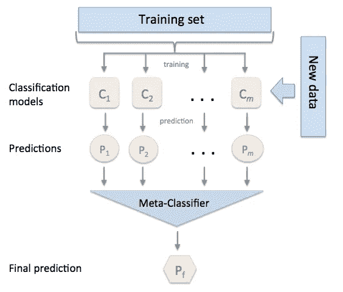

# 集成学习——你的机器学习救星，原因如下(第 1 部分)

> 原文：<https://medium.com/analytics-vidhya/ensemble-learning-your-machine-learning-savoir-and-here-is-why-part-1-78ef52c8c365?source=collection_archive---------24----------------------->

罗曼·贝斯的照片

*这是一系列以简单易懂的方式解释机器学习中的集成方法的帖子。在这篇文章中，我们将讨论异质系综。*

1/异质系综

2/ [同质系综—装袋](/analytics-vidhya/ensemble-learning-bagging-random-forest-part-2-6cc81eb3470d)

3/同质系综—增强

作为一名机器学习爱好者和自学者，我写了以下帖子作为自己的学习材料，并愿意与我的学习者分享。我们的想法是展示不同的系综技术的全貌，何时使用，以及它们对我们的模型有什么影响。

集成是一种通过使用模型集合进行预测的机器学习技术。这就是为什么大多数时候，学习者倾向于在学习了所有其他经典算法之后才发现这种方法的原因。这种技术的优势源于“群体的智慧”这一理念，即:

> “群体中信息的聚合，导致的决策，往往比群体中任何一个成员所能做出的决策更好”(维基百科，群体的智慧，2020)。

事实证明，在 Kaggle 竞赛中有几个使用这种建模方法的获奖预测模型。

实现 Ensemble 有很大的好处。除了惊人的*高精度*之外，通过优化*并行计算*(例如 XBBoost，Light GBM)在更大的数据集上执行集成方法以减少训练时间和内存空间也是理想的。机器学习实践者最糟糕的噩梦之一是过度拟合，特别是对于包含噪声并且不遵循任何典型数据分布的真实世界数据集。在这种情况下，我们也可以使用系综*对抗高方差*(例如随机森林)。

当我们想要组合*不同的微调算法*以得出最佳可能的预测时，使用异质集成。投票和堆叠就是这种技术的例子。

## 硬投票

此方法用于分类任务。它使用模式(选择多数类)组合多个估计量的预测，以选择最终结果。通过选择具有最大投票总数的类别，硬投票集成可以实现比仅使用单一算法的模型更好的预测。

为了有效，我们需要提供一组*奇数*(超过 3)和不同的估计量来产生他们自己的独立预测。

下面是一个使用硬投票集成的代码示例。请注意，算法列表是您的选择，只要它们是微调的、多样的和解决分类任务的。

对分类任务使用硬投票的代码示例

## 软投票

回归和分类任务都可以用于这项技术。为了执行软投票，我们对分类使用平均预测概率，对回归任务使用平均预测值。特征与硬投票相似，除了我们可以使用任何数量的估计器，只要有 2 个以上。我们也可以根据分类器对最终预测的重要性来分配权重，如硬投票。

对回归任务使用软投票的代码示例

## 堆垛

在尝试了硬投票和软投票但仍未达到预期结果后，这就是堆叠开始发挥作用的时候。该技术用于分类和回归任务。堆叠和其他两种异质集成方法的最大区别在于，除了基本学习器之外，我们还有一个额外的元分类器。

首先，基础学习者将在数据集上进行训练和预测。然后，第二层上的元估计器将使用基础学习者层的预测作为下一步的新输入特征。请注意，元估计器将对采用新输入特征(X)的数据集进行训练和预测，新特征的数量等于基础学习者的数量，以及原始数据集的类标签(Y)。在这种情况下，我们不再使用位置估计来进行组合，而是使用可训练的学习器作为组合器本身。

这种方法的好处是元估计器可以有效地检查哪个基础估计器提供更好的预测，以及使用原始数据和新的输入特征直接参与最终预测。

来源:来自 [mlxtend](http://rasbt.github.io/mlxtend/user_guide/classifier/StackingClassifier/) 的打桩模型可视化

对分类任务使用 Staking 方法的代码示例

总的来说，当你已经建立了一个小的估计器集，单独训练和微调它们时，异质集成方法是一个很好的选择。请记住

> ”*只有当学习计划表现相当好时，投票才有意义。如果三个分类器中的两个做出严重错误的预测，我们就有麻烦了！”*(威滕，弗兰克，霍尔，&帕尔，2016)。

通过应用简单和直观的集成技术，异构集成无疑提供了对整体性能的改进。在下一篇文章中，我们将深入探讨另一种由一些获奖算法组成的集成技术。

感谢阅读！

不要害羞，如果你对我的更多帖子感兴趣，让我们联系:

中:【https://medium.com/@irenepham_45233】T4

insta gram:[https://www.instagram.com/funwithmachinelearning/](https://www.instagram.com/funwithmachinelearning/)