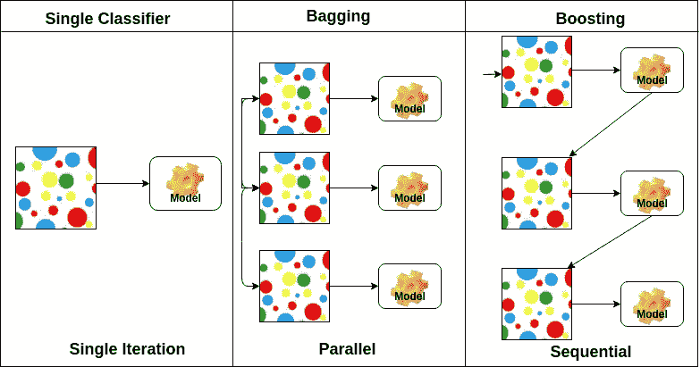
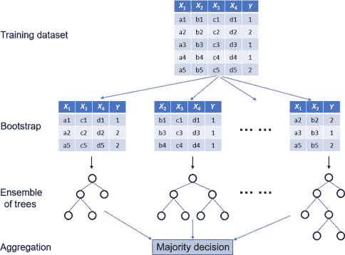
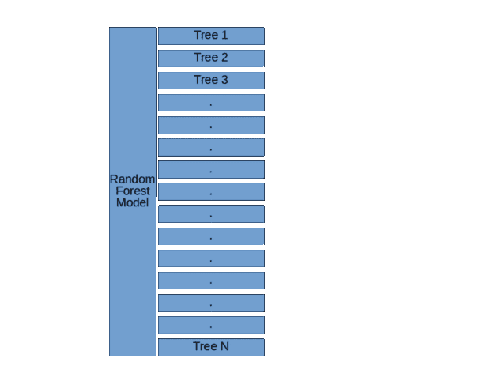

# 集合方法:初学者指南

> 原文：<https://medium.com/analytics-vidhya/ensemble-methods-a-beginners-guide-d14fe23b1ab9?source=collection_archive---------16----------------------->

# **简介**

当我开始我的数据科学之旅时，很少有像 ensemble、boosting 这样的术语经常出现。每当我打开任何 Kaggle 比赛的讨论论坛或查看任何获胜者的解决方案时，大多数都充满了这些东西。

起初，这些讨论听起来完全陌生，这些集合模型看起来像一些不适合新手的花哨东西，但相信我，一旦你对这些概念有了基本的理解，你就会爱上它们！

# 全体

所以我们从一个很简单的问题开始，到底什么是合奏？我谷歌了一下，发现了这个定义

> “组成一个协调整体的一群独立的事物/人”

在某种程度上，这是整个集体学习课程背后的核心思想！现在让我们用一种更技术性的方式来表达，基本上集成是一类算法，其中一组单独的模型(通常称为基础学习器)以某种方式分组，以做出整体决策，从而提高整体模型的预测能力

概括地说，有四种类型的集合技术

*   制袋材料
*   助推
*   级联
*   堆垛

(这里我主要讨论前两个)

来源:[数据营](https://www.datacamp.com/community/tutorials/adaboost-classifier-python)

这四种类型背后的核心思想是相同的，一组基础学习者被组合起来作出决定，区别仅在于两个方面

*   使用什么类型的基础学习者
*   如何将这些基础学习者结合起来做出整体决策

现在，让我们试着回答上述技术的这两个问题

# 制袋材料

好吧，让我们把时间倒回去一点，回到学生时代，记得你曾经得到一张总成绩报告单。这个总分是如何计算出来的，你的各个科目的老师根据他们的标准给出了一些反馈，例如，你的数学老师会根据他自己的标准来评估你，比如代数、三角学等，体育老师会评判你在球场上的表现，音乐老师会评判你的声乐技巧。重点是，每一位老师都有自己的一套评判学生表现的规则，然后所有这些规则结合起来，给出学生表现的总体分数。

用一个非常外行的术语来说，bagging 只做这样的事情。将每个教师视为具有其自身标准/特征的基础模型，并且来自每个基础模型/教师的决策被汇总以计算总体预测/等级。

因此，bagging 基本上是一种技术，其中多个基础学习器(例如决策树)被并行训练，并且在预测期间，这些基础学习器的结果通过各种方法(如多数投票、均值等)被聚集在一起，以获得净结果。现在想象一下，如果你用整个数据集训练每一个基础学习者(比如说一个决策树)，这些模型很有可能会给出相同的结果，因此聚合它们不会增加多少价值。为了解决这个问题，每个基础学习者可以看到原始训练数据集的稍微不同的版本，以便每个模型被不同地训练，并且当聚集时，可以获得一些有意义的结果。为了让每个基础学习者看到原始日期集的不同版本，使用了两种技术

*   行抽样
*   柱状取样

现在，不是给每个基础学习者一个随机的行子集，而是给他们一个列。这里需要注意的一点是，我们仅对行而不是列进行引导(替换采样),即每个引导子集可以多次拥有相同的行，但列是唯一的(如果我们对列也进行引导采样，则基础学习者可能会面临共线性的问题)

来源:[科学指导](https://www.sciencedirect.com/topics/engineering/random-forest)

现在，每个基础学习者被不同地训练，这有助于减少整个模型的净方差(即使基础学习者具有高方差，但是一旦结果被聚集，模型的净方差减少)。现在作为一个例子，随机森林是最流行的装袋技术之一，它使用了上述所有的原则

随机森林模型的基本结构([随机森林、决策树和集合方法由迪伦·斯托里解释](https://www.datascience.com/blog/random-forests-decision-trees-ensemble-methods)

# 助推

现在让我们来看看所有数据科学黑客马拉松/竞赛中使用最广泛的技术之一。基本的工作原理类似于 bagging，在 bagging 中，基础学习者并行地做出决策，随后该决策被聚集，而在 boosting 中，基础学习者顺序地做出决策(一个模型的输出被用作其他模型的输入),使得下一个模型学习上一个模型的错误/失误和失误。

现在让我们通过一个直观的例子来理解这一点，假设一名高尔夫球手正试图将球击入 500 米外的一个洞。他的第一枪会试图覆盖最大的缺口，尽可能地靠近球洞。假设在第一杆之后，他在 80 米之外，现在高尔夫球手将重新评估目标并相应地调整他的挥杆以覆盖这个剩余的距离。让我们假设他覆盖了 20 米的距离，现在在下一次击球中，他会更靠近球洞，更轻柔地击球。

这就是 boosting 算法的大致工作方式，在这里，每个镜头都可以被视为一个连续的基本学习器，它是根据来自前一个镜头/基本学习器的输出/剩余距离来训练的。

顺便说一句，这种方法听起来是不是很熟悉，逐渐向目标收敛，并在接近最优值时迈出越来越小的步伐，如果它让你想起梯度下降，那么你绝对是正确的！事实上，有一个非常流行的提升算法叫做梯度提升决策树(GBDT ),现在你可以自由地得出你关于该模型命名的结论。

AdaBoost 或自适应 boosting 是 Boosting 的另一个例子，其基本原理仍然相同，每个模型都从以前模型产生的错误中学习，这里唯一的区别是，不是学习残差，而是将更多的权重分配给以前模型的错误分类点，XGBoost 只是一个更优化的实现 GBDT。

## 结束注释

这些集合模型是非常强大的技术，可以帮助我们建立一些强大的机器学习模型，已经说过，它们不是某种魔棒，你可以每次挥舞都产生期望的结果，它们也有一些限制。增加模型的复杂性是以牺牲其可解释性为代价的，为了开发好的模型，人们不能总是盲目地依赖这些复杂的模型，你仍然需要在机器学习项目中的其他重要事情上投入时间，如探索性数据分析、特征工程等。

