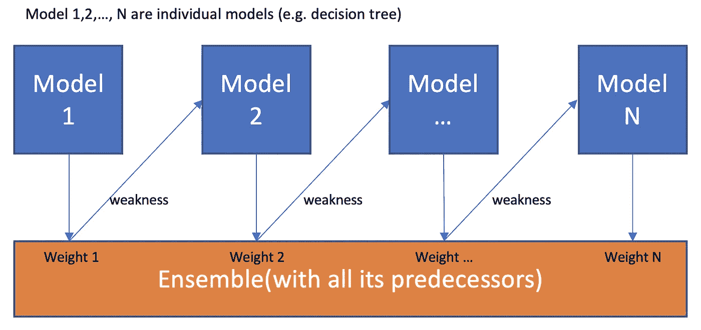

# 集成方法

> 原文：<https://medium.com/analytics-vidhya/ensemble-methods-b644f9c94bc1?source=collection_archive---------13----------------------->

## 需要了解的基本机器学习概念

## 什么是集成学习？

集成学习是一种结合几种不同的机器学习模型来提高稳定性和预测能力的方法。最终结果是一个强大的，最佳的预测。驱动集成学习的主要原理是将几个弱学习者聚集在一起形成一个强学习者，换句话说，提高准确性。

通常，当执行机器学习任务时，低可预测性的主要原因是噪声、方差和偏差。集合方法有助于减少模型中方差和偏差的影响。应该使用探索性数据分析来解决噪音问题。

集成学习类型分为三类:

*   引导聚集
*   助推
*   堆垛

来源:[https://medium . com/ml-research-lab/ensemble-learning-the-heart-of-machine-learning-b4f 59 a5f 9777](/ml-research-lab/ensemble-learning-the-heart-of-machine-learning-b4f59a5f9777)

## 制袋材料

Bagging 结合了 bootstrap 重采样和聚合两种思想。这是一种集合方法，可用于减少模型中的方差。

*通过 bootstrap 聚合训练集成的过程如下:*

1.  *从你的数据集中抓取一个相当大的样本，替换掉*
2.  *在这个样本上训练一个分类器*
3.  *重复进行，直到所有分类器都已经在数据集的样本上接受了训练*
4.  *进行预测时，让集合中的每个分类器进行预测*
5.  *使用您选择的方法，将所有分类器的所有预测汇总成一个预测*

一种保持高方差的算法是决策树，因为决策树对它们被训练的数据是敏感的。如果您考虑将您的树训练为数据的子集，则决策树的预测可能会非常不同。然而，当聚合成一个系综时，结果可以更少变化，更有希望(pssst，随机森林！)

## 助推

Boosting 算法试图通过训练一系列弱模型来提高预测能力，每个模型都补偿其前任的弱点(即调整权重)。

来源:[https://towards data science . com/boosting-algorithms-explained-d 38 f 56 ef 3 f 30](https://towardsdatascience.com/boosting-algorithms-explained-d38f56ef3f30)

1.  基础学习者接受所有的分布，并对每个观察值分配相同的权重或注意力。
2.  如果存在由第一基本学习算法引起的任何预测误差，那么我们更关注具有预测误差的观测值。然后，我们应用下一个基本学习算法。
3.  重复步骤 2，直到达到基本学习算法的极限或达到更高的精度。

最后，它结合弱学习器的输出，创建一个强学习器，最终提高模型的预测能力。Boosting 更加关注被错误分类或由于之前的弱规则而具有较高错误的示例。

## 堆垛

与装袋和增压相比，堆垛是一种较少使用的方法。堆叠背后的想法是，你可以用不同类型的模型来解决机器学习问题，这些模型能够学习问题的一部分，但不能学习问题的全部。一旦你有了中间预测，你就添加了一个新的模型，它从中间预测中学习，同样的目标。

*与装袋和助推不同，堆叠可以(通常是)用于组合不同类型的模型。程序如下:*

1.  *将训练集分成两个不相交的集合。*
2.  *在第一部分训练几个基础学习者。*
3.  *在第二部分测试基础学员。*
4.  *使用 3)中的预测作为输入，使用正确的回答作为输出，训练更高水平的学习者。*

## 来源:

 [## 集成学习——机器学习的核心

### 合奏学习系列…！！！

medium.com](/ml-research-lab/ensemble-learning-the-heart-of-machine-learning-b4f59a5f9777)  [## 机器学习中的集成方法:它们是什么，为什么使用它们？

### 合奏方法，它们是什么？集成方法是一种机器学习技术，结合了几个基本模型在…

towardsdatascience.com](https://towardsdatascience.com/ensemble-methods-in-machine-learning-what-are-they-and-why-use-them-68ec3f9fef5f)  [## 用于机器学习的 Bagging 和随机森林集成算法

### 随机森林是最流行和最强大的机器学习算法之一。这是一种合奏…

machinelearningmastery.com](https://machinelearningmastery.com/bagging-and-random-forest-ensemble-algorithms-for-machine-learning/)  [## 机器学习中的堆叠是什么？

### 回答(第 1 题，共 4 题):堆叠是一种结合多种模型的方法，它引入了元学习者的概念。这是…

www.quora.com](https://www.quora.com/What-is-stacking-in-machine-learning)  [## ML 提升快速指南

### 这篇文章将引导你通过一个被称为 Boosting 的整体方法。boosting 的主要思想是修改一个弱…

medium.com](/greyatom/a-quick-guide-to-boosting-in-ml-acf7c1585cb5)  [## 机器学习中的 Boosting 算法快速介绍

### 引言许多分析师误解了数据科学中使用的术语“提升”。让我提供一个有趣的…

www.analyticsvidhya.com](https://www.analyticsvidhya.com/blog/2015/11/quick-introduction-boosting-algorithms-machine-learning/)