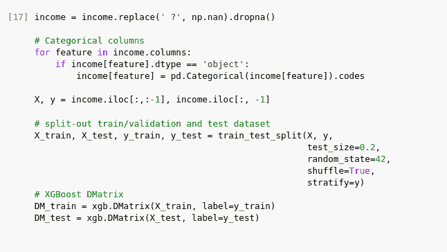
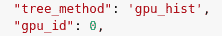
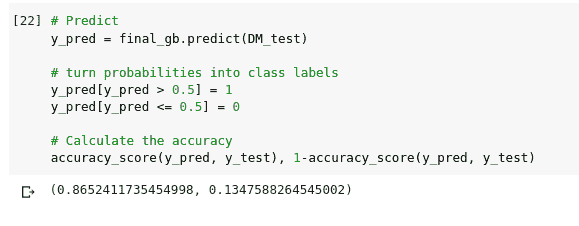
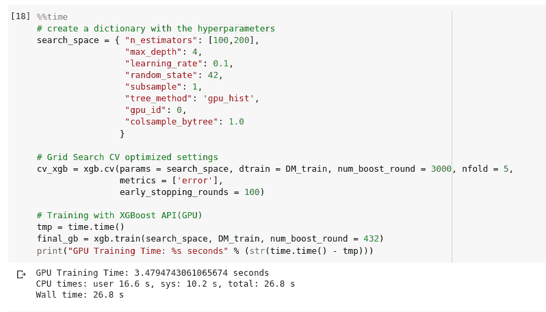
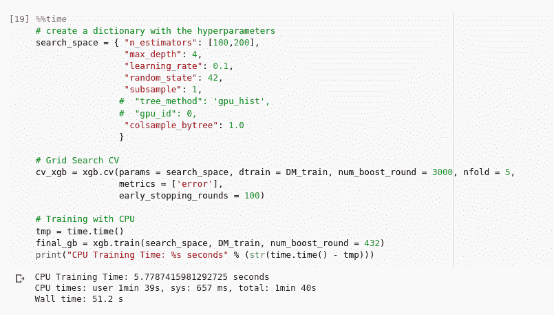

# 集成方法:使用 XGBoost 模型和 API 实现协同工作的 GPU

> 原文：<https://medium.com/analytics-vidhya/ensemble-methods-using-xgboost-model-and-api-to-enable-the-colaboratory-gpu-2da67fcc8281?source=collection_archive---------17----------------------->

图 1

# 提升和问题激励

**Boosting** (原称假设提升)是指任何可以将几个弱学习者组合成一个强学习者的集成方法。大多数 boosting 方法的一般思想是顺序训练预测器，每个预测器都试图纠正其前任。XGBoost 是梯度提升决策树的实现，旨在提高速度和性能。

问题动机是美国的个人收入。数据([加州大学欧文分校网站](http://archive.ics.uci.edu/ml/datasets/Adult) ) 来自 1994 年的人口普查，包含个人的婚姻状况、年龄、工作类型等信息。目标栏(我们要预测的)是个人年收入是小于等于 50k，还是大于 50k。我的目标是使用 XGBoost API 进行机器学习工作流，因此使用 GPU 我可以以更快/更有效的方式实现良好的性能。

# **管道描述**

首先，我们用熊猫获取数据，对她进行处理。因为我的目标是关注 XGBoost API 的使用，所以我做了一个简单的管道。我在 dataframe 中观察到的一个问题是未知数据被标上了问号(`？`).所以我删除了包含这些未知数据的行。除此之外，输入 data.info()我们可以看到一些分类列，所以我使用 pd 来处理它们。pandas 的 categorial()，它在分类列中应用序号编码。

之后，我使用 *train_test_split* 分离出训练/验证和测试数据集，并创建了一个 DMatrix，因为我们使用的是 XGboost API。DMatrix 最初对数据进行排序，以便在构建树时针对 XGBoost 进行优化，这使得算法更加高效。

图 2

然后，我用超参数创建了一个字典，并进行超参数组合，在 XGBoost API 的交叉验证中将字典作为参数传递。超参数包括 XGBoost 模型超参数和其他两个支持 GPU 使用的参数:

图 3

之后，我训练了模型，进行了预测，并计算了准确度，在将从预测中获得的概率转换为模型的类别标签后，准确度约为 0.86。

图 4

# 结论

用 pandas **time** 库测量训练和交叉验证部分花费的时间，我可以意识到使用 XGBoost API 确实提高了速度，因为使用 GPU 花费的时间是 26.8 秒，而使用 scikit learn(CPU)花费的时间是 1 分 40 秒。

图 5

图 6

现在，您可以使用 XGBoost 模型 API 加快启用 GPU 的训练时间。请注意，还有许多方法可以提高模型性能(比如我们之前计算的精确度)，但这不是我们这里的重点。

**结束。**