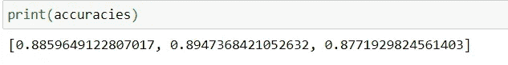
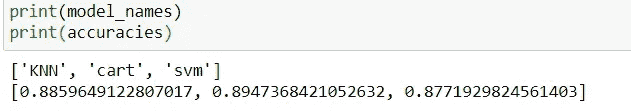
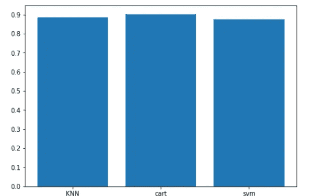
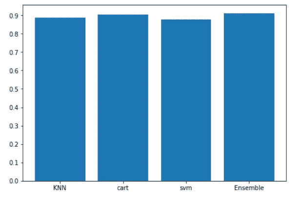
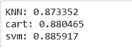
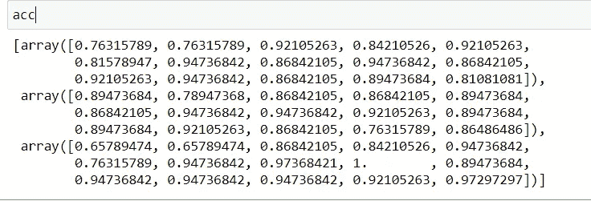
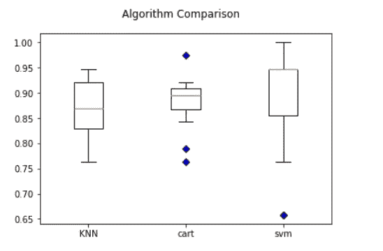
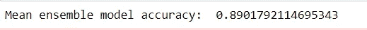
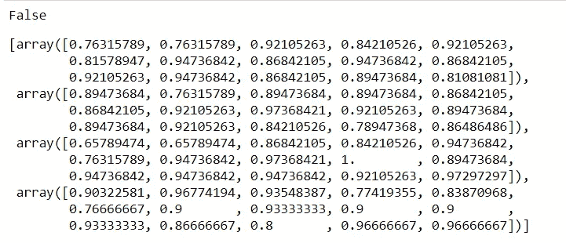
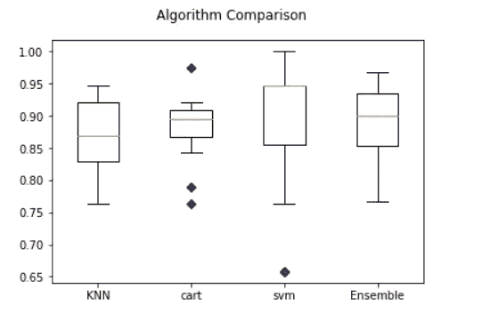

# 集成模型:数据可视化

> 原文：<https://medium.com/analytics-vidhya/ensemble-model-data-visualization-2f4cb06859c1?source=collection_archive---------23----------------------->


威廉·艾文在 [Unsplash](https://unsplash.com?utm_source=medium&utm_medium=referral) 上的照片

这是我上一篇文章的第 2 部分(整体建模——如何在 python 中执行)。为了更好地理解这篇文章，请查阅我以前的文章。谢谢你😊。

[](/analytics-vidhya/ensemble-modelling-in-a-simple-way-386b6cbaf913) [## 以简单的方式集合建模。

### 嘿大家好！这是 Shivani Parekh。我将向你解释如何使用集合模型来预测更多…

medium.com](/analytics-vidhya/ensemble-modelling-in-a-simple-way-386b6cbaf913) 

因此，让我们从可视化不同模型并比较其准确性的教程开始。这里我们采用了 **KNN、决策树和 SVM 模型。**

让我们回忆一下，在以前的文章中，我们使用“accuracys”命名列表来分别存储上述模型的精度。

让我们看看它包含了什么。



> 注意:我们在这里没有单独使用训练集和测试集，我们使用 train_test_split()，这是因为每次我们使用这个 split 函数时，训练集和测试集都会在一个随机点被拆分。因此准确性将根据训练和测试集值不断变化。

现在 model_names 是另一个空的，它将包含模型的名称。这个列表将帮助我们更好地绘图。

```
model_names=[] *#empty list*
for name, model in estimators:
    model_names.append(name)
```



# **标图条标图**

```
import matplotlib.pyplot as plt
fig = plt.figure()
ax = fig.add_axes([0,0,1,1])
ax.bar(model_names,accuracies)
plt.yticks(np.arange(0, 1, .10))
plt.show()
```



line ax.bar()函数创建条形图，这里我们将模型名称指定为 X，精度指定为高度。还可以提及各种其他参数，例如宽度、底部、对齐。

我们甚至可以通过使用下面的代码将集合模型各自的名称和准确度添加到 model_names 和 accuracy 列表来比较集合模型的准确度，并再次运行上面的代码。

```
#adding accuracy of ensemble for comparisonif “Ensemble” not in model_names:
 model_names.append(“Ensemble”)
if ensem_acc not in accuracys:
 accuracys.append(ensem_acc)
```



正如我们可以很容易地看到，系综具有最高的准确性，如果我们更仔细地比较，我们可以看到，SVM 模型给出了最低的准确性。

现在让我们看看如何绘制一个盒状图。

在这里，我们使用 kfold 交叉验证来拆分数据并测试模型的准确性。我们将获得每个模型的多重精度。

在这里，我们将数据分成 15 份，因此它将数据分成 15 组，并测试模型 15 次，因此将获得 15 种不同的精度。最后，我们取这个精度的平均值，知道模型的平均精度是多少。

```
acc=[] #empty list
names1=[]
scoring = ‘accuracy’#here creating a list "acc" for storing multiple accuracies of each model.
for name, model in estimators:
 kfold=model_selection.KFold(n_splits=15)
 res=model_selection.cross_val_score(model,X,target,cv=kfold,scoring=scoring)
 acc.append(res)
 names1.append(name)
 model_accuracy = “%s: %f” % (name,res.mean())
 print(model_accuracy)
```



为了阐明我的观点，让我们看看“acc”列表有什么！



# **标绘框标绘**

```
blue_outlier = dict(markerfacecolor=’b’, marker=’D’)
fig = plt.figure()
fig.suptitle(‘Algorithm Comparison’)
ax = fig.add_subplot(111)
plt.boxplot(acc,flierprops=blue_outlier)
ax.set_xticklabels(names1)
plt.show()
```



这些蓝色的点是异常值。延伸方框的线是胡须，水平的橙色线是中线。

```
k_folds = model_selection.KFold(n_splits=15, random_state=12)
ensemb_acc = model_selection.cross_val_score(ensemble, X_train, target_train, cv=k_folds)
print(ensemb_acc.mean())
```



```
if “Ensemble” not in names1:
 names1.append(“Ensemble”)from numpy import array, array_equal, allclose

def arr(myarr, list_arrays):
 return next((True for item in list_arrays if item.size == myarr.size and allclose(item, myarr)), False)print(arr(ensemb_acc, acc))if arr(ensemb_acc, acc)==False:
 acc.append(ensemb_acc)
acc
```



现在，通过再次运行上面的代码来绘制箱线图，我们得到



您甚至可以使用不同的参数定制您的箱线图，例如 patch_artist= True 将显示带有颜色的箱线图，notch=True 将显示箱线图的凹口格式，vert=0 将显示水平箱线图。

以下是完整的代码:

> 上一篇文章中代码的链接:
> 
> [https://medium . com/analytics-vid hya/ensemble-modeling-in-a-simple-way-386 B6 cbaf 913](/analytics-vidhya/ensemble-modelling-in-a-simple-way-386b6cbaf913)

我希望你喜欢我的文章😃。如果你觉得这很有帮助，那么看到你为我鼓掌来感谢我的努力工作将会非常好👏👏。谢谢你。