# 整体建模-如何在 python 中执行？

> 原文：<https://medium.com/analytics-vidhya/ensemble-modelling-in-a-simple-way-386b6cbaf913?source=collection_archive---------11----------------------->

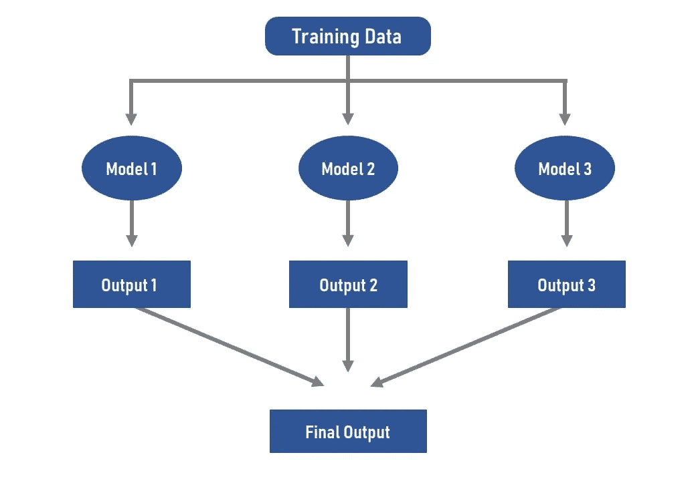

集合模型-作者图片。

嘿！这是 Shivani Parekh。我的这篇文章将讨论如何使用集成方法将不同的机器学习模型结合在一起，并提高模型的整体准确性。

什么是集合建模，我们为什么要使用它？

集成建模是将两个或多个模型组合在一起，然后将结果合成为单个得分。单一模型可能会有偏差、高度可变性或不准确性，影响其分析结果的可靠性，因此集成模型可以用来改善所有这些。

我们将使用乳腺癌数据集，该数据集可在 https://www . ka ggle . com/merishna suwal/breast-cancer-prediction-dataset 找到

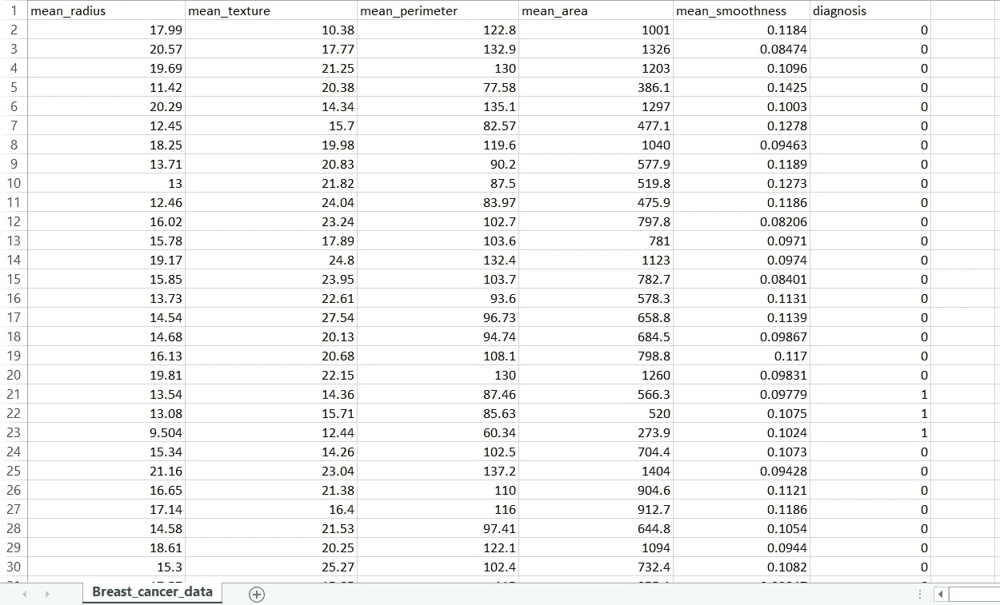

乳腺癌数据集概述

正如我们所看到的，在这个数据集中有 6 个特征，其中我们的目标特征是诊断。我们将预测女性是否患有乳腺癌。诊断有两个值，0 和 1。
0 表示没有乳腺癌，1 表示有乳腺癌。

因此，我们将从导入进行预测所需的重要库开始。

```
import pandas as pd
import numpy as np
import matplotlib.pyplot as pltfrom sklearn import model_selectionfrom sklearn.linear_model import LogisticRegression
from sklearn.tree import DecisionTreeClassifier
from sklearn.neighbors import KNeighborsClassifier
from sklearn.svm import SVC
from sklearn.ensemble import VotingClassifierfrom sklearn.metrics import classification_report , confusion_matrix ,accuracy_score
```

很好，我们正在使用 pandas(数据分析和操作工具)，numpy 来处理数组，matplotlib.pyplot 来绘制图形，sklearn(机器学习库-包含所有 ML 算法)，sklearn.metrics 模块包括得分函数、性能度量和成对度量以及距离计算。

接下来，让我们使用 pandas 读取 csv 文件，并使用 pandas 的 head()方法显示文件的内容。

```
dataset=pd.read_csv(“D:\\Breast_cancer_data.csv”)
dataset.head()
```

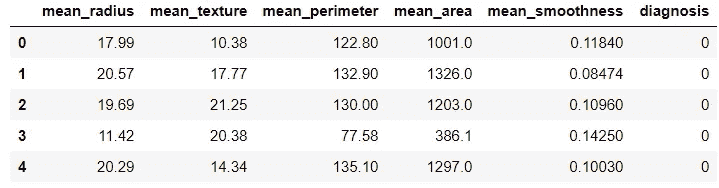

现在，让我们通过使用 iloc 仅选择 X 中的前 5 列和可变目标中的目标(诊断),将目标特征从该数据帧中分离出来。

```
X=dataset.iloc[:,0:5]
print(X)
target=dataset.iloc[:,5]
print(target)
```

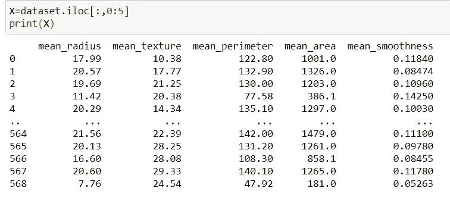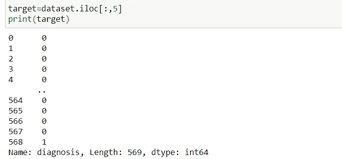

现在，使用 train_test_split()方法将数据集分成训练和测试。test_size 取分割值，这里是 20%，所以 80%是训练数据，20%是测试。

```
from sklearn.model_selection import train_test_split
X_train, X_test, target_train, target_test = train_test_split(X, target, test_size = 0.20)
```

现在我们将采用单个模型并预测其准确性。
这里使用了 K-最近算法。n_neighbors 指定要使用的邻居数量。

```
#creating empty lists
estimators=[] #will store model names and its classifier instance.
accuracys=[] #will store accuracy of each model.model1=KNeighborsClassifier(n_neighbors=3)#adding model1 to list, this step is performed for ensemble method.
estimators.append((“KNN”,model1))model1.fit(X_train,target_train)target_pred1=model1.predict(X_test)KNNacc=accuracy_score(target_test,target_pred1)
print(“KNN acc:”,KNNacc)#adding accuracy of this model to list,this step is performed for data visualization.
accuracys.append(KNNacc)
```

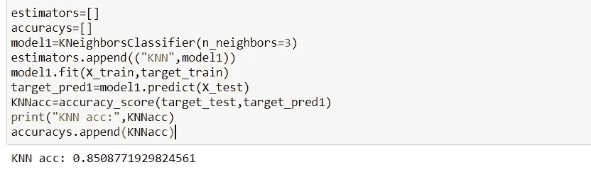

我们可以看到，KNN 模型给出了 0.8508 的精度。

现在 model1.fit(X_train，target_train)是做什么的？
根据训练数据训练模型。
model 1 . predict(X _ test)是做什么的？
它对测试数据进行预测，这里是 X_test。

同样，我们将使用我们正在使用的其他两个模型，即 DecisionTreeClassifier()和 SVC()，对其他预测进行同样的操作。

```
model2=DecisionTreeClassifier()
estimators.append((“cart”,model2))
model2.fit(X_train,target_train)
target_pred2=model2.predict(X_test)
Dtacc=accuracy_score(target_test,target_pred2)
print(“Decision Tree acc:”,Dtacc)
accuracys.append(Dtacc)model3=SVC()
estimators.append((“svm”,model3))
model3.fit(X_train,target_train)
target_pred3=model3.predict(X_test)
SVMacc=accuracy_score(target_test,target_pred3)
print(“SVM acc :”,SVMacc)
accuracys.append(SVMacc)
```

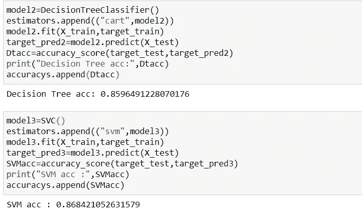

决策树精度是. 8596，SVC 精度是. 8684。

因此，这是我们将在这里使用集成方法 VotingClassifier()的部分。这里将采用参数 estimators=estimators(因为列表名称相同)。让我们回想一下，估计器有 3 种模型，即 KNN，决策树，SVC。

```
ensemble=VotingClassifier(estimators)
ec=ensemble.fit(X_train,target_train)
target_pred=ec.predict(X_test)
print(target_pred)
```

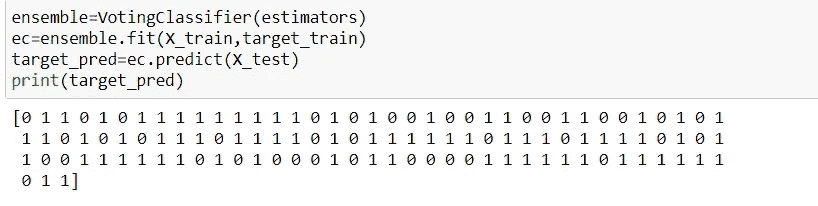

在上面我们已经创建了一个单一的模型，该模型基于该类收到的最高多数的投票来预测输出类。

让我们以一种简单的方式看到预测值和实际值，这样我们就可以比较它。

```
df=pd.DataFrame({‘Actual’:target_test, ‘Predicted’:target_pred})
df.head(20)
```

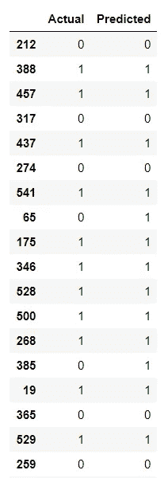

使用 accuracy_score(target_test，target_pred)和混淆矩阵来检查集合的准确性，我们还可以使用分类报告来检查性能，该报告为我们提供了精确度、召回率、f1 分数和支持。

```
ensem_acc=accuracy_score(target_test,target_pred)
print(“Accuracy of ensemble model is :”,ensem_acc)
print(confusion_matrix(target_test,target_pred))
print(classification_report(target_test,target_pred))
```

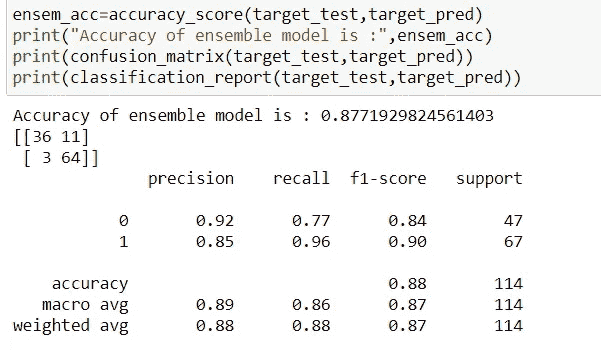

所以这里我们可以看到集合模型的精度是. 8771。明显比其他型号多。

```
print(“KNN acc:”,KNNacc)
print(“Decision Tree acc:”,Dtacc)
print(“SVM acc :”,SVMacc)
print(“Ensemble acc:”,ensem_acc)
```

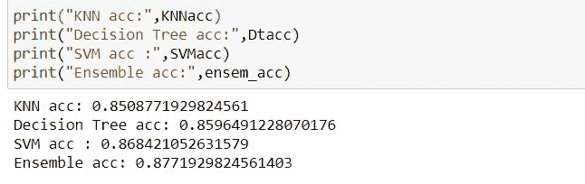

这是完整的代码。

所以差不多就是这样了。在下一篇文章中，我将向您展示这个模型的可视化和准确性比较。

我希望你喜欢我的文章😃。请欣赏我的努力，如果可能的话，请为我鼓掌👏👏。谢谢你。