# 集合模型:装袋和增压

> 原文：<https://medium.com/analytics-vidhya/ensemble-models-bagging-boosting-c33706db0b0b?source=collection_archive---------3----------------------->

## KNIME 分析平台的理论与实践

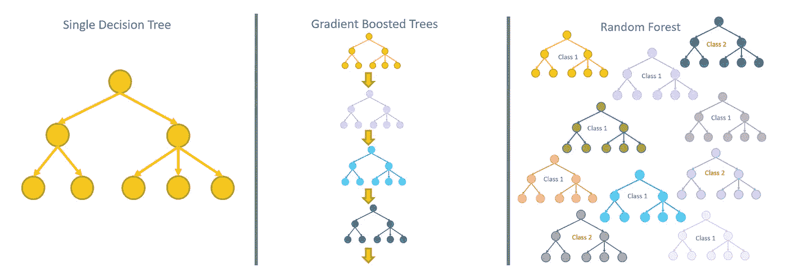

集成模型结合了多种学习算法，以提高每种算法单独的预测性能。集成模型有两种主要策略——bagging 和 boosting——以及许多预定义集成算法的示例。

**Bootstrap aggregation**n，或简称为 **bagging** ，是一种集成元学习技术，它在训练数据的不同分区上训练许多分类器，并使用所有这些分类器的预测组合来形成输入向量的最终预测。

**Boosting** 是另一种基于委员会的合奏方法。它在两个步骤中都与权重一起工作:学习和预测。在学习阶段，增强过程多次训练新模型，每次将新模型的参数调整到目前已有的增强模型的误差。在预测阶段，它根据模型预测的加权组合提供预测。

# 制袋材料

该集成技术由 Breiman 于 1994 年提出[1]，可用于许多预测模型。

当我们为一个模型定型时，最终的预测和模型参数取决于用于定型集的数据分区的大小和组成。特别是，如果训练过程以过度拟合[2]训练数据而结束，最终模型和预测可能会非常不同。我们说，在这种情况下，就参数和预测而言，*模型方差*非常高。因此，装袋技术的最终效果是减少模型方差，从而使预测过程更加独立于噪声。

# 装袋技术实施

1. *N* 训练子集通过以下方式创建:

*   *p* ≤ *n* 从 *n* 个数据样本的原始训练集中抽取的有或无替换的引导数据样本
*   *q* ≤ *m* 数据集的原始 *m* 维度的属性

2.在每个引导训练子集 *T = 1，…，N 上训练预测模型 *hT(x)* 。这导致最终的集成模型 *H(x) = {hT(x)，T = 1，…，N}**

3.为了应用集合模型 *H(x)* ，所有预测模型 *hT(x)* 都在输入数据样本 *x* 上运行。

集合 *H(x)* 的最终预测基于所有模型 *hT(x)* 产生的预测的组合。

4.在分类问题中，可以使用多数投票或平均班级分数。多数票把大多数模型预测的类 *hT(x，ci)* 作为最终类。平均类得分取所有模型上计算的最高平均得分预测的类 *hT(x，ci)* ，即:

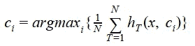

5.在数值预测问题中，使用在所有模型 *hT(x)* 上计算的平均值，即

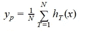

# 树系综和随机森林

最著名的集合装袋模型当然是随机森林。随机森林是一种特殊类型的决策树集成。

决策树的集成模型训练了多个 *T* 决策树，每个决策树位于 *p* ≤ *n* 行和/或 *q* ≤ *m* 列的不同子集上，在每次迭代中随机选择替换。最终的模型是一个由 *T=1，…，N* 稍微不同的决策树组成的集合。

此外，Random forest 还修改了决策树的训练算法，以便在每个决策树的每次分裂中允许不同的 *q < m* 输入特征子集。通常[3]:

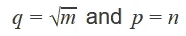

其中 *m* 和 *q* 分别为输入维数的原始数和提取数 *n* 和 *p* 分别为数据样本的原始数和提取数。

测量随机森林预测误差的一个常用度量是出袋(OOB)误差。Out-of-bag error 是对不存在于引导训练子集中的所有训练样本 *xj* 计算的平均预测误差。

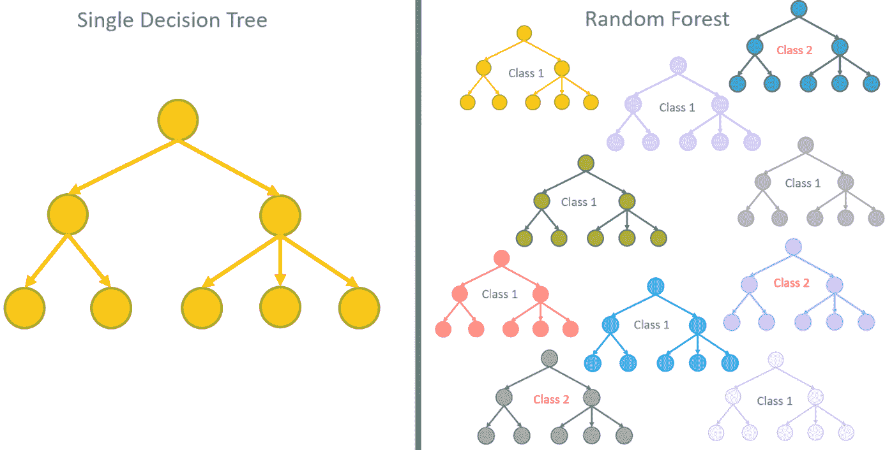

*图一。在树集合中，在稍微不同的训练集上训练的多个树被组合在一起成为更强的模型。*

# 预包装装袋模型

[KNIME 分析平台](https://www.knime.com/knime-analytics-platform)有两个预打包的 bagging 算法:树集成学习器和随机森林。两种算法都处理决策树的集合。不过随机森林会对其应用随机森林变体。

两个节点集都引用一个分类设置，这意味着数字或分类/名义输入，但只针对目标类的分类/名义输出。作为监督模型处理分类问题，KNIME 实现依赖于学习者预测器基序，就像所有其他监督算法一样(图 2)。

就配置而言，树集合学习器节点比随机森林学习器节点允许配置更多的自由参数。例如，树集成学习器节点允许用户设置提取的数据样本的数量、输入特征的数量和决策树的数量；而随机森林只允许用户设置决策树的数量。两个预测器节点都允许将多数投票(默认)或最高平均概率(软投票)设置为最终类的决策策略。

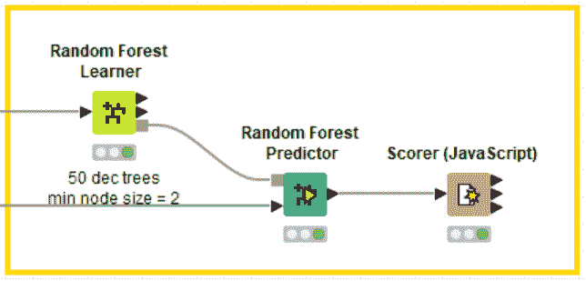

*图二。学习器——随机森林算法的预测器主题，适用于在* [*KNIME 分析平台*](https://www.knime.com/knime-analytics-platform) 中实现的所有监督模型

注意两个学习器节点的三个输出端口:一个是模型(下端口)；一个是袋外(OOB)预测(顶部端口)；一个是属性统计(中间)。

属性统计作为输入要素重要性的一种测量方法非常有用。事实上，一个属性被集合中的不同树用来分割数据集的次数表明了该属性的重要性。例如，如果“年龄”比“性别”被更多的树使用，这可能意味着它的信息对区分训练集中的类更有用。如果考虑到拆分级别，就更是如此。与树中后来的分割相比，最开始的分割更普遍，更不容易使数据溢出。因此，检查属性在树中较早被选择来分割数据集的次数是其重要性的良好指示。

类似地，但是在较低程度上，属性在集合中的树的早期级别中被选择作为分裂候选的次数可以被认为是输入属性对于最终分类的重要性的度量。

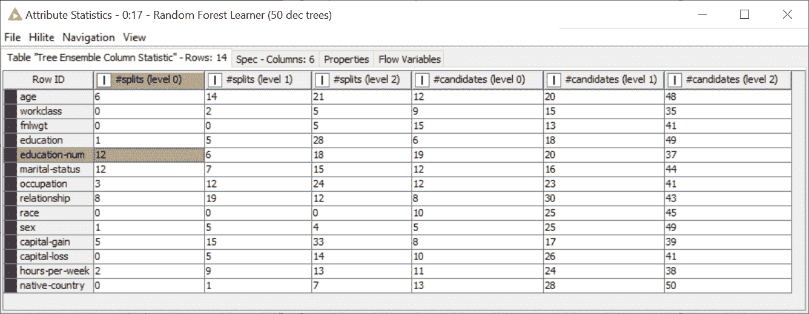

*图 3。随机森林的属性统计。在这里,“教育人数”和“婚姻状况”是最常被选择来分裂系综决策树的根节点。*

请注意，类似的节点可用于数值预测问题:随机森林学习器/预测器(回归)和树集成学习器/预测器(回归)节点。

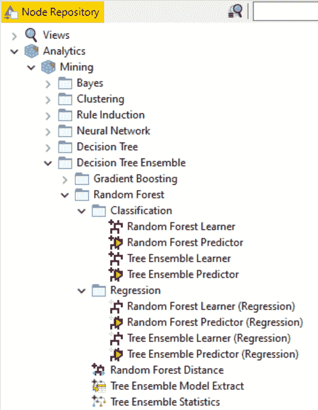

*图 4。KNIME 分析平台中用于分类和回归的随机森林和树集合的节点*

# 定制装袋模型

然而，bagging 是一种通用的集成策略，可以应用于决策树之外的其他模型。要制作你自己的 bagging 集合模型，你可以使用名为“Bagging”的元节点。

“Bagging”元节点构建模型，即实现过程的训练和测试部分。双击元节点将其打开。在里面，你可以找到两个循环:第一个循环在训练数据上训练模型的袋子；第二个循环将所有模型应用于测试数据，并使用多数投票(投票循环结束节点)来决定最终的类。

这意味着几件事:

*   两个输入端口，一个用于训练集，一个用于测试集
*   一个用于测试集预测的输出端口
*   只有分类问题，因为我们使用多数票作为决策标准

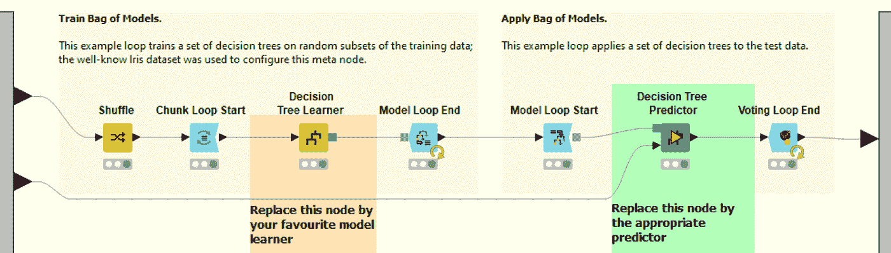

*图 5。元节点“Bagging”的内容。*

集成的默认模型是决策树。只要将适当的学习器和预测器节点放置在元节点中，就可以使用任何其他模型。

用于集合的模型的数量在块循环开始节点中决定。对于 N 个模型，块循环开始节点在训练集的 1/N 部分上训练它们中的每一个。所有模型都由模型循环结束节点收集。类似地，所有模型都由模型循环开始节点检索。

这个元节点中的子工作流片段可以被重用，以形成我们想要创建的集成的学习器和预测器节点。

# 助推

助推是另一种基于委员会的方法。这里的想法是在连续的步骤中添加多个弱模型来改进预测任务。弱模型通常是具有很少参数的轻量模型，并且仅训练几次迭代，例如浅决策树。由于其弱特征，该模型只能在训练集中的一些数据上表现良好。因此，在每一步，我们都添加一个更弱的模型来关注前一组模型的错误。

这种方法有几个优点。第一个是记忆。例如，与同时训练许多更强模型的随机森林相比，仅对数据子集进行几次迭代的小模型在每一步需要更少的内存。第二个优势是弱模型的专业化。一般来说，它们的性能可能不好，但是在某些类型的数据上，它们的性能很好。因此，它们中的每一个都可以在决策过程中得到适当的加权。

# 助推技术实现

Boosting 被引入到数值预测任务中。通过将类别概率作为预测值来考虑，可以将其扩展到分类。

boosting 算法逐阶段构建模型。在第*次*迭代中，一个简单的模型 hm(x)被添加到先前建立的整体模型中:

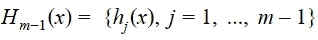

并且它适合于预测从先前的第*(m-1)*次迭代可获得的模型 Hm-1(x)的残差。

在每个阶段 *m* ， *1 ≤ m≤ M* ，存在一个不完美模型 *Hm-1(x)* 来逼近训练集中相应属性向量 *x* 的期望目标值 *y* 。模型预测值 *Hm-1(x)* 与实际目标值 *y* 之间的误差或残差为 *(y-Hm-1(x))* ，相应的损失函数为该残差的函数*L**L(y，Hm-1(x))* 。

在当前模型 *Hm-1(x)* 中添加了附加的基本学习器 *hm(x)* 以拟合这些残差值，从而创建了新模型 *Hm(x) = { Hm-1(x)，hm(x)}* 并且拟合了模型 *hm(x)* 以最小化损失函数 *L(y，Hm-1(x)】*。

因此，在 *M* 次迭代之后，将所有模型组合成一个加权和，我们得到最终模型:

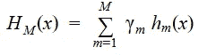

其中 *HM(x)* 是经过 *m = 1，…，M* 次迭代后的最终模型， *hm(x)* 是基学习器， *Hm(x)* 是最终模型在每次迭代 *m* 时的不同近似。

在每次迭代中 *m，*boosting 算法:

1.  从在前一次迭代中构建的训练集开始 *m-1*
2.  训练一个新型号 *hm(x)* 。
3.  评估训练集的模型错误
4.  基于这样的误差计算模型权重。
5.  最后，通过对错误/正确预测的训练样本进行过采样/欠采样来构建新的训练集。过采样/欠采样因子来源于模型权重。

第一次迭代的训练集是整个训练集。

当达到最大迭代次数 *M* 或模型误差太大(即权重太接近 0，因此相应的模型无效)时，算法停止。

该学习阶段的输出是多个模型，低于或等于所选的最大迭代次数。

请注意，boosting 可以应用于任何训练算法。但是，它在弱模型的情况下特别有帮助。事实上，boosting 技术对噪声和异常值非常敏感，也就是对过拟合非常敏感。

预测阶段在所有模型上循环，并基于分类的多数投票和数值预测任务的加权平均值提供预测。

# 梯度增强树

梯度增强树是将多个顺序简单回归树组合成更强模型的集成模型。通常，固定大小的树被用作基础(或弱)学习器。

为了简化过程，选择回归树作为基学习器，使用梯度下降算法最小化损失函数。

该算法的修改[5]为树的每个叶子选择单独的最优权重值，而不是为整个树选择单个权重，其中选择权重以最小化仅落在该叶子中的训练数据的损失函数。

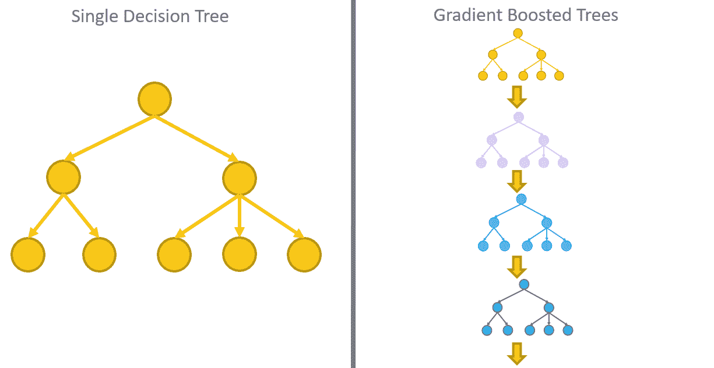

*图 6。在梯度增强树中，多个顺序简单回归树被组合成一个更强的模型。每棵树都是在来自先前树序列的残差上训练的。然后使用一个附加模型将所有的树组合在一起，其权重通过梯度下降过程来估计。*

# 预包装的增压模型

[KNIME 分析平台](https://www.knime.com/knime-analytics-platform)基于回归树，提供了一些实现梯度提升树算法的节点。同样，对于所有其他监督算法，KNIME 实现依赖于学习器预测器基序(图 7)。

就配置而言，梯度增强树学习器(回归)节点允许设置回归树的数量、每棵树的深度和学习率作为每棵树的权重。

请注意，KNIME Analytics 平台中的梯度增强树实现也包含了树集成范例的一些元素。事实上，在配置窗口的“高级”选项卡中，您可以为用于训练每个回归树的数据子集设置提取策略。

梯度增强树预测器(回归)线性组合每棵树的输出，并输出最终值。

类似地，梯度增强树学习器和梯度增强树预测器节点处理用于分类的回归树的增强，将回归树的输出解释为类概率。

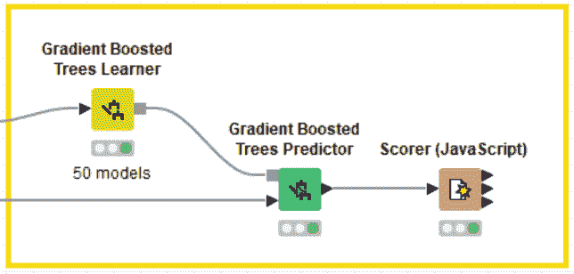

*图七。学习器—梯度提升树算法的预测器基元，适用于在* [*KNIME 分析平台*](https://www.knime.com/knime-analytics-platform) 中实现的所有监督模型

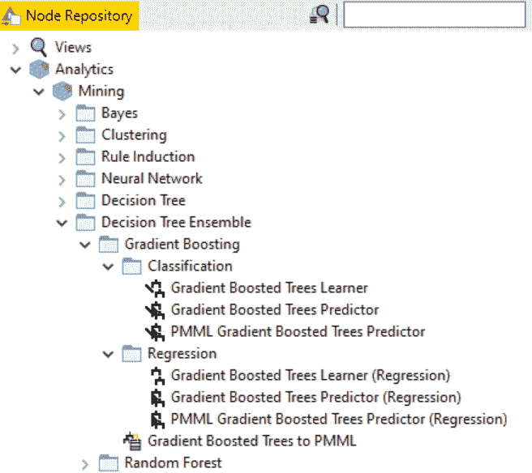

*图 8。KNIME 分析平台中用于分类和回归的梯度提升树的节点*

# 定制增压模型

至于 bagging 技术，KNIME Analytics Platform 还提供了用不同的模型定制你的助推策略的可能性，而不仅仅是决策树。事实上，KNIME 分析平台实现了 Adaboost，这是最常用的提升算法之一，在“挖掘->集成学习”类别中有两个元节点:“提升学习器”和“提升预测器”元节点。

“促进学习者”元节点(图 9)通过“促进学习者循环开始”节点和“促进学习者循环结束”节点实现学习循环。

“增强学习者循环结束”节点设置最大迭代次数、目标列和预测列。目标列和预测列用于:

-识别错误分类的模式

-计算模型误差

-计算模型重量

“提升学习者循环开始”节点使用模型权重和误分类模式来改变训练集的组成。

循环体包括任何受监督的训练算法节点，如“决策树学习器”或“朴素贝叶斯学习器”(默认)，及其相应的预测器节点。预测器节点是必需的，即使这是一个学习元节点，因为在每次迭代中，需要识别正确和不正确分类的模式以及计算模型误差。

对于每次迭代，boosting 循环输出模型、其误差和其权重。

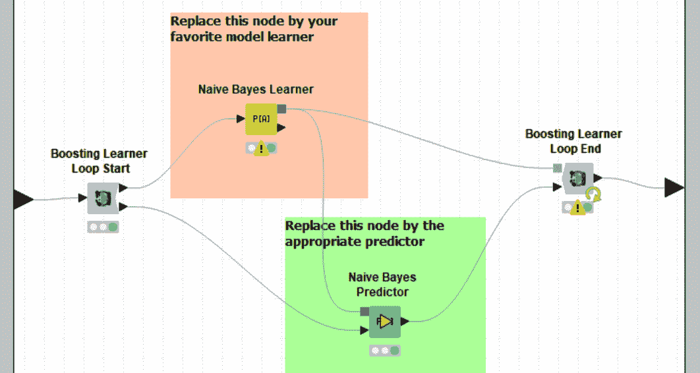

*图 9。元节点“助推学习者”的内容*

“增强预测器”元节点从学习器节点接收模型列表和输入数据。对于每个数据行，它在所有模型上循环，并权衡它们的预测结果。

“增强预测器循环开始”节点通过识别权重列和模型列来开始增强预测器循环(请参见其配置窗口中的设置)。

“增强预测器循环结束”节点对所有模型结果实施多数表决，并将最终值分配给输入数据行。其配置窗口需要识别预测列。

循环体必须包括在学习节点中选择的挖掘模型的预测值。

# 结论

在本文中，我们试图解释装袋和助推程序背后的理论。我们还展示了它们最著名的实现，依赖于决策树:树集合、随机森林和梯度提升树。

我们还展示了专用节点和可定制节点，用于在 [KNIME 分析平台](https://www.knime.com/knime-analytics-platform)中训练和应用预打包或定制的打包或增强算法。

此处显示的所有示例都收集在工作流“[随机森林、梯度增强树和树集合](https://kni.me/w/LScZ19IMhPT-Rxnr)”中，可从 [KNIME Hub](https://hub.knime.com/) 免费下载。

# 参考

[1] L .布雷曼。打包预测值。*机器学习*，24:123–140，1996。

[2]伯纳姆，K. P。安德森博士，*模型选择和多模型推理*(第二版。)，施普林格出版社，2002 年

[3]布莱曼。随机森林。*机器学习*，45:5–32，2001。

[4]田锦豪， [*随机决定森林*](https://web.archive.org/web/20160417030218/http:/ect.bell-labs.com/who/tkh/publications/papers/odt.pdf) *(PDF)* 。1995 年 8 月 14 日至 16 日在 QC 蒙特利尔举行的第三届国际文件分析和识别会议的会议录，第 278-282 页。

[5] Jerome H. Friedman，“贪婪函数逼近:梯度推进机”，《统计年鉴》，第 29 卷第 5 期，第 1189-1232 页(2001 年 10 月)

[6]杰罗姆·h·弗里德曼，《贪婪函数逼近:梯度推进机》(1999 年)