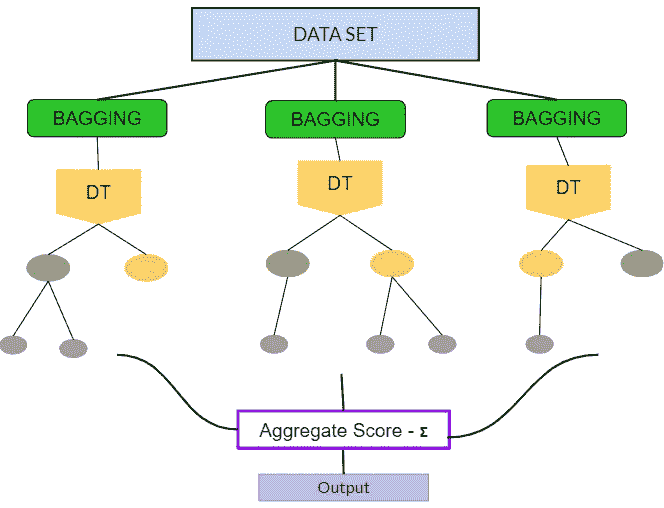
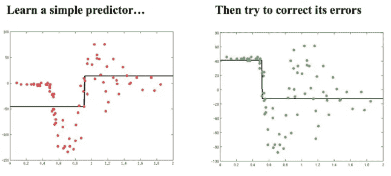

# 集合模型:装袋与助推

> 原文：<https://medium.com/analytics-vidhya/ensemble-models-baggings-vs-boosting-8affa6d18098?source=collection_archive---------8----------------------->

装袋和助推有什么区别？打包和提升是两种最常见的集成技术。

# 哪个更好？—装袋与增压

如果超参数被正确修改，Boosting 模型可以比 bagging 模型表现得更好。然而，这可能非常耗时。Bagging 模型更好地避免了过度拟合，但很少会得到更好的偏差。另一方面，boosting 可以生成误差较低的模型，但容易过度拟合。这是因为 boosting 更像是一个不断自我改进的单一模型，bagging 将并行运行几个模型。

# 制袋材料

bagging 也称为 bootstrap aggregation，它通过替换从训练数据集中获取样本，并为每个样本训练一个模型。数据集中的所有要素被选中的概率相等。Bagging 模型将独立运行，然后汇总输出。在 bagging 模型中，最终输出预测是所有子模型的平均值(例如树)正在运行。

两种最常见的装袋模型是(1)装袋决策树和(2)随机森林。

**袋装决策树**

决策树模型获取 X 个数据，并找到将这些数据分割成独立数据集的规则。在学习决策树的时候，我的大会讲师[马特·布雷斯](http://argmatt.com/)把运行这个模型比作一个有 20 个问题的游戏。基于这些数据(问题)，你的模型将计算出在每个节点上分割的最佳 X 变量。

与常规决策树相比，袋装决策树使用 N #棵树，并且每棵树用于其自己的引导样本。预测是基于全班的投票。

**随机森林**

随机森林类似于袋装决策树。与袋装决策树不同，随机森林试图消除树与树之间的相关性。随机森林模型不是在决策树中选择最佳分割点，而是只为每个分割考虑一个随机的要素子集。在随机森林中，树是平行的，树之间在建造时没有相互作用。

# 助推

Boosting 将运行一个模型，识别第一个模型中的薄弱学习者，然后尝试在下一个模型中加强这些学习者。两种最常见的增强模型是(1)AdaBoost 和(2)梯度增强。

**AdaBoost**

AdaBoost 代表自适应增压。

[来源](https://www.researchgate.net/figure/Training-of-an-AdaBoost-classifier-The-first-classifier-trains-on-unweighted-data-then_fig3_306054843)

最佳显示在图像中，AdaBoost 将运行其第一个模型，识别错误分类的项目，然后为下一个模型将更多权重放在这些错误分类的项目上。当下一个模型运行时，该模型承认先前模型的错误分类，并更新它们的权重以进行关注。与梯度下降相比，AdaBoost 逐渐向模型中加入预测因子，使模型更好。AdaBoost 的一个缺点是它不能并行化。

**梯度推进**

资料来源:由基弗·卡托维奇(科幻)、马特·布莱姆斯(DC)撰写的联大讲稿

梯度推进模型通过将先前的预测器误分类预测添加到集合中来工作，这确保了错误将被纠正。梯度推进模型将尝试将新的预测器拟合到由先前预测器产生的残差。

当运行第一梯度增强模型时，计算误差，并在下一个模型中用作目标变量。最后一个模型的预测与前一个模型的预测相结合。使用预测值和实际值计算新的残差。重复这个过程，直到误差不变或达到估计量的最大极限(超参数)。