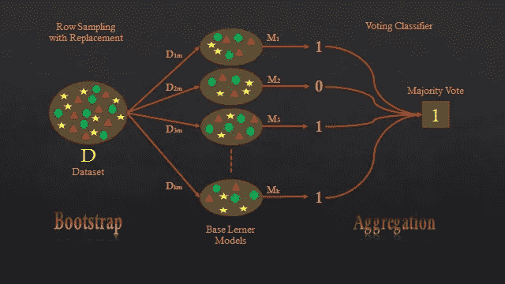

# 集成技术

> 原文：<https://medium.com/analytics-vidhya/ensemble-technique-37bd040ce9de?source=collection_archive---------18----------------------->

总体基本上意味着创建多个模型，然后将它们组合起来。我们试图利用多个模型(训练一个特定的数据集)，最后我们会得到输出。实际上，集成模型背后的原理是将弱学习器组合在一起并形成强学习器，这将增加模型的准确性。

有两种类型集合技术。

1.  打包(或引导聚合)
2.  助推

在这篇文章中，我将尝试用一种非常简单的方式来解释装袋技术。提升技术将在下一篇文章中介绍。

让我们开始学习装袋技术。

## **装袋技术**

下面举个例子来了解一下套袋技术。对于一个特定的问题陈述，我们有一个数据集(D ),它有许多行。

装袋技术

由于这是集成技术，所以我们将结合多个模型，如上图，有多个基础模型 M1，M2，M3，…Mk，并且每个模型将仅仅提供数据集的一个样本。在图 D1m，D2m，D3m，…..Dkm 是具有相同长度(m)的不同数据集。而这种数据的抽样称为*带替换的行抽样。*

正如我们所知道的 D1m，D2m，D3m，…..Dkm 是分别提供给 M1、M2、M3……Mk 基础学习者模型的数据集的不同样本。因此，假设基本学习者模型是二元分类器，因此每个模型将按照提供的样本数据集进行训练。

现在让我们测试我们的测试数据 D *test* 和每一款车型 M1、M2、M3……M *k* 将给出每个记录的一些结果(对于二进制分类器将是 0 或 1)，现在我们将使用*投票分类*并基于投票，将考虑模型给出的大多数投票。对于我们的例子，多数投票是 1，因此对于特定的测试数据集 D *test，输出将是 1。*

> 我们使用带替换的行抽样的步骤称为**引导**。
> 
> 而当我们使用投票分类器在多数的基础上考虑结果时叫做 ***聚合。***

## 随机森林

随机森林是装袋技术中的一种，我们不会深入研究随机森林，而是试图理解这种算法的结构。让我们看看下图。

随机森林

RS →带替换的行采样

FS →带替换的特征采样

d →数据集 D 中的行

m→数据集 D 中的特征

这里是 D1，D2，D3，…Dk 是样本数据集。数据集 D 的长度大于 D1，D2，D3，…黑暗的

长度 D >长度 D1，D2，D3，…Dk

d’→RS 中的行

m’→FS 中的特色

在随机森林中，所有基础学习者模型都将是 ***决策树模型*** 。所有模型都将使用样本数据集进行训练，每个 DT 模型都会给你一些结果(二元分类器为 0 或 1)，我们将使用投票分类器选择一个结果。

**现在还需要了解一件事，当我们在一个特定的随机森林中使用这么多决策树时，会发生什么？**

*   假设我们正在创建一个完整深度的决策树，因此它具有:

→ **低偏差**:意味着它正确地训练到训练数据集，所以*训练误差会非常非常小。*

→ **高方差**:意味着每当我们得到新的测试数据时，那些决策树容易产生大量错误。

简而言之，每当我们创建一个深度完整的决策树时，都会导致一种叫做 ***的过度拟合。***

那么在随机森林中发生了什么，我们使用了多个决策树，我们知道每个 DT 都有很高的方差。但是当我们根据多数投票来组合所有决策树时，那么高方差将被转换成 ***低方差。*** 表示误差会更小。

基本上，当我们使用 RS & FS 并为基础模型提供不同的数据集时，所有基础模型将进行训练，DT 倾向于成为关于特定样本数据集(RS，FS)的专家，并*将高方差转换为低方差*。

我们基本上是在争取多数票。我们不仅仅依赖于决策树的输出。这就是我们把所有的 DT 合并的原因，高方差转化为低方差。

*   结合 DT 需要理解还有一个好处。

如果我们更改测试数据集(例如，从 100000 条记录更改为 500 条记录)，它不会对 DT 的准确性或输出产生太大影响。这意味着无论何时我们改变测试数据，我们都会得到*低方差或低误差。*

所以，这些是随机森林最重要的性质。随机森林实际上在我们试图做的大多数机器学习用例中工作得非常好。

> 这是关于二元分类器的，现在假设我们有回归问题，那么 DT1，DT2，DT3，…DTk 是连续值，因此我们将采用该特定输出的平均值/中值/众数。

这是关于装袋技术的。希望你从这里有所收获，在接下来的文章中，我们将探索像 ADABoost，梯度提升和 XG 提升的提升技术。别走开，我很快会带着助推技术回来。

谢谢大家！！！