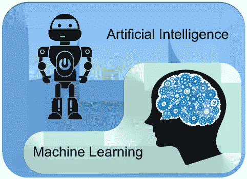
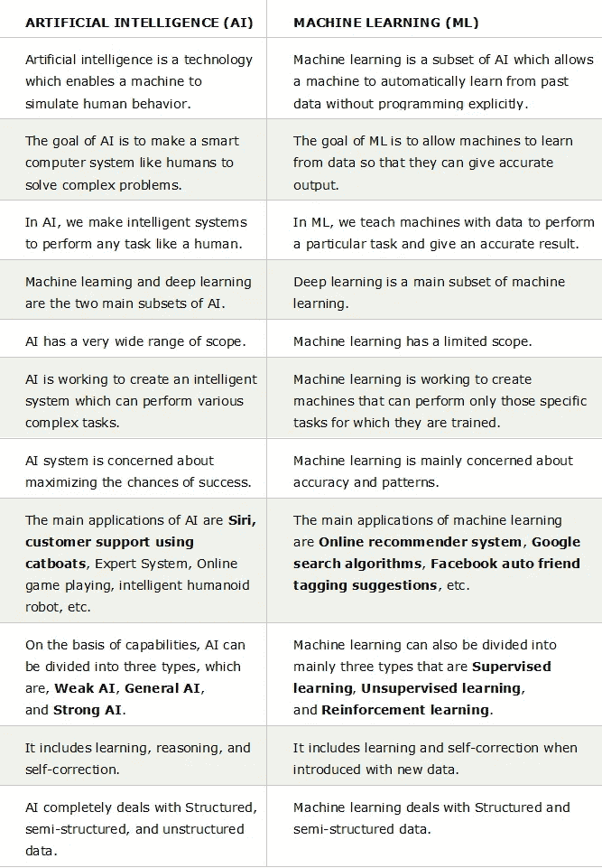
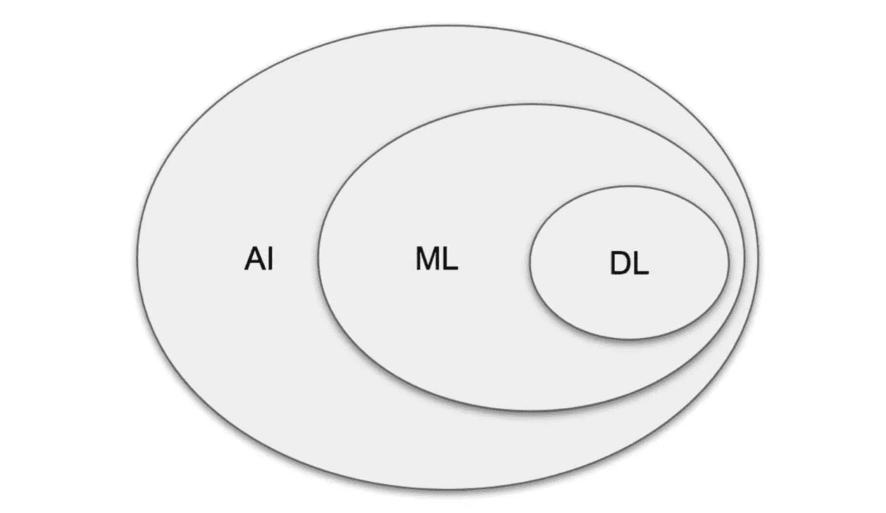
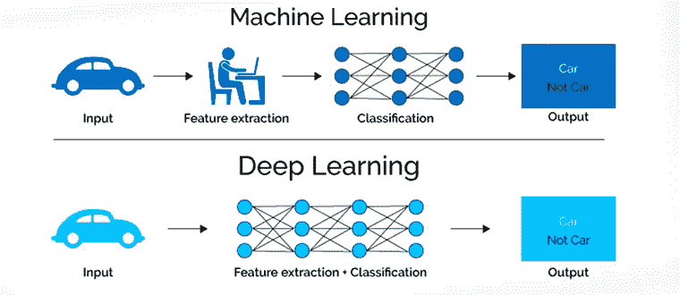

# 进入人工智能的世界！(AI、ML 和 DL)

> 原文：<https://medium.com/analytics-vidhya/entering-into-the-world-of-artificial-intelligence-ai-ml-and-dl-a831e9b2448e?source=collection_archive---------24----------------------->

在这个广阔的**人工智能** (AI)领域，人们通常会遇到的第一个词可能是**机器学习** (ML)。在流行文化中，机器学习是人工智能的一个子集，它使我们能够用数据训练机器，使它能够预测或分类我们提供的新数据。

人工智能的一个子集

AI 和 ML 是两个不同的术语。ML 只是 AI 的一个子集。 ***人工智能*** *是一种技术，利用它我们可以创建能够模拟人类智能的智能系统。*另一方面， ***机器学习*** *是人工智能的一个子领域，它使机器能够从过去的数据或经验中学习，而无需显式编程。*

AI vs ML

我已经简单介绍了人工智能和人工智能的主要区别。

现在，随着我们进一步深入讨论，我们遇到了另一个术语，称为**深度学习**或 **DL** 。深度学习相对于 AI 和 ML 来说是一个比较新的领域。*深度学习(DL)主要参与神经网络的构建，神经网络是由人工神经元组成的电路。*这个神经网络据说是模仿生物神经网络来训练机器的。

如今，递归神经网络( **RNN** )和卷积神经网络( **CNN** )等深度学习架构已经应用于计算机视觉、语音识别、自然语言处理( **NLP** )和医学图像分析等领域。

深度学习(DL)最初是机器学习(ML)的子集，主要应用于更大的数据集。因此，我们可以总结为 DL 是 ML 的子集，ML 是 AI 的子集。下图对此进行了说明。

AI vs ML vs DL

随着时间的推移，当数据变得庞大而复杂，ML 算法无法解决时，DL 变得越来越重要。随着时间的推移，随着数据越来越多，ML 模型(算法)的性能变得停滞不前(平台)。直到那时，深度学习才得到更多的认可。

为什么要深度学习？吴恩达幻灯片，版权所有。

DL 的另一个重要属性是，数据越多，模型越大，结果越来越好。这是数字图书馆在当今世界越来越重要的另一个主要原因。

为了清楚地了解 ML 和 DL 之间的差异，让我们考虑这样一种情况，我们必须用年龄、工资等特征来分类一个人是否会购买一件产品..

在训练 ML 模型时，我们必须手动将特征及其相关权重输入到训练数据中。

另一方面，在训练 DL 模型时，神经网络自动检测训练数据的每个特征的权重(重要性),并对客户是否会购买该产品进行分类。

ML vs DL

另一个常见的例子是“手电筒的例子”。假设我们有一个手电筒，我们训练一个 ML 模型在有人说“黑暗”时打开手电筒，ML 模型将分析人们说的不同短语，它将搜索单词“黑暗”并打开手电筒。

如果有人说“光线太暗，我什么也看不见”，这时用户想打开手电筒，但是句子中没有“黑暗”这个词，所以手电筒不会打开。这就是深度学习不同于机器学习的地方。如果它是一个深度学习模型，它将在手电筒上，DL 模型将能够从自己的计算方法中学习。

综上所述，我们可以说人工智能是一个总括术语，机器学习和深度学习是该领域的子领域，有助于实现人工智能。

希望我已经给出了 AI、ML、DL 的层次描述，并澄清了这些术语之间的基本不确定性。在那之前，祝编程愉快！