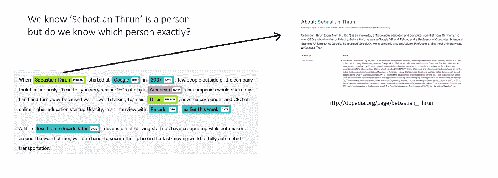

# 实体链接:信息抽取的主要自然语言处理任务

> 原文：<https://medium.com/analytics-vidhya/entity-linking-a-primary-nlp-task-for-information-extraction-22f9d4b90aa8?source=collection_archive---------1----------------------->

我敢肯定，你们大多数人都会遇到命名实体识别(NER)。NER 是一项基本的自然语言处理(NLP)任务，有着广泛的使用案例。这篇文章不是关于 NER，而是关于一个与 NER 密切相关的 NLP 任务。

你知道什么是命名实体链接(NEL)吗？它如何帮助信息提取，语义网 …