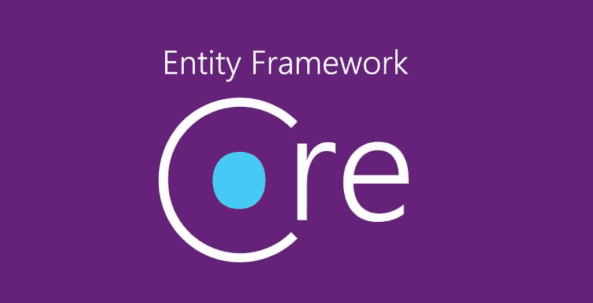

# 更好地了解实体框架核心—最佳实践

> 原文：<https://medium.com/analytics-vidhya/entityframework-core-dont-get-burnt-in-production-335ddfcfdfda?source=collection_archive---------0----------------------->

## 操作指南列表

## 以下是您今天应该使用的最佳实践列表

[显示代码(github)](https://github.com/NMillard/EFCoreLearnings)

当我发现新的实践时，我会继续更新这篇文章。

EntityFramework 是一个超级容易使用的 ORM 库。NET 开发人员。尽管它很容易使用…