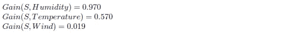

# 熵计算、信息增益和决策树学习

> 原文：<https://medium.com/analytics-vidhya/entropy-calculation-information-gain-decision-tree-learning-771325d16f?source=collection_archive---------0----------------------->

# 简介:

决策树学习是一种逼近离散值目标函数的方法，其中学习的函数被表示为 if-else/then 规则集，以提高人类的可读性。这些学习方法是归纳推理算法中最流行的，并已成功地应用于广泛的任务；从学习诊断医疗案例，到评估贷款申请人的信用风险。构建决策树最流行的算法是 ID3(迭代二分法 3)。其他的还有 ASSISTANT 和 C4.5 .这些决策树学习方法搜索一个完全表达的假设空间(所有可能的假设)，从而避免了受限假设空间的困难。他们的归纳偏向是偏爱小树而不是长树。

# 何时使用决策树:

记住，有许多分类器可以根据训练样本对未知实例进行分类。我们必须通过查看训练示例来了解哪个分类器最适合数据集。如果问题特征看起来像以下几点，决策树是最有效的-
1)实例可以用属性-值对来描述。2)目标函数是离散值的。

# 决策树的构建:

决策树通过从根节点到某个叶节点对实例进行排序来对实例进行分类。每个节点指定实例的某个 ***属性*** 的一个测试，从该节点向下的每个分支对应于该属性的一个可能值。我们的基本算法 ID3 通过自顶向下构建决策树来学习决策树，从问题“应该在树根处测试哪个属性？”为了回答这个问题，使用统计测试来评估每个属性，以确定它单独对训练示例进行分类的效果如何。最佳属性被选为树的根。我们的下一个任务是找到 root 之后的下一个节点。在这种情况下，我们希望再次选择对训练示例分类最有用的属性。然后重复这个过程，直到我们找到叶节点。
现在的大问题是，ID3 如何衡量最有用的属性。答案是，ID3 使用一种称为 ***信息增益*** 的统计属性，该属性测量给定属性根据训练示例的目标分类将它们分开的程度。一旦我们在下一节中获得了关于*}的一些知识，我们将更详细地讨论关于 ***【信息增益】*** 。*

**

*图 1:打网球的数据集，将用于训练决策树*

# *熵:*

*为了精确地定义信息增益，我们首先定义一个在信息论中常用的度量，叫做熵。熵基本上告诉我们一组数据有多不纯。术语不纯在这里定义了非同质性。换句话说，我们可以说，“熵是同质性的度量。它向我们返回关于任意数据集的信息，即数据集有多不纯/不均匀。”
给定一个样本/数据集 S 的集合，包含一些目标概念的正例和反例，S 相对于这个布尔分类的熵是-*

**

*为了说明这个等式，我们将做一个例子来计算图 1 中数据集的熵。数据集有 9 个阳性实例和 5 个阴性实例，因此-*

**

*通过仔细观察方程 **1.2** 、 **1.3** 和**1.4；**我们可以得出一个结论，如果数据集是完全同质的那么杂质是 0，因此熵是 0(等式 **1.4** )，但是如果数据集可以被平均分成两类，那么它是完全非同质的&杂质是 100%，因此熵是 1(等式 **1.3** )。*

**

*图 2:熵图*

*现在，如果我们尝试将 ***熵*** 绘制在一个图中，它将如图 2 所示。它清楚地表明，当数据集是同质的时，熵最低，而当数据集完全是非同质的时，熵最高。*

# *信息增益:*

*给定熵是数据集集合中杂质的度量，现在我们可以度量属性在分类训练集方面的有效性。我们将使用称为 ***信息增益*** 的度量，简单来说就是根据该属性对数据集进行分区所导致的 ***熵*** 的预期减少。属性 A 相对于数据集 S 的集合的信息增益 ***(Gain(S，A)*** 定义为-*

**

*为了更清楚，让我们使用这个等式，从图 1 的数据集中测量属性*的 ***信息增益*** 。数据集有 14 个实例，因此样本空间为 14，其中样本有 9 个正实例和 5 个负实例。属性**风**可以具有值**弱**或**强**。因此，**

**值(风)=弱，强**

****

**所以， ***信息增益*** 乘**风**属性为 0.048。让我们通过**展望**属性来计算 ***信息增益*** 。**

********

**这两个例子应该使我们清楚，我们怎样才能计算出*的信息增益。图 1 数据集的 4 个属性的信息增益是:***

******

***记住，度量 ***信息增益*** 的主要目的是找到对分类训练集最有用的属性。我们的 ID3 算法将使用属性作为它的根来构建决策树。然后，它将再次计算信息增益以找到下一个节点。据我们计算，最有用的属性是“展望”,因为它比其他属性给我们提供了更多的信息。所以，“展望”将是我们这棵树的根。***

****

**图 3:从 ID3 的第一阶段部分学习的决策树**

**图 3 显示了我们在 ID3 第一阶段学习的决策树。训练样本被排序到相应的后代节点。**阴**后代只有正实例，因此成为分类为**是**的叶节点。对于另外两个节点，问题又出现了，应该测试哪个属性？这两个节点将通过选择相对于实例的新子集具有最高信息增益**的属性来进一步扩展。让我们在 **Sunny** 后裔处找到应该测试的属性。****

**图 1 中的数据集在第 1 天、第 2 天、第 8 天、第 9 天、第 11 天的值为 **Sunny** 。所以这里的样本空间 S=5。**

****

**我们现在可以按照测量**增益(S，湿度)**的相同方法来测量温度和风的信息增益。最后，我们会得到:**

****

**所以湿度在这个阶段给了我们最多的信息。**【展望】**后的节点在**晴**后代将是**湿度**。**高**后代只有反例**正常**后代只有正例。所以两者都成为叶节点，无法进一步展开。如果我们用同样的方法展开 **Rain** 后代，我们会看到 **Wind** 属性提供了最多的信息。我把这部分留给读者自己去计算。因此，我们最终的决策树如图 4 所示:**

****

**图 4:通过 ID3 算法完全学习的决策树**

# ****决策树学习中的归纳偏差:****

**学习算法的归纳偏差(也称为学习偏差)是学习者在没有遇到输入的情况下用来预测输出的一组假设{Tom M. Mitchell，Machine Learning}。给定一组示例，可能有许多决策树与这些示例一致。ID3 选择哪个决策树？ID3 搜索策略(a)选择较短的树而不是较长的树，以及(b)选择将具有最高信息增益的属性放置在最接近根的树。由于 ID3 使用的属性选择启发式算法和它遇到的特定训练示例之间的微妙交互，很难精确描述 ID3 表现出的归纳偏差。然而，我们可以近似地将它的偏好描述为对 ***的偏好。“短树优于长树，将高信息增益属性放置在靠近根的树优于那些不靠近根的树。”*****