# 熵-SGD:偏向梯度下降到宽谷

> 原文：<https://medium.com/analytics-vidhya/entropy-sgd-biasing-gradient-descent-into-wide-valleys-af3c9df03ac6?source=collection_archive---------9----------------------->

H 你的深度学习模型有多大的学习甚至泛化能力？将我们的深度学习模型的行为理论化，用合理的假设来限制它们的泛化误差一直是一个挑战。

> 从这个意义上来说，已经做了很多工作来试图理解深度学习中的一般化，比如[1a]、[1b]或最近的[1c]，我可能会在我的下一篇文章中涉及这些。

在这篇文章中，我将谈论一篇我觉得非常有趣的论文[2]:“熵-SGD:偏向梯度下降进入宽谷”，作者是[普拉蒂克·乔达里](https://arxiv.org/search/cs?searchtype=author&query=Chaudhari%2C+P)、[安娜·乔洛曼斯卡](https://arxiv.org/search/cs?searchtype=author&query=Choromanska%2C+A)、[斯特凡诺·索阿托](https://arxiv.org/search/cs?searchtype=author&query=Soatto%2C+S)、[扬恩·勒村](https://arxiv.org/search/cs?searchtype=author&query=LeCun%2C+Y)、[卡洛·巴尔达西](https://arxiv.org/search/cs?searchtype=author&query=Baldassi%2C+C)、[克里斯蒂安·博格](https://arxiv.org/search/cs?searchtype=author&query=Borgs%2C+C)、[詹妮弗·查耶斯](https://arxiv.org/search/cs?searchtype=author&query=Chayes%2C+J)、[莱文特·萨格作者领导了一些实验，这些实验从经验上证明了深度学习中能够很好地概括的最优解具有特定的局部几何形状:宽谷。根据这一假设，他们试图建立一个新的优化器，该优化器将主动寻找使训练误差最小化的最佳解决方案，但也位于宽谷(平坦的最小值)中，然后将更有可能更好地泛化。](https://arxiv.org/search/cs?searchtype=author&query=Sagun%2C+L)

# 平坦与陡峭的极小值

当训练一个深度学习模型时，我们正在寻找一个解决方案 *x* ,使给定训练集上的损失函数最小化。这个解存在于一个非常高维的空间(数千、数百万甚至数十亿个参数要学习)中，叫做参数空间。当我们分析这个解的局部几何时，它要么位于一个宽谷上，要么位于一个尖谷上。对于那些不熟悉这些术语的人，你可以想到一个二阶多项式 *a.x。*当 *a* 接近 0 时，图形变平，并且 *x=0* 位于宽谷中。下图说明了这一点。这是一些深度学习模型解决方案的局部几何形状，但在非常高维的空间中。

在[1]中，作者注意到，在各种神经网络架构上，优化器找到的解决方案往往是平坦的最小值。这就像优化者含蓄地理解那些解决方案比尖锐的最小值更倾向于一般化，并且向那些点收敛。

例如，当分析在 MNIST 数据集上训练的卷积神经网络时，最优解 hessian 有大约 94%的特征值接近 0。这只是意味着 hessian 的大部分方向都在零向量附近，这意味着我们解的局部几何几乎在每个方向上都是宽的。

这些观察安慰了解的局部几何越宽，泛化能力越好的想法。但是请注意，这不是一个充分条件。它甚至不是一个条件，而是一个假设。今天我们只是在研究其中一个试图解释深度学习中泛化的假设。

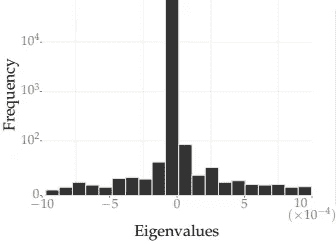

一个 Hessian 在局部最小值的特征值直方图

尽管有这些经验结果，这个假设可能仍然不是真正直观的。让我们从不同的角度来看这个问题。

在评估深度学习模型时，输入特征可能不总是与训练集的输入特征完全相同:两种分布之间通常存在偏移。这是完全可以理解的，因为训练集只是真实集的一个样本。这揭示的是，在训练集上评估的损失函数可能不会真正覆盖验证集上的损失函数，在某种程度上，我们可以观察到损失函数在参数空间中的移动:在训练集上找到的最优解可能是真实最优解的移动，即概括最佳解的移动。

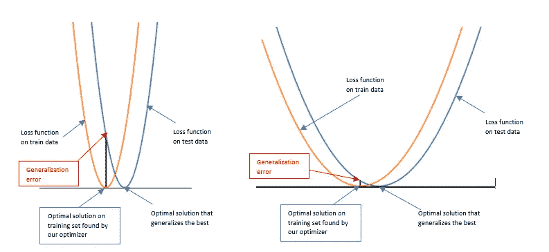

左:尖锐的极小值对右:平坦的极小值

也就是说，当我们的解决方案位于一个陡峭的山谷时，我们会观察到什么:正如我们在上图中可以清楚地看到的那样，泛化差距爆炸了。在贝叶斯学习设置中，尖锐的最小值具有高度集中在其周围的后验概率，这意味着我们的解决方案在训练集上非常专业，并且可能对数据扰动(过拟合)不鲁棒。

根据之前的经验结果，我们已经看到，像 SGD、Adam 等优化器隐式地、被动地收敛于宽谷解。但不能保证永远如此。这激发了一种积极寻找平坦最小值的算法的产生:熵 SGD。

# 熵随机梯度下降

在这一部分，我们将一步一步地建立一个算法，使我们能够训练一个向宽谷局部最小值收敛的深度学习模型。

给定一个训练集，我们的目标是优化一个目标函数(损失函数) *f(x)* 其中 *x* 是模型参数。

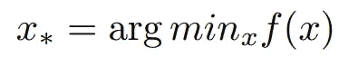

可用于该任务的一种非常常见的算法是 SGD(随机梯度下降),其中我们使用以下规则迭代更新 *x* ,直到“收敛”:

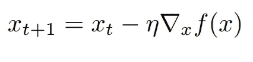

但是请记住，这只会优化我们的训练集上的损失函数，而不会对宽谷解决方案进行任何积极的研究。然后，我们将建立一个不同的损失函数。

## 负局部熵

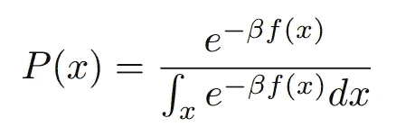

在贝叶斯学习设置中，解决上述优化问题等同于从下面的吉布斯分布中采样参数。

实际上，当β → ∞时，这个概率分布集中在最优解 *x* 附近，即使 *f* 最小的那个，从而与我们的问题联系起来。

然后，我们可以考虑修改这个概率分布，使它不像以前那样集中在任何最优解，而是集中在更稳健的宽谷解。我们引入一个新的变量*x’*，对于本文的其余部分，让 *β = 1* 。

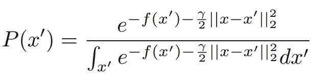

嗯，很多事情都变了。我们的吉布斯分布设置在我们的新变量*x’*(x 仍然是我们想要优化的参数)，指数中有一个新的项，它计算我们的新变量到我们的实际参数 *x* 的距离。归一化常数(相对于 x’)将被表示为 *Z(x)* :它是一个被称为配分函数(相对于β)的函数，它依赖于 x。我们为什么要做所有这些呢？

我们希望收敛到宽谷解，这意味着我们不仅对最优解感兴趣，而且对其邻域感兴趣。当 x'=x 时，我们找到初始吉布斯分布。

粗略地说，*P(x’)*是一个条件概率，以我们正在优化的当前参数权重 x 为条件，在 *x* 的邻域内:事实上，当*x’*进一步远离 *x* 时，*P(x’)*趋向于 0。这个概率展示了有趣的性质。考虑两个不同的点 *x1* 和 *x2* 。设 *x1* 为锐最小值，而 *x2* 为平最小值。

在这个设置中，我们更可能观察到以 *x1* 或 *x2* 为条件的概率*P(x’)*将是集中在 *x1* 周围的非常窄的分布，以及在 *x2* 周围的宽分布。

事实上，当我们考虑一个尖锐的最小值 *x1* 的邻域时，仅仅从 *x1* 的一个微小的移动就使*f(x’)*爆炸，这意味着*-f(x’)*很快被*γ| | x1-x’| |*所掩盖，对于邻域中的大多数点*x’*；使得邻居的概率很低，即使是更近的邻居。但是，-*f(x’)*仍然很高，即使我们从 *x2* 走得更远，对于邻域中的大多数点来说，如果 *x2* 位于一个宽谷中，那么在收缩之前需要稍长的时间；更远的邻居的概率仍然很高。

请注意，参数γ允许我们选择希望的谷宽:γ越低，意味着谷越宽。尽管最初的吉布斯分布只关注全局极小值(无论如何)，我们也考虑了现在的邻域及其广度。

如果我们更仔细地观察我们的配分函数(归一化在 *x* 上参数化的常数)，

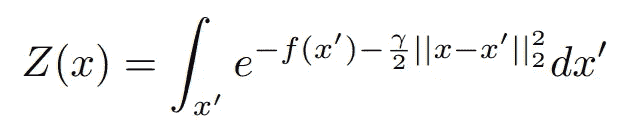

看起来这个函数对于点 *x，*是最大的，使得它的最远邻居可能“最小化”训练损失 *f* ，( *x* 本身包括在内) :显然是平坦最小值的定义。答对了。！！

然后我们可以把这个在 *x* 上参数化的函数的反函数当作一个新的损失函数。但是为了导数计算的方便，我们宁愿使用对数技巧，并且考虑我们的配分函数的负对数(负对数配分函数)。

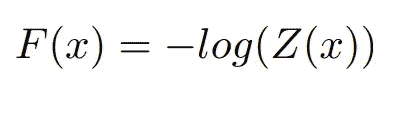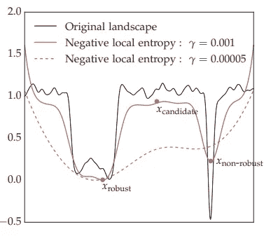

就是这样！我们刚刚建立了新的损失函数:)。

现在，我们可以像以前一样，使用 SGD、Adam 等算法来优化这个新函数。对于这个问题，让我们区分我们的新损失。

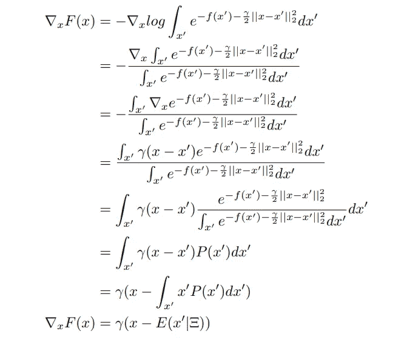

我们的梯度结束于一个简单的外在表达。但事实完全不是这样。我们需要计算*x’*的期望值(期望值取决于训练数据集)。

*x’*在一个非常高维度的空间上遵循吉布斯分布，这是不容易处理的，并且它完全不可能解析地计算这个分布的期望。为了避免这个问题，我们宁愿从这个分布中抽取一定数量的点，并取这些样本的平均值。在这个问题上，我们可以使用 SGLD(一种蒙特卡罗抽样方法)。你可能需要阅读[3]来了解更多关于 SGLD 的细节。

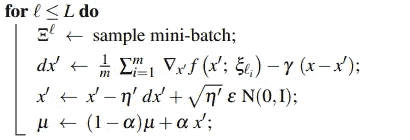

μ是期望值的估计值。一般来说，在蒙特卡罗抽样方法中，当我们在抽样过程步骤中走得更远时，我们抽取的样本往往更好，并遵循实际分布。然后，作者使用指数平均法，而不是仅仅取平均值，对最后的样本赋予更多的权重。这也是一种优化方法，然后向比初始点更好的点收敛，因此使用指数平均。

最后，如果我们重新考虑我们的 SGD 算法，使用 SGLD 采样步骤和计算的梯度，这是我们得到的最终算法。

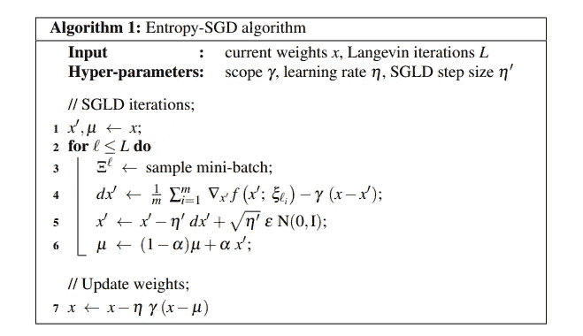

我们刚刚建立了熵 SGD 算法。值得注意的一点是，我们可以将熵 SGD 算法建立在其他算法的基础上，如亚当、内斯特罗夫动量等。

## 实验

新的优化器(熵 SGD)已经在各种不同规模的神经网络上进行了测试[2]；它已经在基于 MNIST 训练的全连接网络、也在 MNIST 训练的卷积网络、在 PenTree Bank 训练的用于单词级预测和字符级预测的 reccurent 神经网络上进行了测试。这是结果。

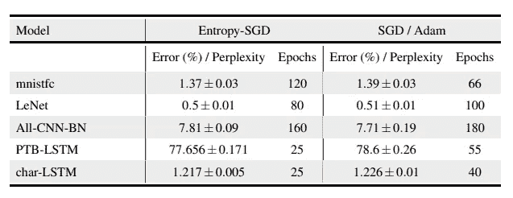

## 结论

熵 SGD 在泛化性能方面产生与 SGD 或 Adam 相似的结果。这并不奇怪，因为熵 SGD 只是以一种潜在的方式更明确和积极地做 SGD 和 Adam 所做的事情:寻找宽谷最小值。然而，在实验过程中，作者注意到熵 SGD 的训练误差较低。

尽管在泛化误差方面有微小的改进，但这篇论文在很多方面真的很有趣:实验导致了对深度学习中最优解的局部几何的探索和理解，作者构建这种新架构的过程，对深度学习中泛化的理解和理论化的尝试。

我真的很喜欢它！

对这个方法有兴趣吗？看看我构建的优化器的 keras 版本:[https://pypi.org/project/EntropySGD/](https://pypi.org/project/EntropySGD/)

## 参考

[1a]Sepp Hochreiter，J \u rgen schmid Huber，[平坦极小值](https://www.bioinf.jku.at/publications/older/3304.pdf) (1997)，神经计算 9(1):1{42 (1997)

[1b]张，Samy Bengio，Moritz Hardt，Benjamin Recht，Oriol Vinyals，[理解深度学习需要重新思考泛化](https://arxiv.org/abs/1611.03530) (2016)，arxiv

[1c]，何，，杨远，A [对称谷:超越尖锐与平坦的局部极小值](https://papers.nips.cc/paper/8524-asymmetric-valleys-beyond-sharp-and-flat-local-minima.pdf) (2019)，NeurIPS 2019

[2] Pratik Chaudhari，Anna Choromanska，Stefano Soatto，Yann LeCun，Carlo Baldassi，Christian Borgs，Jennifer Chayes，Levent Sagun，Riccardo Zecchina， [Entropy-SGD:偏向梯度下降进入宽谷](https://arxiv.org/abs/1611.01838) (2016)，arxiv

[3] Max Welling，Yee Whye Teh，[通过随机梯度朗之万动力学进行贝叶斯学习](https://www.ics.uci.edu/~welling/publications/papers/stoclangevin_v6.pdf) (2011)，ICML 2011:第 28 届机器学习国际会议论文集(2011 年 6 月)第 681–688 页