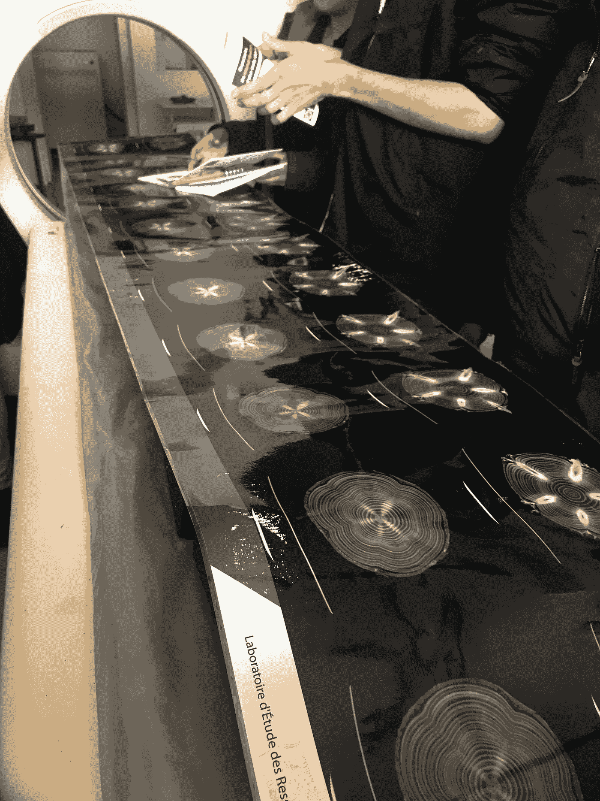
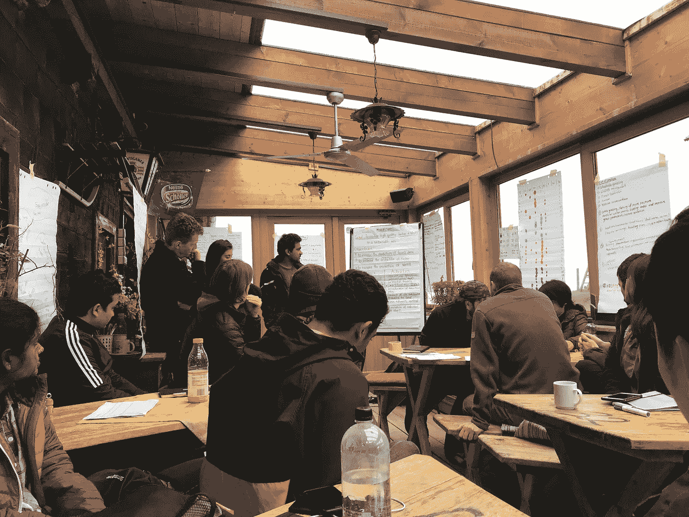

# 环保主义者也应该学习数据科学！

> 原文：<https://medium.com/analytics-vidhya/environmentalists-should-learn-data-science-too-315f5239e021?source=collection_archive---------10----------------------->

伊玛特·巴加·古米拉在 [Unsplash](https://unsplash.com?utm_source=medium&utm_medium=referral) 拍摄的照片

我作为一名环保主义者开始学习数据科学。统计学过去是，将来也永远是我组织数据解决现实生活问题的首选工具。

我学习的是环境科学的一个分支，很少有人会把这个分支作为进入大学的首选。我学习森林和农业科学。这是一个跨学科的课题，因为我不仅可以关注森林，还可以关注植物生理学、遗传学、生态学和景观科学、环境科学、流行病学等等。尽管这个名字可能会带来非常狭隘的直觉，但在这篇文章中，我想谈谈为什么环保主义者和每个人都应该学习编程。

个人文档(法国南希，2019)。木材的核磁共振扫描，摄于南锡 INRAe Champenoux 的木材材料实验室

我开始学习编程，因为我必须学习它来分析我的论文项目的数据。我正在处理跨越 10 个重复区块的 400 棵树，并收集至少 3 个生长参数的数据，因此观察结果由 1200 个数据点组成。我可以用 Excel 进行分析，但我从别人那里得知，使用其他软件可能会很有趣。所以我和博士生以及和我一起工作的导师聊了聊，他们建议 SAS。SAS 是我的第一个编程环境。

我以前从来不知道如何编码，我一头扎进了编程。这很难，但我知道这值得我花时间。从那以后，我转向了 R，当我对它变得熟练时，我转向了 Python。这确实很难，我花了 7 个月的时间在主管的旧代码的帮助下学习 SAS，并以我自己的理智为代价，但后来，我可能只用了 2 个月就学会了 R。现在，我正在从头开始编写代码，并学习另一种语言。我从自己的经历中得到的启示是，学习编程可以提高我的情商。它教会我要有耐心，解决冒名顶替综合症，并理解我的价值观。你也应该学习还有其他原因！

## 数据产生得很快:一个环保主义者应该知道如何理解它。

现在环境科学的很多方面都需要数据。例如，解决土地使用管理方面的问题。

土地管理现在是一门多学科的学科。不考虑生物多样性、碳排放和当地人民需求的土地管理可能导致气候变化。反过来，这种情况影响到土地和所有与之相关的人，无论他们的专业如何。这就是为什么解决土地管理中的问题需要不同学科的人之间的合作。让人们参与进来需要数据驱动的证据。

是什么让一种管理比另一种更好？一个管理层如何在维持国家经济的同时管理生物多样性？

我们应该用同一种语言和不同的人交谈。我们应该谈谈数字。这就是为什么人们正在努力改进收集数据的方法。

例如，用于遥感和地球观测的工具正在发展成更加集成、简单和廉价的工具。开源数据库中已经存储了如此多的可用地理数据，如 [GIS 和 Esri 开放数据](https://hub.arcgis.com/search)、 [OpenTopography](https://opentopography.org/) 和 [UNEP 环境数据浏览器](http://geodata.grid.unep.ch/)。

个人文件(奥地利阿尔彭，2019 年)。确定阿尔卑斯山森林多用途土地利用策略的模拟。

这也适用于其他主题，如种植园项目。为了确保一个森林种植项目能够导致消耗大气中的二氧化碳，环保主义者应该确保种植的树木能够生长。

该物种对不同温度的适应能力有多大？我们能检查它们适应气候变化、干旱、洪水甚至频繁虫害的遗传潜力吗？

植物的遗传潜力现在变得更受欢迎，特别是利用它们的过程需要越来越少的时间。如今，你不必等上几个月才能得到一个人的 DNA，因为测序变得更便宜、更快。它显示了为我们的研究生成数据的速度有多快。

随着技术和环保意识的提高，环保主义者可以设计他们的项目，并从在线数据库中收集数据。

1.  应该种植多少棵树来加速大气中碳的消耗？
2.  在不允许过量用水的情况下，我们应该用多少水来灌溉我们的农田？
3.  在气候变化下，一个物种将如何在各自的位置上奋斗？

如果环保主义者知道如何分析数据和解释结果，这些问题都是可行的。所有这些都需要统计和数学直觉。此外，由于现在分析是以自动化的方式进行的，并且见解是使用大量数据生成的，因此灵活性是关键。通过编码数据处理管道进行编程是环保主义者应该拥有的灵活性，因为你可以在一个软件中完成所有的过程。

## 编程是一门交流的艺术。

本质上，编程是一种交流方式。它是关于你如何要求和利用你的机器为你做复杂的事情。因此，你必须知道如何用它能理解的方式给它下命令。R 和 Python 等编程语言是将我们拥有的高级语言翻译成机器代码的平台。高级语言有自己的语法结构，这也是学习编程难的地方。

学习编程意味着你在学习一种和你的机器有效的交流方式。在 Excel 或其他图形用户界面软件中，你必须点击相关按钮才能下达命令。在高级语言中，你也需要这样做，但是通过键入代码。在某种程度上，您必须构建您的代码脚本，以从机器中获得您想要的东西。类似于与人类交流，代码越简单，机器理解得越好，分析完成得越快。

学习编程是一种可以转移的技能。你肯定会将这种编程方法应用到你写文章的方式或者你与公众交流的方式中。

作为一名环境保护主义者，你必须通过将技术术语翻译成更通用的词语来找到一种有效的方法来表达你的观点。举个例子，你是婆罗洲的环保主义者，为了行业自身的利益，你想聚集民众去对抗一个破坏防护林的行业。你收集并分析了数据，你发现了有影响力的证据，证明破坏防护林只会增加当地人民遭受自然灾害的风险。如果你不能简化你的语言，你可能就不能向这些人表达你的观点。

## 协作的数据科学。

国与国之间不再有隔阂。由于世界受到当前疫情的影响，也有一种虚拟工作的可能性。所有的机器都是连接的，工作可以通过一个协作平台来完成。这些东西只会加速人与人、产业与国家之间的合作

作为一个环保主义者，你明白这是什么。包括气候变化在内的全球挑战是影响所有人的集体问题，也受所有人的影响，无论他们的背景和社会地位如何。可持续发展目标(SDG)和巴黎协定中提到合作是解决全球挑战的一种方法。如今，协作是虚拟完成的，并随着数据驱动的证据而进步。

我们不仅与人类合作，还与数据合作。当您在一个组织中工作时，您可能需要协作处理数据，因此您希望您的代码易于理解，以减轻每个人的工作负担。这也是沟通的艺术；当你能简化你的程序并把它们翻译成代码时，不仅机器会理解，人类也会理解。这将导致该组织项目的成功。

作为一个环保爱好者，分享你的代码意味着扩大你的项目的受众范围。这是提高数据科学界环境意识的另一种方式。

通过深入数据科学社区，您可以了解环境对我们的真正意义。其他人会回应你，要么分享你的代码，阅读你的见解，要么复制你的方法。你的方法正在发展，你对环境的感知正在深入。

个人文件(奥地利阿尔彭，2019 年)。合作如何在阿尔彭森林中进行:)

## 总之…

数据科学是一个多学科领域。任何人都可以从中学习和受益。能够分析数据和编程数据处理管道可以带你走得更远。统计学总是每个科学领域的核心，现在我们应该通过学习编程我们的统计分析来加快我们的游戏。它是可转移的，因为你也将学会如何创造一个有效的沟通和协作的方法。