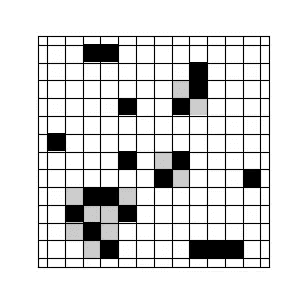
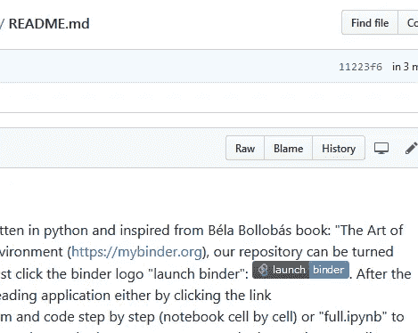
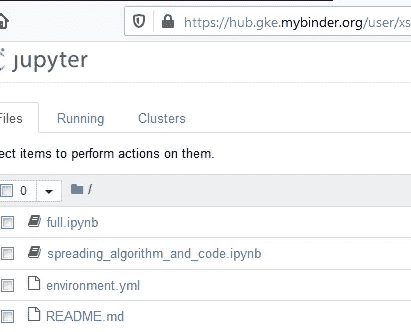
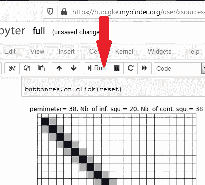

# 信息和思想的广泛传播。正方形网格上的模拟

> 原文：<https://medium.com/analytics-vidhya/epidemic-spreading-of-information-and-ideas-simulation-on-a-square-grid-9825a91c37b7?source=collection_archive---------22----------------------->

**传播问题的流行病学方法**

为了推广一个想法、一个产品或一项服务的信息，政府、机构和公司通常需要一个在网络上有效传播的策略；必须根据他们的具体需要、目标和手段来设计和建造。由于信息和流行病传播过程的相似性，大多数关于信息传播的研究(市场营销、广告、科学出版物、政治项目……)都是受流行病模型的启发。

常用的流行病模型之一是*感染在正方形网格上的传播。*在《数学的艺术》(2006)一书中，béla bollo bas 提出并分析了在 N×N 正方形网格(N=12)上的流行病传播问题。

这种传播概念在几年后变得如此流行，以至于世界上最著名的两家报纸:“纽约时报”(美国)和“卫报”(英国)分别在 2013 年[和 2017 年](https://wordplay.blogs.nytimes.com/2013/07/08/bollobas/)[的“谜题版”中提出了解决 bollo bas 问题的方法。](https://www.theguardian.com/science/2017/mar/13/did-you-solve-it-pi-day-puzzles-that-will-leave-you-pie-eyed)

在一个 NxN 2D 网格(N=12，见图 1)中，一些(黑色)方块，比如 n=20，被感染，而(N -n)个方块是健康的(白色)。在每个污染步骤，新的被污染的一代出现，并且只有当一个健康的方块有一个以上被感染的正交邻居(灰色方块)时，它才会被感染。没有对感染免疫的方块，被感染的方块永远被感染。

图一。在 NxN 网格中随机分布 n=20 个受感染(黑色)方块(N=12)。受污染的(灰色)方块是指有一个以上受感染邻居的方块。

最初的 bollo bas 问题问，最初被感染的方块的最小数量 x 是多少，它能在整个网格上传播感染？在数值模拟的帮助下，我们在这篇文章中讨论了最小数量 x，以及如何在网格上分配 x 个正方形，以确保整个网格的感染。

*1-随机分布*

我们提出的第一个解决方案是如图 1 所示的随机分布。从算法的角度来看，这是最便宜的解决方案，因为我们不需要额外的计算来寻找哪些方块有影响，哪些没有。但是，如果感染方格的初始数量是随机的，并且不能保证感染整个格子*。*

*2-对角线分布*

对角线分布代表 bollo bas 解。如果我们把 x=N=12 个方块沿主对角线分布(图-2)，那么所有与主对角线相邻的方块沿两条超对角线分布，都有不止一个被感染的邻居，成为全部被污染。他们是第一代被污染的人。就周长/感染面积的比例而言，这种分布可能是最高的。一旦被感染，它们会污染它们健康的邻居，如此类推，直到最后一个方块，之后

图二。N×N 网格(N=12)中 n=N 个染毒(黑)方块的对角线分布。

N-1 步污染。对角线感染是感染整个网格最快的方式。

3- *双边分配*

图 3 所示的双边分布是另一种分布，x=N =12 平方。在 2(N-1)-1 步污染后，这种分布将感染扩散到整个网格。虽然它的感染区域周长等于对角线感染的周长(22 个方块)，但它的传染能力较弱，因为与对角线分布的第一代 22 个方块相比，它只能污染 12 个方块(第一代污染)。

图三。*NxN 网格(N=12)中 n=N 个感染(黑色)方块的双边*分布。

这三种分布之间的简单比较表明，就“感染速度”而言，对角线分布是最有效的选择，因为它只需要整个网格感染的 N-1 步污染。

**讨论**

从 bollo bas 问题看来，流行病传播是一种“临界现象”,因为它只有在受感染的方块达到临界浓度时才会发生。在对角线感染的情况下，如果感染方块的初始数目 x 小于 N，那么总传播将是不可达的。

似乎感染区域的周长不会随着感染的增长而增加。bollo bas 问题的模拟(参见模拟部分)表明，随着感染的增长，感染域的周长会减小，直到达到整个网格感染。网格上的“感染速度”取决于受感染方块的初始数量，但也取决于它们在网格中的几何位置。

**Python 模拟传播**

在本节中，我们编写 python 程序来模拟 2D 正方形网格上的流行病传播过程。我们在 BinderHub 的帮助下，把它变成了交互式笔记本(Jupyter notebook)。为此，我们首先在[*【GitHub】*](https://github.com/)中创建 [*【传播信息与观念的传播*](https://github.com/xsources/Epidemic-Speading-of-Information-and-Ideas) 知识库，在上面我们写下“ *full.ipyn* ”，在一个个方格的网格里，传播过程的互动笔记本。

让我们首先展示一些 jupyter-python 代码所依赖的算法元素。我们从导入必要的库和小部件(交互工具)开始(步骤 1)

第一步。导入必要的库

通过使用 python“networkx”库，我们创建(步骤 2)与 2D 正方形网格(边数 N=20)相关联的图 g。我们将 *nng* 定义为节点网格列表，将 *ninf* 定义为受感染节点的数量。我们还定义了*感染*，一个定义感染方块分布的函数:随机或对角线。默认情况下，我们的代码显示受感染方块的两边分布。对于随机或对角分布，只需*取消相关程序块的*注释即可。

第二步。定义一个图 g，它与 2D 网格和受感染节点的“*受感染*”分布相关联。

我们定义(Step-3) *spreading()* ，从第 n 步到第 n+1 步传播感染的函数。这个函数创建一个新的图 *Ginf* ，其中存储了所有被感染的节点。它还计算 *allneighbors* 函数来查找被感染方块的所有邻居。*neighbor 2 times*是另一个新函数，它计算哪些节点不止一次是受感染方块的邻居。我们还需要计算 perim 函数来计算整个感染区域的周长。在这段代码的最后，我们创建了 *data_saver* 。 *mat* ，一个. mat 文件，存储与感染区域周边相关的数据。

第三步。扩展函数的定义

在我们程序的最后(步骤 4)，我们设置了窗口小部件功能:显示新的被污染的方块并重置当前操作。

第四步。设置按钮的点击功能:“下一次展开”和“复位”

疫情传播过程 [*full.ipyn*](https://github.com/xsources/Epidemic-Speading-of-Information-and-Ideas/blob/master/full.ipynb) 的完整 jupyter-notebook 程序现已准备好在 [BinderHub](http://Docker image) 平台上运行。要运行它，点击显示在[流行病传播信息和想法](https://github.com/xsources/Epidemic-Speading-of-Information-and-Ideas)库的 README.md 文件上的“启动活页夹标志”(图 3)。

图 3

在检查了存储库文件(图 4)之后，BinderHub 将用户重定向到 Jupyter 服务器(图 5 ),我们的程序将在那里运行。

图 4

图 5

点击展开程序之一: *full.ipynb* 或*spreading _ algorithm _ and _ code . ipynb*运行(图 6)展开过程。如果您选择第二个程序，您必须逐个单元格地运行它(通过单击 run 按钮运行每个单元格，直到程序结束)。

图 6

[1]超对角线条目是直接位于主对角线右上方的对角线

[2] [BinderHub](http://Docker image) 从 Git 存储库中构建并注册 Docker 映像