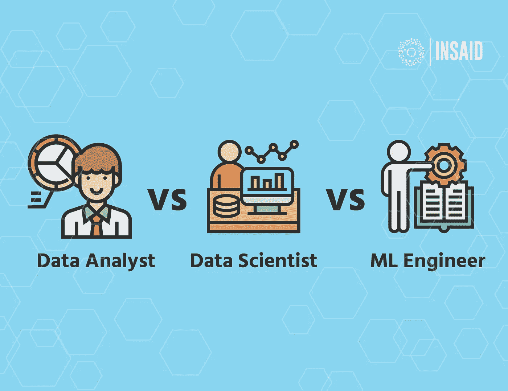

# 将数据科学家等同于医生

> 原文：<https://medium.com/analytics-vidhya/equating-data-scientists-with-doctors-2a5b837bb93f?source=collection_archive---------15----------------------->

## 随着 Corona 席卷全球，我目睹了数据科学行业的大量个人*失业。这篇博客帖子可以作为一个小指南，帮助您识别数据科学行业的职业类型，并根据公司的要求雇用他们，或者将自己培训成一个可以最大限度地发挥您的技能的人。*

关于数据科学专业，很难被各种专家的名字迷惑，比如数据分析师、科学家、机器学习工程师等等。很有可能组织招聘时没有考虑头衔背后的因素，认为拥有一个像机器学习工程师这样的奢侈头衔是令人愉快的，这可以吸引许多人，但真正的工作只是包括一些数据分析。数据科学是一个新的职业，有点难以理解各种职位及其必要性。为了让一个门外汉理解不同的功能，我想把它等同于现存的最古老的职业，医生(医学)。

# 外科医生

这类医生执行临床活动和医疗程序，被视为外科专家。它们在数量上并不多，因为与人类可能有的广泛的临床问题相比，需要医疗程序的临床病例要少得多。

类似地， ***机器学习工程师*** 是开发和部署可扩展模型的专家。他们拥有大量关于数据工程的信息，或者可以在数据管道上与数据工程师合作，为公司部署模型。没有多少组织或业务用例真正需要构建模型，然而那些需要的组织或业务用例却得到了丰厚的报酬，因为模型为他们的业务提供了显著的激励。

**工作类型:**构建和部署可扩展的机器学习模型。

**公司类型:**拥有大数据能力和已确定的机器学习模型用例的成熟公司。

**所需技能:**精通在 PyTorch、Tensorflow 等框架中构建模型(工具因公司而异)。不同算法及其实现的知识。

**挑战:**有时需要花费大量时间来构建训练数据集和训练模型，这可能需要大量的手动工作。

**何时雇佣:**当你有一个清晰定义的 ML 问题，并且有大量数据可用时。例如:建立人脸识别 ML 模型，从照片或视频中识别一个人。

**薪酬:**高。

**机遇:**低谷。

# 专家

这些类型的医生拥有各种各样的技能和对特定领域的深刻了解，例如:心脏病专家、妇科专家、宇宙学家等。他们可以诊断特定的身体部位或功能，并推荐适当的治疗方法。诊断可能导致药物或手术，需要外科医生或专家自己作为一个整体。

这就是数据科学家*的工作性质，他们可能是金融、医疗保健、供应链物流等特定领域的领域专家，但他们的主要工作是了解手头的业务问题，并通过诊断现有数据给出解决方案。他们负责识别业务问题，试图找出原因并制定出可行的解决方案。像专科医生一样，他们可以通过倡导简单的分析变化或建议手术(机器学习模型)来补救原因。在较小的公司，数据科学家兼任 ML 工程师，并像专业外科医生一样进行建模。*

***工作类型:**通过数据的方式理解和解决业务问题。*

***公司类型:**小型到希望解决复杂问题，有良好数据来源和理由的中等规模公司。*

***所需技能:**好奇心、分析思维、领域知识、技术理解和数据辩论技能，以及讲述分析结果的良好演示技能。*

***挑战:**如果不是专家，将需要花费大量时间研究和获取领域知识。*

***何时招聘:**当公司产生大量数据，而你需要就一些业务决策获得“专家意见”时。例如:如何理解客户行为以推动销售。*

***薪酬:**中到高。*

***机会:**中到高。*

# *全科医生*

*全科医生是我们熟悉的最常见和最熟悉的医生类型，通常是治疗的第一站。也被称为家庭医生，他们没有特定的领域或技能，但可以治疗普通疾病，无论是一剂药还是看专家的建议。*

*一名 ***数据分析师*** 类似于一名全科医生，他们查看产生的日常数据，构建 KPI 指标，并在仪表板上将其可视化。根据公司的规模/类型，他们可能需要/可能不需要领域知识和复杂的解决问题的技能。他们需要成为数据辩论专家，从数据中提取信息，以便向更广泛的受众讲述故事。这个领域的工作量很大，因为每一个产生足够数量数据的公司都可以在数据分析师的帮助下做很多事情。这个角色与业务分析师同义，唯一的区别是业务分析师的职位需要具备业务/领域知识。*

***工作类型:**建立、监控和控制公司的关键绩效指标。*

***公司类型:**任何类型的公司，工作性质都会稍有不同。例如:在初创公司，DAs 必须兼任 DS 和 mle，而在成熟公司，DAs 只能跟踪和改进 KPI。*

***所需技能:**数据辩论和可视化技能，以及讲述分析结果的良好演示技能。*

***挑战:**在不存在数据基础设施的情况下，需要花费大量时间编写复杂的查询或清理原始数据。*

***何时招聘:**当你需要有人来监督和控制你公司的成长时，前提是你有数据来衡量。与上月相比，销售额增长了多少？哪些地区表现较好？*

***工资:**中低*

***机会:**非常高*

> ******免责声明:上述所有职位可能因公司而异。这只是一个在不同规模的公司担任过不同角色的人的一般观点。我没有冒犯任何职业的意思，我只是被拿来做比较。******

*如果你喜欢我的文章，并且想用通俗的语言寻找更多关于数据科学的帖子，请在 medium 上关注我。如果你有疑问，可以在 LinkedIn 上联系我(【https://www.linkedin.com/in/aishwarya-nair-21091994/】**)。谢谢你一路读到这里，请继续关注！***