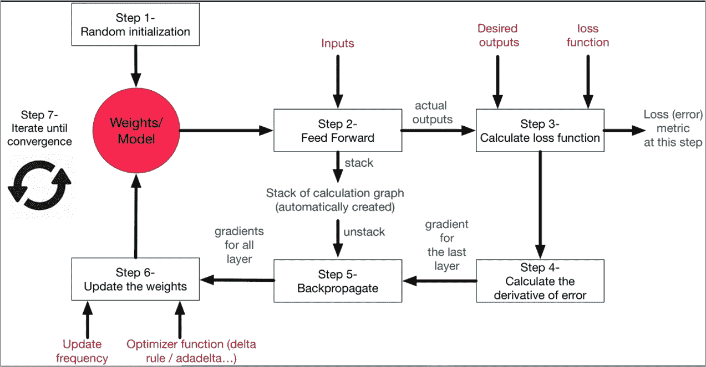

# 神经网络中的误差反向传播、消失梯度问题

> 原文：<https://medium.com/analytics-vidhya/error-back-propagation-vanishing-gradient-problem-in-neural-networks-df66a0c53ef4?source=collection_archive---------11----------------------->

# 反向传播方法:

神经网络

反向传播简单易懂…就像洗澡一样。说到这个…

这个例子帮助你回忆每天洗澡时的反向传播。让我们开始吧…

现在有两个阀门可以放水给你洗澡。因此，主阀将水从设施处的水箱/蓄水池释放到浴室，副阀将水释放到头部。

因此，当你想淋浴时，你会看到主阀打开，水开始流向副阀(输出层),让你打开淋浴。

现在在这里，首先你注意到水对你来说太多了，这意味着产量很高。所以，你试着调整二级阀，试着减少出水量。你会看到水流仍然有点高(谈论舒适！)，所以你把主阀的阀门调小以调节水流，然后把副阀调大一点以获得最佳水流。但是由于这种操作，你注意到温度不合适，所以你试着一次又一次地调整两个阀门，直到你的水在你想要的范围和温度内。

同样，在神经网络中，神经元的权重必须反复调整，直到观察到误差最小的结果。

所以，你的水很好很好，这很好。但是在极端的气候条件下呢？也就是说，如果你不得不在你的网络中等待很长时间来训练呢？有一个问题是，你的网络一次又一次地训练，但你不会将权重调整/调整到几乎可以忽略不计的量。

这是因为，误差是导数，对吗？因此，当通过横向层进行通信以调整神经元的权重时，初始层做得很少，或者有时会因为权重小而无法听到它们需要调整，最终由于学习非常慢而给出不太好的结果。

这就是**消失渐变问题。**

# 克服渐变消失的问题:

## 为什么网络的早期层对我们如此重要？

网络中的**早期层**很重要，因为它们负责*学习和检测简单模式*，并且实际上是我们网络的**构建模块**。显然，如果它们给出不正确和不准确的结果，那么我们怎么能期望下一层和整个网络很好地执行并产生准确的结果。

**对我们的模型有什么危害？**

**训练过程耗时过长，模型的预测精度会下降。**

这就是消失梯度问题对我们的神经网络模型所做的一切。试想一个高度复杂的深度神经网络模型，其中有数百万层，训练这样一个深度网络并产生良好而准确的结果会有多大的问题。

下面是一个很好的视频消失梯度问题，以了解它的视觉效果:

消失梯度问题可以通过使用 ReLU 激活函数来解决，该函数将输出限制在 0 到 1 之间，也就是说，当该函数的输入为负数或 0 时，它会给出一个零，当您给出任何正数时，如果小于 1，它会给出正值，当 ReLU 的输入为 1 时，它会给出 1。

如果您处理基于对话的数据或顺序数据，请尝试使用 LSTM 模型，它可以更好地处理消失梯度问题。

既然您已经理解了反向传播，那么它就像洗澡一样简单！

谢谢你读到这里！下一集再见！