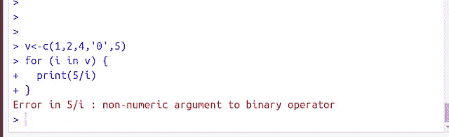
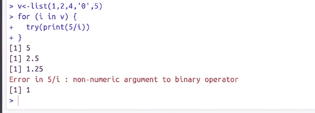
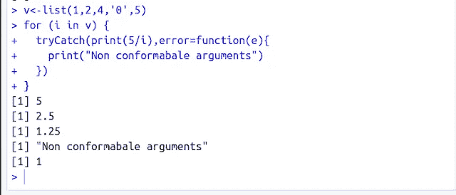

# R 中的错误处理

> 原文：<https://medium.com/analytics-vidhya/error-handling-in-r-23b22d82fa6f?source=collection_archive---------21----------------------->


# 什么是例外？

当你的代码被执行时，一个不希望出现的情况被称为异常，例如当你的代码试图将一个值除以零时。

# 异常处理

异常处理是处理代码中可能出现的错误并避免代码突然停止的过程。用简单的英语来说，我们的代码应该要么通过执行预期的任务来结束，要么在无法完成任务时打印一条有用的消息。

我们有这个代码，它在列表中有一个非数字值，我们试图用向量 v 的每个元素除 5

#list 用一个非数值 v



Here we can see that the code has not printed any result and has stopped abruptly.

To avoid these situations we use exception handling constructs available in R

# Exception Handling Constructs in R

1.  try
2.  tryCatch

# Using try

We need to enclose the objectionable statements in the try block. The statements passed inside are like arguments to a function. In case you have more than one statements, it is preferred that you write a function with all those statements and call the function inside the try block

```
v<-list(1,2,4,'0',5)
for (i in v) {
  try(print(5/i))
}
```



Using the try block we can see the code ran for all the other cases even after the error in one of the iteration.

# Using tryCatch

The try block will not let your code stop but does not provide any mechanism to handle the exception. By handling I mean the actions we want to perform if some error occurs in code execution.

In this case, we can use the **tryCatch** 块来处理异常。

我们将在 **tryCatch** 块中包含不良语句，并向 tryCatch 传递另一个参数 **error** 。

该错误将一个函数或一个指令作为输入，并且我们可以执行在该函数中出现错误的情况下要执行的所有补救步骤。

```
v<-list(1,2,4,'0',5)
for (i in v) {
  tryCatch(print(5/i),error=function(e){
    print("Non conformabale arguments")
  })
}
```



我希望这能帮助你理解 r 中的错误处理概念。

*你可能还想阅读:*

*   [R 中的循环](https://techscouter.blogspot.com/2019/12/looping-in-r.html)
*   [编写你的第一个围棋程序](https://techscouter.blogspot.com/2020/03/writing-first-go-program.html)

订阅 [Techscouter](https://techscouter.blogspot.com/) 获取有关 ML、数据挖掘、编程语言和当前市场趋势的文章更新。

作者:[贾普内特·辛格](https://www.linkedin.com/in/japneet-singh-chawla/)

快乐学习