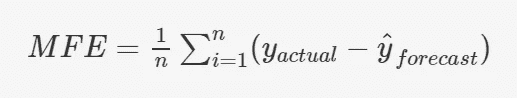
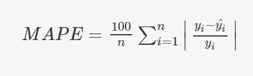
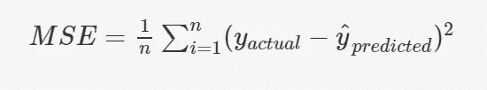
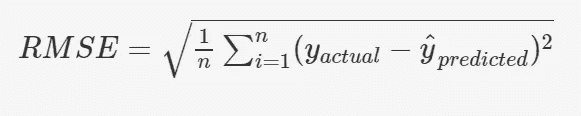

# 时间序列预测建模中的误差度量

> 原文：<https://medium.com/analytics-vidhya/error-metrics-used-in-time-series-forecasting-modeling-9f068bdd31ca?source=collection_archive---------16----------------------->

时间序列预测模型性能分析

误差度量在评估模型性能时非常有用。这些误差指标可以广泛地用于两个目的:一是使用这些误差指标，我们可以了解我们的预测有多正确，二是使用这些指标，我们可以比较不同的模型，然后考虑所有模型中的最佳模型。显然，误差越低，模型对未来数据点的预测或简单的预测就越准确。

让我们来看一些特别用于时间序列预测模型评估的常见误差指标，它们是:

平均频率误差

绝对平均误差

平均绝对百分比误差

均方误差

均方根误差

让我们详细讨论一下每个错误指标。

1.  **平均频率误差(MFE)** :也叫频率偏差。这个指标通常被认为是一个简单的指标，因为我们只考虑实际值和预测值之间的差异，然后取它们的平均值。这样做，它就抵消了实际值低于或高于预测值所产生的正负效应。因此，它被认为是一个幼稚的指标。使用这个标准，我们将从整体上了解所做的预测是被低估了还是被高估了。MFE 为正值表明我们的预测总体上低于实际值。同样，导致负值表明我们的预测总体上高于实际值。使用这个度量标准，我们将不会知道实际值和预测值之间的任何偏差。这促使我们考虑另一个更好的指标，叫做 MAE。

平均频率误差

其中:
* **y 实际**是指目标变量的实际时间戳数据点。
* **y hat 预测**是指时间序列预测模型对目标变量做出的预测。
**备注**:y 实际值和 y 预测值的这些定义同样适用于所有其他公式。

2) **平均绝对误差(MAE)** :这个度量帮助我们克服由 MFE 引起的缺点。我们考虑误差项的绝对值，然后取它们的平均值，而不是考虑实际值和预测值之差的平均值。这样做，积极和消极就不会互相抵消。使用这个指标，我们将知道预测值与实际值的平均偏差。同时，在理解该指标时存在细微差别，为了通过估计该指标得出任何结论，我们需要考虑实际值的范围。假设一位数的实际值和 MAE 值的标度是 1.5，在这种情况下，预测中的这种偏差是不可接受的。或者，如果实际值以千为单位，并且在计算后 MAE 值变为相同的 1.5，在这种情况下，所做的预测被认为是好的，因为 MAE 值非常小。因此，在评估时需要考虑实际值的规模。为了克服这一缺点，我们从实际值的百分比方面考虑，这样做促使我们采用另一种新的指标，即 MAPE。

绝对平均误差

3) **平均绝对百分比误差(MAPE)** :这一指标是为了更好地理解评估。这通过考虑绝对误差项与实际值的百分比来实现。这样做，我们就不需要考虑实际价值的尺度。因为 MAPE 是从 100 减去的百分比，我们将了解我们预测的**精确度**。它只是 MAE 的一个简单版本。

平均绝对百分比误差

4) **均方误差(MSE)** : MSE 和 MAE 基于相同的思想，避免了求和时误差项中正负的抵消。这里，我们考虑误差项的平方，然后取它们的平均值。通常，MSE 被用作回归设置中的误差函数，然后被优化以获得最佳模型参数。很多时候，作为误差函数，MSE 将是比 MAE 更好的误差函数选择，因为 MAE 在其最小值处是不可微的。结果，我们不能获得考虑 MAE 作为误差函数的最佳模型参数。尽管每一个都有积极和消极的一面。同样，这都归结到一个不同的误差函数的话题。我们不要再偏离了。考虑 MSE 时有细微差别，因为我们考虑的是误差项的平方，MSE 的单位与实际值不同。为了有一个相同尺度的评估，我们在我们的帖子中继续讨论我们的最终指标。简而言之，MSE 还告诉我们，平均而言，哪些预测值偏离了实际值。

均方误差

5) **均方根误差(RMSE)** :作为实际值的小尺度，我们考虑 MSE 的根。

均方根误差

这些是时间序列预测建模中常用的一些误差指标。一些指标甚至用于其他机器学习建模，如回归设置。

终于，本帖我们告一段落了！！

# 参考资料:

upGrad 学习平台。
图片来源:upGrad 学习平台:时间序列预测-1
表头图片来源:relexsolutions.com