# ESP8266 —基于 Arduino 的系统中的 Python 连接

> 原文：<https://medium.com/analytics-vidhya/esp8266-python-connection-in-arduino-based-system-5d4a308bd79b?source=collection_archive---------8----------------------->

在我的 [**上一篇文章**](/@imlent/esp8266-arduino-connection-and-first-setup-be24171d8923) 中，我解释了如何用 **Arduino UNO** 连接和设置 AT 命令 **ESP8266** 。

我正在给另一个烧结方案布线 **ESP8266** 到 **Arduino。**我们将自动设置我们的 WiFi 模块，这就是我们要改变接线方式的原因。

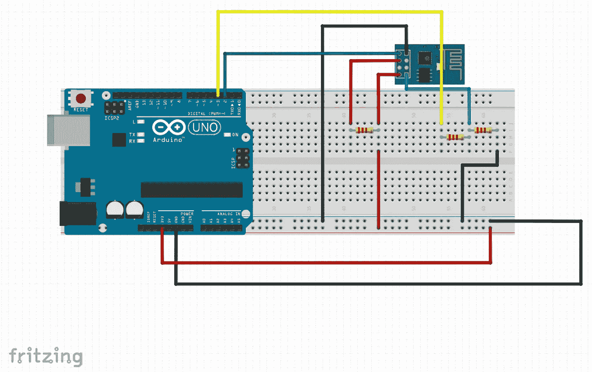

我们将为新方案增加 3 个电阻。我们这样做是因为我们想稳定我们的电源系统和 **RX** 接收器。这些电阻可以是 1k**ω**(在方案中它们是 220**ω**因为我找不到 1ks)。此外，我们将 **RX** 和 **TX** 引脚从 0–1 个数字引脚改为 2–3 个数字引脚。这种改变使我们能够与 Python 联系起来。所有草图和 Python 脚本都可以在 [**这里**](https://github.com/alicamdal/ESP8266---Python-Connection) **找到。**

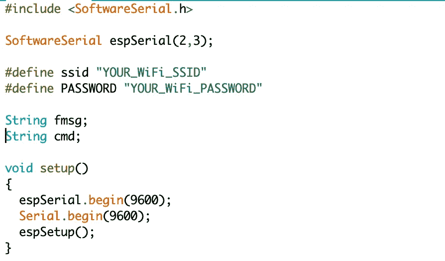

开始时，我们将把我们的库(软件串行)导入到我们的草图中。然后我们必须从这个库中创建一个实例。上面可以看到的是 espSerial。然后，我们需要我们的 WiFi 的 SSID 和密码，由 **ESP8266** 用于连接到 WiFi。此外，我们有两个不同的字符串变量。那么我们应该以 9600 波特率开始我们的串行通信。这是我们的观点，我们看到有一个函数叫做“ **espSetup** ”。当我们给系统通电时，此功能会自动设置我们的 **ESP8266** 。

我们将通过 7 个步骤完成我们的设置。第一步是重置 **ESP8266。**然后，我们将在步骤 2 中使用【T36 AT 命令测试连接。

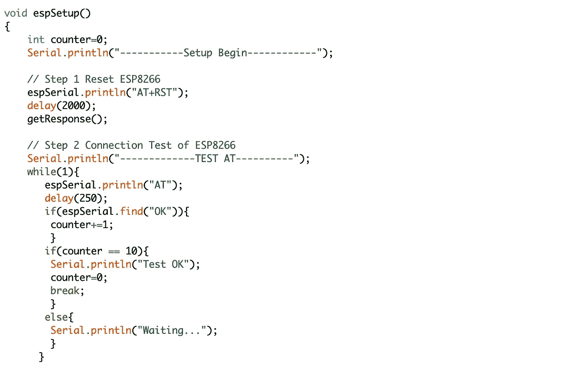

设置过程的前两步。

正如我们在截图中看到的，有一个名为“**计数器**的变量。有了这个变量，我们将能够多次发送我们的命令，并且我们将确定它们。此外，我们还有另一个名为“ **getResponse** ”的函数。

此外，我们会延迟多次发送命令。对于“ **AT** 命令，我们将发送它直到计数器达到 10。但是计数器的条件是在命令响应为 **OK** 时找到 10 个成功的**。我们可以通过“ **espSerial.find** ”函数在 **espSerial** 通讯上找到我们要找的东西。**

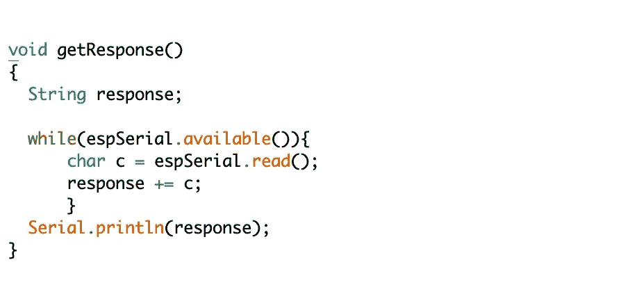

当我们用 **espSerial** 发送一个命令时，这个命令应该有一个响应。使用“ **getResponse** ”功能，我们将看到这些响应。

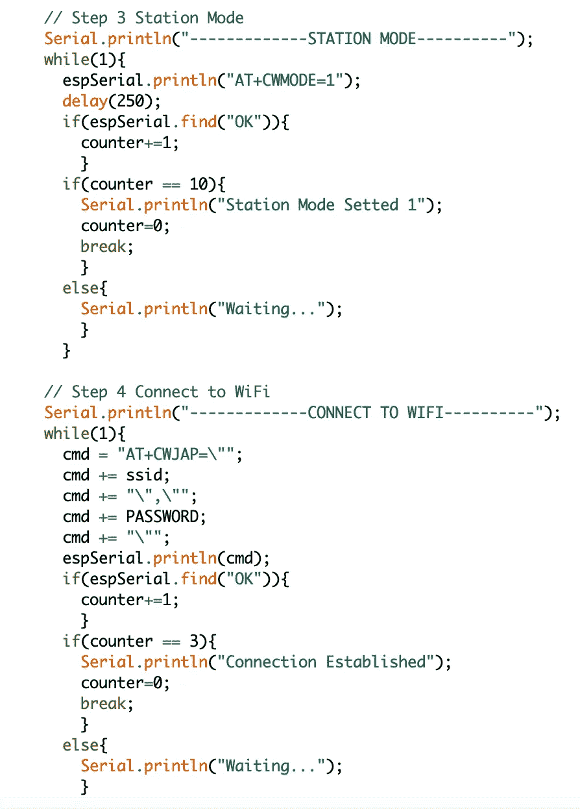

第 3 步和第 4 步

在接下来的两步中。我们将设置站模式和 WiFi 连接。这里有一点很重要。我们应该在开始时更改 **SSID** 和**密码**的定义。

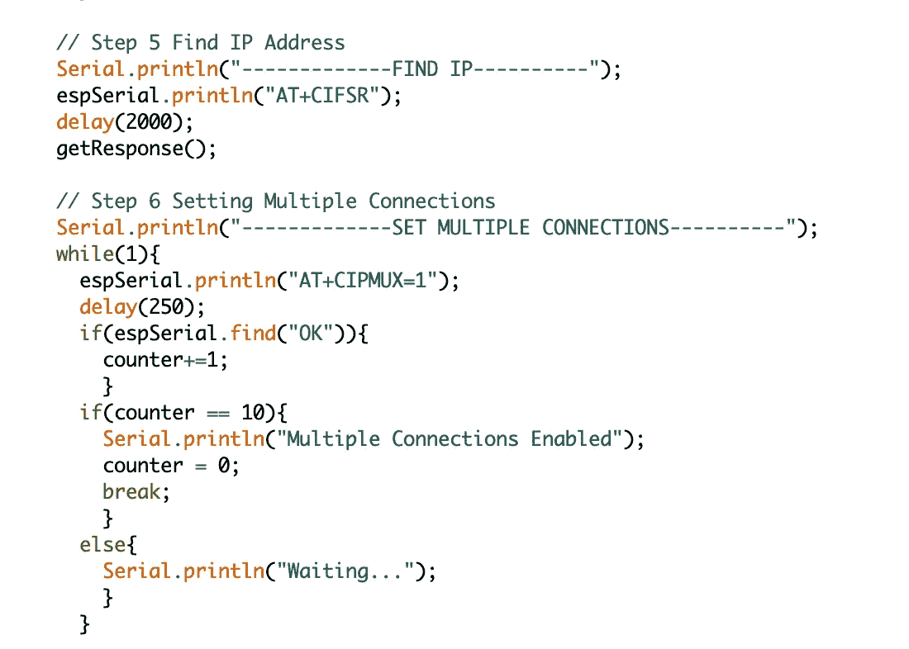

第 5 步和第 6 步

在第 5 步和第 6 步中，我们将找到我们设备的 IP 地址，并启用多个连接设置。有了多重连接设置，我们可以通过 Python 访问我们的设备。

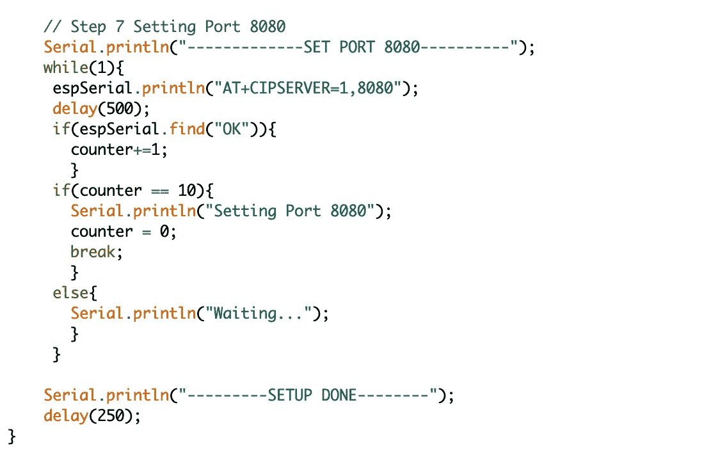

第七步

最后但同样重要的是。在第 7 步中，我们设置设备的服务器设置及其端口。这一步结束后，我们完成了设置。如果您在执行这些步骤时遇到错误，请随时发表评论。否则，恭喜你有一个可以自动设置 **ESP8266** 的功能。

现在我们需要通过我们的系统和 Python 来获取消息。为此，我们必须准备 Arduino 的循环功能。

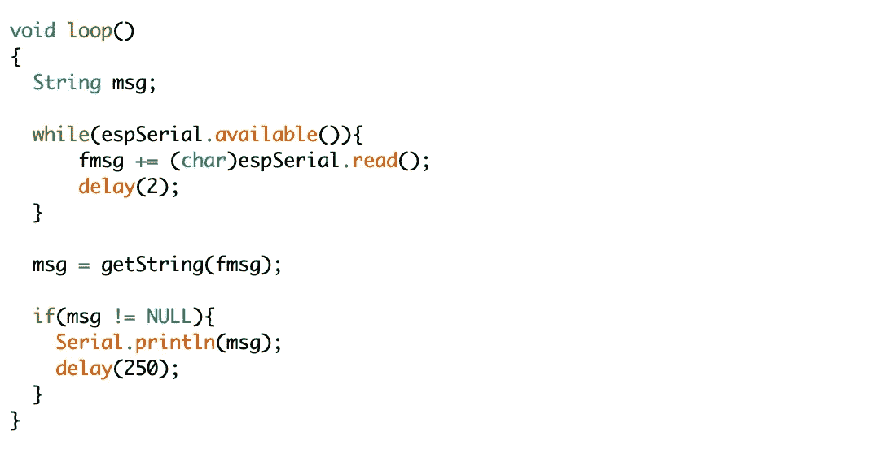

循环功能

我们知道这个函数永远有效。因此，我们需要为我们的消息定义一个变量。我们为他们准备了 **msg** 。开始时，我们将" **fmsg** "定义为一个全局变量，并通过它获得原始消息。然后我们要用" **getString** 函数。我创建了这个函数，因为如果您将原始消息打印到串行监视器，您会看到在您的串行监视器上有一些带有“ **:** ”分隔符的垃圾数据。为了传递信息，我们必须除掉他们。

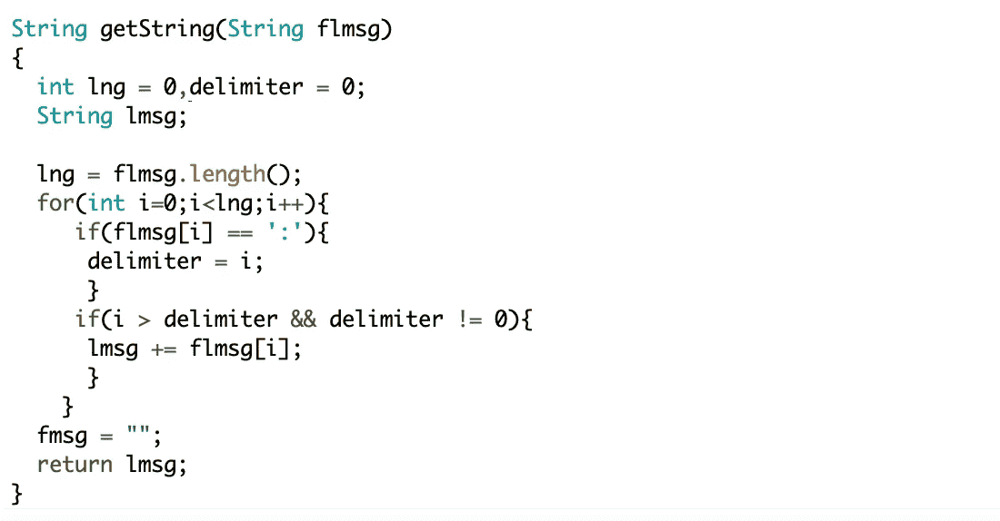

getString 函数

" **getString** "函数接受 1 个参数，该参数是字符串" **flmsg** "，该参数是我们的原始数据。正如我之前所说，在我们的原始数据中有一个分隔符。使用 **for** 循环，我们将找到我们的分隔符，然后我们将得到我们真正的消息。我知道这个过程有一些内置函数。但是这些天我需要花些时间。

这是我们 Arduino 端的最后一个功能。现在我们可以准备 Python 脚本了。

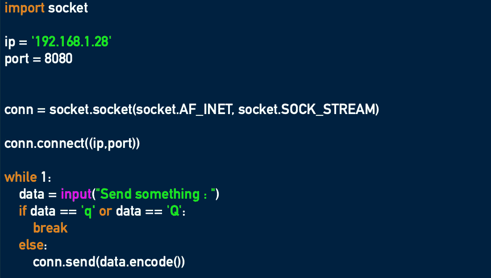

Python 连接脚本

我说“准备”，但它并不完全是准备。只有 11 排。首先我们需要" **socket** 库。这个模块为 **Berkeley Socket API 提供了一个接口。现在我们需要找到我们的 IP 和端口。如果您没有对设置进行任何更改，您可以使用显示的 IP 和端口设置进行连接。但是如果你改了，你可以用" **AT+CIFSR** "命令找到它们。**

在 **conn** 变量中，我们可以为“ **socket** ”函数提供许多其他参数。但是 **AF_INET** 地址族只需要一对 IP 和端口。这对我们来说足够了。

然后我们用包含 IP 和端口的元组触发了“ **connect** 函数。如果一切顺利，您将在 Python 空闲屏幕上看到“**发送东西:**”。您可以向 **ESP8266** 发送任何数据，除了“Q”和“Q”的单个字符。这些是我们退出的角色。

此外，我准备了这个应用程序的一个例子，它在我的 [**GitHub**](https://github.com/alicamdal/ESP8266---Python-Connection) 中。可以在 Python_Led_Connection 文件夹下找到。在本例中，如果您在上键入**，Arduino 的内置 led 将会亮起。**

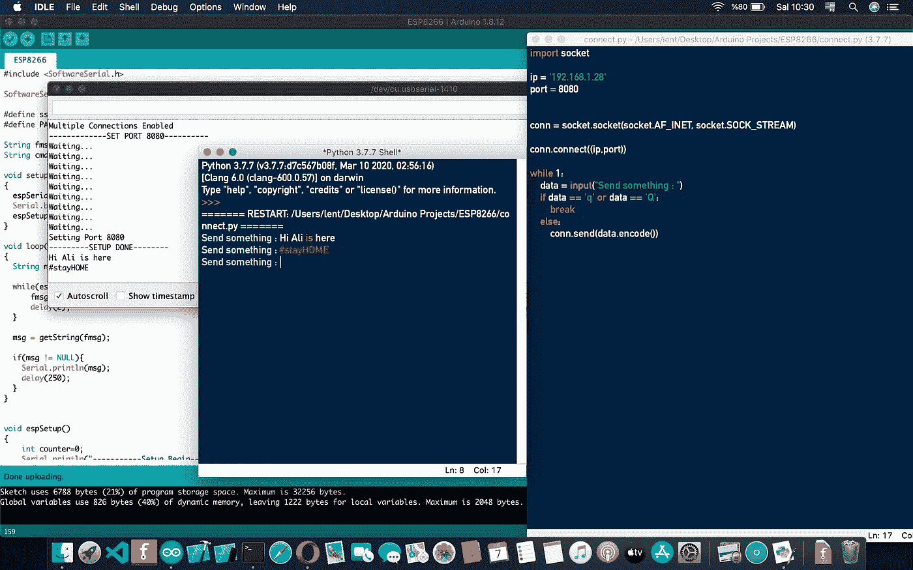

一切正常

再见。