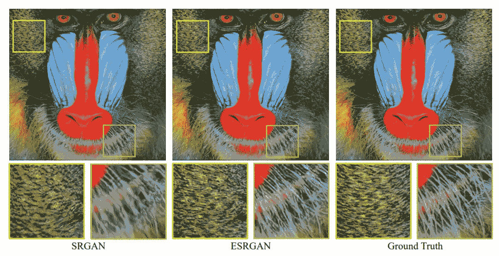
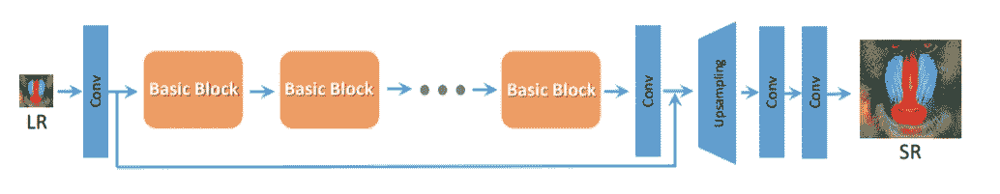
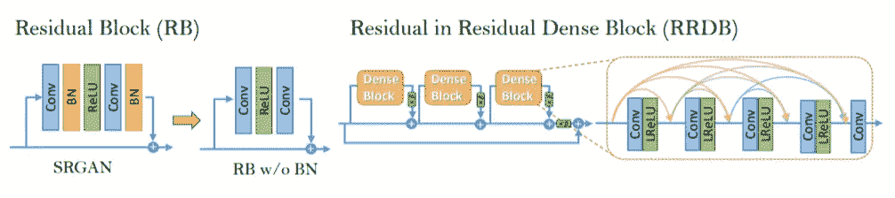
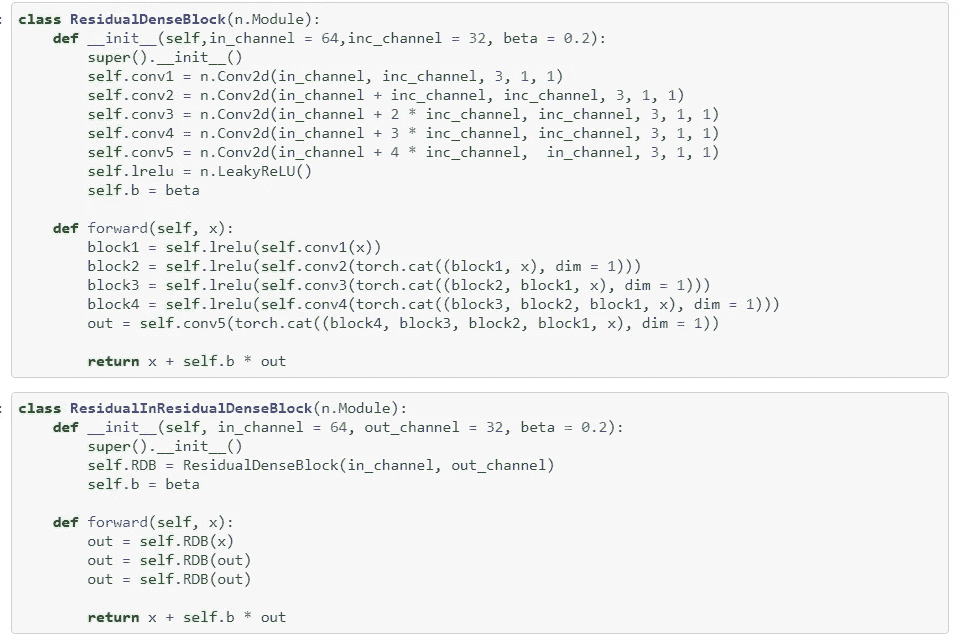
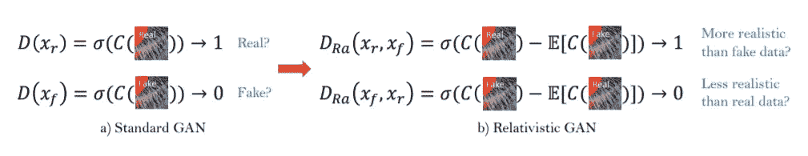
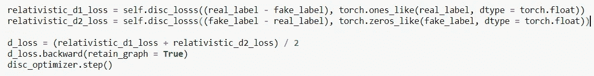
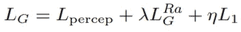

# 增强的超分辨率 GAN

> 原文：<https://medium.com/analytics-vidhya/esrgan-enhanced-super-resolution-gan-96a28821634?source=collection_archive---------11----------------------->

[来源](https://arxiv.org/pdf/1809.00219.pdf)

计算机视觉中的超分辨率(之前的实现——[SRGAN](/analytics-vidhya/super-resolution-gan-srgan-5e10438aec0c))一组再加一个，本文是[es rgan 的 PyTorch 实现:增强型超分辨率生成对抗网络](https://arxiv.org/pdf/1809.00219.pdf) *。*

顾名思义，这是以前的 SRGAN 实现的增强版本。保留了网络的总体高级架构设计，但添加和更改了一些新概念，最终提高了网络的效率。

直接引用报纸上的话，

> 为了进一步提高视觉质量，我们深入研究了 SRGAN 的三个关键组成部分——网络架构、对抗损失和感知损失，并对它们进行了改进，得到了一个增强的 SRGAN (ESRGAN)。

让我们讨论一下 SRGAN 组件的所有这三个改进:

> **网络架构**

通过引入残差密集块(RRDB)改进了发电机的网络结构，提高了网络的容量，也使训练变得容易。

[来源](https://arxiv.org/pdf/1809.00219.pdf)

上面是生成器的架构，其中基本块实际上是 RRDB。

为了提高 SRGAN 生成图像的质量，主要在网络架构上做了两处修改:

1.  移除所有批次标准化(BN)层
2.  用 RRDB 代替原来的基本块

[来源](https://arxiv.org/pdf/1809.00219.pdf)

在左上图中，可以看到 BN 层被移除，在右图中，RRDB 块用于更深的模型，其中β是剩余缩放参数。

已经观察到，在许多网络架构中，BN 层的移除导致性能的提高以及计算复杂度和存储器使用的降低。同时，与 SRGAN 中的原始残差块相比，RRDB 导致了更深和更复杂的生成器网络结构，这最终提高了网络的性能。残差缩放参数在 0 和 1 之间保持恒定，以防止网络不稳定。

下面是 PyTorch 框架中 RRDB 块的实现:

[来源](https://github.com/vishal1905/ESRGAN-Enhanced-Super-Resolution/blob/master/ESRGAN.ipynb)

在 ESRGAN 的当前实现中，在发电机网络中使用了 23 个这样的 RRDB 块。

> 不利损失

第二个改进是使用相对论平均 GAN (RaGAN)的概念改进鉴别器，使鉴别器能够判断“一个图像是否比另一个图像更真实”，而不是“一个图像是真实的还是伪造的”。

[来源](https://arxiv.org/pdf/1809.00219.pdf)

以上是标准甄别器和相对论甄别器的区别。相对论鉴别器试图预测真实图像比虚假图像相对更真实的概率，而不是给出图像真实或虚假的概率的标准鉴别器。

下面是 PyTorch 中相对论鉴别器的实现:

[来源](https://github.com/vishal1905/ESRGAN-Enhanced-Super-Resolution/blob/master/ESRGAN.ipynb)

> 知觉丧失

在超分辨率中引入感知损失，在特征空间而不是像素空间优化超分辨率模型。在 ESRGAN 中，通过使用激活前的功能来改善感知损失，这可以实现亮度一致性和纹理恢复。感知损失是通过在激活之前而不是像在 SRGAN 中那样在激活之后使用 VGG 特征来实现的。

由于以下两个原因，在 ESRGAN 中使用激活前的功能:

1.  被激活的特征非常稀疏，这提供了弱的监督，从而导致较差的性能。
2.  与地面真实图像相比，激活的特征导致不一致的亮度

**训练详情**

与 SRGAN 类似，ESRGAN 也将低分辨率(LR)图像缩放为高分辨率(HR)图像，从 64 x 64 到 256 x 256，放大系数为 4。

发电机的总损耗计算如下:

[来源](https://arxiv.org/pdf/1809.00219.pdf)

其中，L1 是内容损耗，Lpercep 是感知损耗，其他是相对论性发生器损耗。λ，η是平衡不同损失项的系数。λ和η在训练中分别设置为 0.005 和 0.01。

对于优化，使用 Adam optimizer，学习率为 0.0002，β1 = 0.9，β2 = 0.999 为默认值。

# 参考

[艾斯根纸](https://arxiv.org/pdf/1809.00219.pdf)

# 履行

[Github](https://github.com/vishal1905/ESRGAN-Enhanced-Super-Resolution)

有关整体架构的更多信息，请参考 [SRGAN](/analytics-vidhya/super-resolution-gan-srgan-5e10438aec0c) 文章。