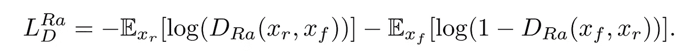

# ESRGAN:使用 Keras 的增强超分辨率生成对抗网络

> 原文：<https://medium.com/analytics-vidhya/esrgan-enhanced-super-resolution-generative-adversarial-network-using-keras-a34134b72b77?source=collection_archive---------3----------------------->


ESRGAN 是 SRGAN 的增强版本。ESRGAN 的作者试图通过修改模型架构和损失函数来增强 SRGAN。

# 开始

在深入研究 ESRGAN 之前，我们先来了解一下 GAN。GANs 能够生成看起来很真实的假数据。GAN 的一些应用是为了提高图像质量。GAN 的高层架构包含两个主要网络，即**发生器网络**和**鉴别器网络**。发生器网络试图产生假数据，鉴别器网络试图区分真实数据和假数据，从而帮助发生器产生更真实的数据。


# 埃斯甘

ESRGAN 的主要架构与 SRGAN 相同，但有一些修改。ESRGAN 在残差密集块(RRDB)中有残差，残差密集块结合了多级残差网络和密集连接，无需批量归一化。

**网络架构**


**残中残密块(RRDB)**


```
from keras.layers import Add, Concatenate, LeakyReLU, Conv2D, Lambdadef dense_block(inpt):
    """
    Dense block containes total 4 conv blocks with leakyRelu 
    activation, followed by post conv layer Params: tensorflow layer
    Returns: tensorflow layer
    """
    b1 = Conv2D(64, kernel_size=3, strides=1, padding='same')(inpt)
    b1 = LeakyReLU(0.2)(b1)
    b1 = Concatenate()([inpt,b1]) b2 = Conv2D(64, kernel_size=3, strides=1, padding='same')(b1)
    b2 = LeakyReLU(0.2)(b2)
    b2 = Concatenate()([inpt,b1,b2])    b3 = Conv2D(64, kernel_size=3, strides=1, padding='same')(b2)
    b3 = LeakyReLU(0.2)(b3)
    b3 = Concatenate()([inpt,b1,b2,b3]) b4 = Conv2D(64, kernel_size=3, strides=1, padding='same')(b3)
    b4 = LeakyReLU(0.2)(b4)
    b4 = Concatenate()([inpt,b1,b2,b3,b4]) b5 = Conv2D(64, kernel_size=3, strides=1, padding='same')(b4)
    b5 = Lambda(lambda x:x*0.2)(b5)
    b5 = Add()([b5, inpt])

    return b5def RRDB(inpt):
    """
    RRDB(residual in residual dense block) contained three dense  
    block, each block followed by beta contant multiplication(0.2) 
    and addition with dense block input layer. Params: tensorflow layer
    Returns: tensorflow layer
    """
    x = dense_block(inpt)
    x = dense_block(x)
    x = dense_block(x)
    x = Lambda(lambda x:x*0.2)(x)
    out = Add()([x,inpt]) return out
```

**相对论鉴别器**

除了使用标准鉴别器，ESRGAN 还使用相对论 GAN，它试图预测真实图像比假图像相对更真实的概率。


```
from keras import backend as K**def** relativistic_loss(x):
    real, fake = x
    fake_logits = K.sigmoid(fake - K.mean(real))
    real_logits = K.sigmoid(real - K.mean(fake))

    **return** [fake_logits, real_logits]
```

鉴别损失和对抗损失定义如下。



```
dis_loss =
K.mean(K.binary_crossentropy(K.zeros_like(fake_logits),fake_logits)+                    K.binary_crossentropy(K.ones_like(real_logits),real_logits))gen_loss = K.mean(K.binary_crossentropy(K.zeros_like(real_logit),real_logit)+K.binary_crossentropy(K.ones_like(fake_logit),fake_logit))
```

**知觉丧失**

通过在激活函数之前约束特征来引入更有效的感知损失。

```
from keras.applications.vgg19 import preprocess_inputgenerated_feature = vgg(preprocess_vgg(img_hr))
original_fearure = vgg(preprocess_vgg(gen_hr))percept_loss = tf.losses.mean_squared_error(generated_feature,original_fearure)
```


图像'狒狒'激活前后代表性特征图。随着网络的深入，激活后的大多数特征变得不活跃，而激活前的特征包含更多信息。

**培训详情**

ESRGAN 将低分辨率(LR)图像缩放为高分辨率图像，放大系数为 4。

对于优化，Adam optimizer 使用默认值。

**参考文献**

 [## ESRGAN:增强的超分辨率生成对抗网络

### 超分辨率生成对抗网络(SRGAN)是一个开创性的工作，能够生成现实的…

arxiv.org](https://arxiv.org/abs/1809.00219)  [## 使用生成对抗网络的照片级单幅图像超分辨率

### 尽管使用更快和更深的卷积在单幅图像超分辨率的准确性和速度方面取得了突破…

arxiv.org](https://arxiv.org/abs/1609.04802)