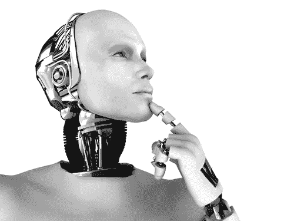
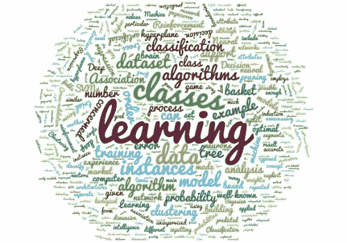
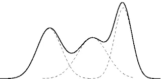

# 机器学习的本质

> 原文：<https://medium.com/analytics-vidhya/essence-of-machine-learning-ce687b517424?source=collection_archive---------10----------------------->

在这篇博客中，我将尝试表达我对机器学习本质上是什么的看法。我们将举例讨论机器学习的直觉，然后逐步定义“机器学习”这个时髦词。

大多数人将机器学习(ML)定义为“在没有显式编程的情况下，用数据‘学习’的能力”，老实说，我从来没有理解过这个定义。通过阅读，似乎 ML 是某种巫术。此外，有许多关于 ML 只是一堆 IF-ELSE 语句的笑话。那么 ML 到底是什么？它是把一个大脑放进一台机器里，还是只是一些令人费解的 IF-ELSE 语句？

为了真正理解机器学习的意义并掌握机器实际上是如何学习的，我们需要理解与之相关的术语。但是，在此之前，让我们举一个例子来直观地了解机器是如何学习的。

比方说，一个孩子平生第一次看到一架飞机从他头上飞过。现在，孩子出于好奇问他的父亲“爸爸，刚才什么东西从我头上飞过？”父亲告诉他:“嘿，儿子，这是一架飞机”。

过了一会儿，孩子看到一只鸟从他头上飞过。但是，由于他的知识有限，他告诉他的父亲:“看！爸爸，一架飞机”假设从他头上飞过的都是飞机。

现在，父亲纠正他，告诉他:“不是飞机儿子。仔细看，它有一个喙，可以扇动的翅膀，体型也小得多，所以它是一只鸟”。

这孩子现在已经学会区分飞机和鸟。他现在可以在任何时候看到一只鸟或一架飞机时正确地叫出来，但是，如果他看到天空中有一只风筝，会发生什么呢？他肯定会感到困惑，父亲现在会教他通过提及这些飞行实体的显著或不同的特征来区分风筝、飞机和鸟。

只要孩子得到正确的信息，他就能做出正确的决定。类似地，我们试图给机器输入具有显著特征的数据，这样它就可以像孩子一样学习数据并做出正确的决定。在理解了这个例子之后，我们现在可以开始学习机器学习的术语了。

走到这一步，我们必须定义一些术语，以进一步理解机器学习的实际意义。学习从数据开始。数据只不过是我们得到的信息。它由特征组成。特性只不过是与每个数据实例相关联的属性。

与上面的例子相比，数据是父亲提供给儿子的所有信息，特征是提供信息的方式，例如:拍动的翅膀、大小、喙的存在等。在现实世界中，我们主要以行和列的形式获取数据。

表格中的每一行都代表数据的一个实例，或者用 ML 术语表示:一个样本点/观察值。Columns 表示数据的属性，在 ML 术语中称为特性。

现在让我们理解机器如何从数据中学习。我们一给机器输入这些表格，它就开始从数据中学习，这是不正确的。我们制定某些规则，陈述一些假设，制定一个假设，并准备一个成本函数，基于此，机器可以从中迭代学习。这里最重要的两个术语是:**假设函数和成本函数**。为了理解这些术语，我们首先需要知道什么是总体和样本。

总体是由所有可能的观察值组成的数据的总体/完整形式。样本是总体的一个子集，它应该是数据的真实代表。现在，回到假设函数。

在机器学习中，我们相信群体是由某种函数来表示的。我们的工作是对该函数进行假设，以便机器可以学习该函数的参数。

函数的参数通常是通过迭代数据样本来学习的(很难获得完整的总体，所以我们对样本进行研究。)并且在每次迭代中计算成本函数。成本函数基本上是一个惩罚函数，当机器学习错误时惩罚它，当它学习正确时奖励它。

与上面的例子相比，在那种情况下，不断教导儿子的父亲就是成本函数。假设功能是儿子的逻辑，他根据观察到的情况做出决定。他所做的观察是原始人群的样本。这些是机器学习的基础。

使机器学习规则的主要驱动力之一是假设函数的正确假设。假设函数的一个最简单的假设或我们认为最准确表示总体的函数可以是高斯分布。如果我们的假设是正确的，那么我们的成本函数的值将会很低。然而，如果假设是错误的，那么这意味着我们将从成本函数中获得非常高的值。然后，我们需要为这个假设做一个复杂的假设。

复杂假设的一个例子可以是高斯混合模型，这意味着我们的总体来自一个以上分布的集合/混合。

高斯混合模型

因此，我们可以说，我们对定义总体的函数的假设越好，模型的预测就越好。现在，一个合乎逻辑的问题出现了:“这里到底学到了什么？”。这个问题的答案是:定义我们假设分布的参数。

例如，如果我们假设我们的函数来自高斯分布，那么模型将学习高斯分布的参数，即平均值和标准差。如果我们假设我们的函数是一条线:y = m*x + c 那么，模型将学习参数 m 和 c。

至此，我们现在还可以讨论机器学习中模型的两种分类:生成模型和判别模型。

生成式模型‌learns**联合概率分布 p(x，y)。**这意味着生成模型将尝试直接估计原始人口函数。因此，它实际上可以生成属于总体的数据点。

然而，一个判别模型‌learns 了**条件概率分布 p(y|x)。**这意味着，这些模型仅学习区分类别，并不尝试实际生成数据点。最后，在这篇博客的结尾，我想留给你我们在机器学习中解决了什么类型的问题:

总结一下:

1-监督学习有一些输入点(X)和一些指定的输出标签(y)。我们的任务是映射一个函数，使得 f(X) → y。

2-在无监督学习中，我们仅被给予输入标签(X ),并且我们必须仅从中观察模式/信息。

3 —在强化学习中，我们致力于通过从环境/刺激中产生反馈来实现持续改进的概念。