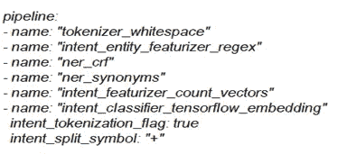
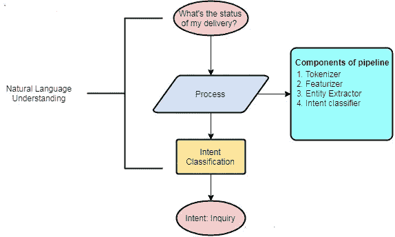
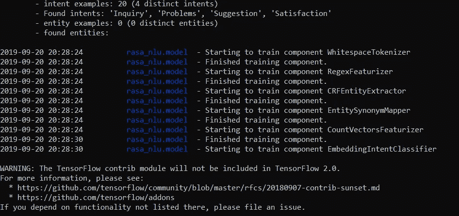
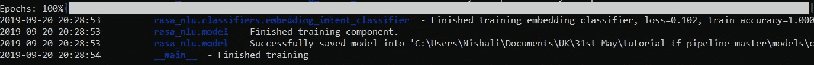

# 拉萨·NLU 的精髓

> 原文：<https://medium.com/analytics-vidhya/essence-of-rasa-nlu-899629a83a89?source=collection_archive---------5----------------------->

什么是拉莎·NLU？

asa 是开源的对话式人工智能工具。Rasa 中的 NLU 代表自然语言理解。在 NLP 和 NLU 之间困惑？NLP 是自然语言处理的缩写，而 NLU 是自然语言理解的缩写。两者的共同目标是理解自然语言(例如英语)和计算机语言之间的交互。Rasa NLU 是自然语言处理工具，用于意图分类、响应检索、实体提取等等。它专门用于识别情感、会话聊天机器人、命名实体识别和识别句子的目的(意图)。

# 目标

在本文中，我们将建立一个意图分类模型，它将理解用户提供的意图，并相应地对句子进行分类。Rasa pipeline 主要是为聊天机器人理解而开发的，但在这里我们对它进行了调整，以获得所需的结果。

**先决条件和依赖关系**

*   Python 3.5
*   Rasa_nlu -0.15.0
*   Rasa_core -0.14.4
*   Visual C++生成工具
*   节点. js
*   张量流-1.13.1

我们将使用 Rasa 提供的 tensorflow 管道。

> L 墨-[https://github.com/RasaHQ/tutorial-tf-pipeline](https://github.com/RasaHQ/tutorial-tf-pipeline)

**张量流管道解剖**

1.  d **ata/nlu.md** :你的 nlu 训练数据
2.  **data/stories.md** :你的故事
3.  **domain.yml** :您助手的域
4.  **自述。** md:指令文件
5.  **config.yml** :您的 NLU 和核心机型的配置

config.yml 包括以下组件:



管道

**管道结构外形图**



意图模式

创建/编辑降价文件(data/nlu_data.md)并提供相应的示例。我给了四个不同的意图与他们的样品。

> *##意图:查询*
> 
> -嘿，我想知道你们店里洗衣机的价格范围。我需要在你的网站上注册了解更多细节吗？你的 xyz 产品的上市日期是什么时候？
> -早上好，我们能不能请你将案件编号更新为已完成。我目前的产品有什么进展吗？
> 
> ##意图:建议
> 
> -改进 led 屏幕灯。交付团队应该跟踪他们交付的客户。
> -客户应该在订单的 2-3 天内收到消息，而不是 5-7 天。
> -保修期应从 12 个月延长至 18 个月。
> -所有人都可以享受借记卡/信用卡优惠。
> 
> #意图:满意
> 
> 服务很好，我很喜欢。
> -交付团队的良好表现。我的公寓在顶楼。
> - Fab 产品。我很享受。
> -非常感谢你的快速交货。
> -巨大的努力。我的问题在两天内得到了解决。
> 
> ##意图:问题
> 
> -产品未交付。令人沮丧。
> -送货队没有接到电话。太不专业了。
> -产品上有凹痕。我通知了，但没有回音。廉价服务。
> -对流程不满意。太冗长乏味了。
> -购物车中缺少产品。几小时前我加入了购物车。很烦。

**训练时间到了**

```
*python -m rasa_nlu_train -c config.yml — data data/nlu_data.md -o models — fixed_model_name nlu_model — project current — verbose*
```



培训过程



培训完成

**测试分类器**

我们将把新的样本传递给解析器来测试我们的准确性。意图分类器生成具有置信度的意图。

```
*interpreter.parse("I don't like you product. take it back its cheap")*
```

> {'intent': {'name': 'Problems '，' confidence': 0.7875019907951355 }，
> 'entities': []，
> ' intent _ ranking ':[{ ' name ':' Problems '，' confidence ':0.7875019907951355 }，
> {'name': 'Satisfaction '，' confidence ':0.398760080375244 }，
> {'name': 'Inquiry '，' confidence '，' confidence ':0.拿回它的便宜" }

```
interpreter.parse("I really like your product. It's nice and elegant")
```

> { ' intent ':{ ' name ':' Satisfaction '，' confidence ':0.7504403591156006 }，
> 'entities': []，
> ' intent _ ranking ':[{ ' name ':' Satisfaction '，' confidence ':0.7504403591156006 }，
> {'name': 'Inquiry '，' confidence ':0.43102625012397766 }，
> {'name ':'问题'，'问题很好看很优雅" }

```
interpreter.parse("What is the date of  delivery?")
```

> {'intent': {'name': 'Inquiry '，' confidence ':0.8536046743392944 }，
> 'entities': []，
> ' intent _ ranking ':[{ ' name ':' Inquiry '，' confidence ':0.8536046743392944 }，
> {'name': 'Problems '，' confidence ':0.24555110251903534 }，
> {'name ':'满意'，'满意}

```
interpreter.parse("Try to improve service offerings")
```

> {'intent': {'name': 'Suggestion '，' confidence ':0.6914837956428528 }，
> 'entities': []，
> ' intent _ ranking ':[{ ' name ':' Suggestion '，' confidence ':0.6914837956428528 }，
> {'name': 'Inquiry '，' confidence ':0.3903597593307495 }，
> {'name ':'问题'，'问题

我真的希望你喜欢我对如何使用 Rasa 的 tensorflow 管道实现一个简单的意图分类器的小小探索。检查这个[链接](https://github.com/Shubham619/Intent-Classifier_Tensorflow_pipeline)的代码。

如有疑问，请通过[shubhamdeshmukh @**Yahoo . in**联系作者。如果你对数据科学/机器学习有热情，请随时在](http://shubhamdeshmukh40@yahoo.in) [LinkedIn](https://www.linkedin.com/in/shubhamdeshmukh619/) 上加我。