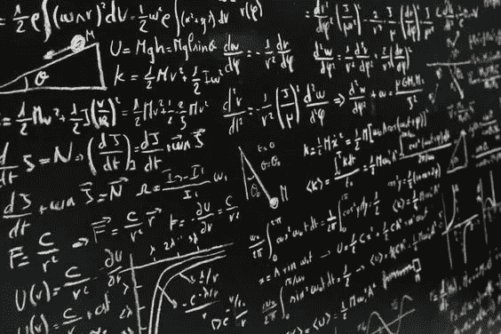

# 深度学习的基本数学

> 原文：<https://medium.com/analytics-vidhya/essential-math-for-deep-learning-d21e701e4401?source=collection_archive---------27----------------------->

当假设深度学习需要大量的数学背景才能成为深度学习专家时，许多人都感到沮丧，在这篇博客中，我将介绍每个深度学习专家都应该熟悉的最必要的数学知识。

这种基本数学知识对于从其他行业进入深度学习的新人尤为重要:硬件…