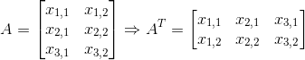

# 理解神经网络的基本数学

> 原文：<https://medium.com/analytics-vidhya/essential-math-for-understanding-neural-networks-1173be7e1219?source=collection_archive---------12----------------------->

你好，人类同胞，我希望我能帮助你学习机器学习。我们将涵盖你可能需要完全理解神经网络背后的算法和概念的所有主题。我们将学习:偏导数、多维图形、标量、向量、矩阵、张量和一些最重要的概率分布。对于所有列出的主题，我将给出一个机器学习的例子，以及它是如何应用的。注意，在本文中我不会解释神经网络背后的概念；我打算通过掌握必要的数学知识，让你对 NN
的学习体验更容易消化，这些知识应用在 NN 后面的算法中，或者至少在正确的方向上引导你。

让我们从**偏导数**的基础知识开始。它们在机器学习中很常见，尤其是在用于调整神经网络权重的反向传播中。
我们需要在反向传播中使用偏导数的原因是为了找出比重或偏差如何影响损失函数。区分偏导数和普通导数的符号是一个非常艺术的 d 符号，∂.
假设我们有一个多变量函数:

计算关于 x 的偏导数看起来像这样:

当我们计算上面的表达式时，我们把 y 和 z 看作常数。
我们知道，如果我们在一元微积分中有普通导数 df/dx，它说的是:对于 x 的微小变化，函数的输出会改变多少。但是我们如何解释，如果我们有一个多元函数 f(x，y) = x，y？dx 仍然表示输入变量 x 的微小变化，df 当然仍然表示函数的最终变化。但是 x 不是我们唯一可以移动的方向，我们也在多维空间中，我们也可以在 y 方向移动。现在，我们可以计算 df/dy，它告诉我们，对于 y 方向上的小位移，输出如何变化。我们可以得出结论，这两个导数都没有告诉我们函数是如何变化的，这就是我们称它们为偏导数的原因。这是一个二元函数在 3d 空间中的样子:

f(x，y)=x y

单变量导数更正式的定义是这样的:

如果我们选择某个函数的两个值 f(x₀和 f(x₁，并想计算它们之间割线的斜率，我们可以使用游程公式。

现在我们知道，如果 f(x₀和 f(x₁之间的距离变得很小，我们会得到 f(x₀).值的切线斜率如果我们改写公式，用δx 表示一些小的推动，我们得到:

但是我们不能把δx 设为 0，因为我们会得到 0/0，这是一种未定义的形式，这也是我们需要使用极限的原因，因为δx 接近于 0，但绝不是 0。所以当我们计算函数在某点的导数时，我们得到了该点切线的斜率。对于对 x 的偏导数，形式上的定义非常相似:

重要的是要注意，标记为微小输入的δx 被添加到不同的输入变量中，这取决于我们所取的偏导数。但是当我们计算一个多元函数的偏导数时，图形解释是什么呢？如果我们假设有两个变量函数 f(x，y)=…，并计算 x 在某个特定点的偏导数，我们可以通过在图形上画一个平面作为常数 y 值，并测量最终切割的斜率来实现这一点。为了获得更好的视觉效果，我推荐你看这个[视频](https://youtu.be/dfvnCHqzK54)。

偏导数的另一个方面是用于反向传播的**多变量链式法则**。我将向您介绍开始理解它的基础知识。单变量链法则规定，复合函数 f(g(x))的导数是 f’(g(x))* g’(x)。现在让我们看看这个例子:

推导这个函数看起来像这样:

我们实际上是这样做的:

现在看多变量链式法则应该比较容易，下面的等式*里就用到了。

多变量链式法则

在神经网络中，当我们试图计算一个函数对某个变量的偏导数，但该变量依赖于它之前的变量时，就会出现这种情况。在反向传播的情况下，函数 c 的成本相对于连接 kᵗʰ神经元和 jᵗʰ神经元的 Lᵗʰ层中的权重的偏导数看起来像这样(“a”表示 lᵗʰ层中的 mᵗʰ神经元):

*成本函数相对于权重的偏导数

现在为了更好地解释和形象化上面的等式，我们将定义什么是**梯度下降**。函数的梯度是对函数的所有偏导数进行分组的一种方式。假设我们有这个函数:f(x，y)=x sin(y)。对 x 的偏导数是:

关于 y 的偏导数是:

现在我们用符号 nabla 表示函数 f 的梯度:

我们可以称这个函数为向量值函数，它以二维点为输入，输出一个二维向量。如果我们用四维输入来做这件事，我们会得到四维输出。看梯度的一个有用的方法是作为一个算子，它的形式是一个向量，充满了对不同变量的偏导数(在机器学习中，这个数字可以是几百万)，我们可以用一个函数乘以它，我们可以看到如何得到我上面写的格式。

函数的梯度是最陡上升的路径，在几何解释中，是我们需要走的路径，以便用最少的步骤达到局部最大值。既然我们知道梯度是什么，定义梯度下降就更容易了，这是最陡下降的路径，我们通过采取与梯度的负值成比例的步骤来得到它，换句话说，找到局部最小值的方法是最小化损失函数的方法。我建议你查看[汗学院](https://www.khanacademy.org/math/multivariable-calculus/multivariable-derivatives/partial-derivative-and-gradient-articles/a/introduction-to-partial-derivatives)网站，了解更多关于偏导数和多变量微积分的信息，以及 3Blue1Brown Youtube 频道。关于反向传播和详细解释的更多信息，请查阅这本[书](http://neuralnetworksanddeeplearning.com/chap2.html)。

在我们的旅程中，我们必须包括部分**线性代数**，神经网络中的所有数据点都是张量的形式，这使得在编码环境中编写和计算单元计算非常高效。数据集、图像都是矩阵形式，每一行都有相同的长度，即相同的列数，因此我们可以说数据是矢量化的，每一行代表特定的数据输入。行可以一次或成批地提供给模型。让我们从标量开始。一个**标量**只是一个单一的数字，当我们定义它时，它将被记为 n∈R，其中 n 是直线的斜率。
一个**向量**是一个数字数组，我们可以把向量中的每个数字看作一个定义不同轴上坐标的数字。

x 的第一个元素是 x₁，第二个是 x₂…如果我们还想说向量 x 中存储的是什么样的数，即如果每个元素都是实数，向量有 n 个元素，那么向量就位于取ℝⁿ.ℝn 次的笛卡尔积(两个集合 a 和 b 的笛卡尔积记为 A×B，定义为:A×B = { (a，b) | aϵA 和 bϵB })形成的集合中
矩阵是数字的二维数组，所以每个元素由两个索引来标识，而不是只有一个，但是在神经网络中，我们需要 X-D 数组，它们被称为**张量**。假设我们有一个名为 a 的张量，我们想通过写 Aᵢⱼₖ.来确定 a 在坐标(I，j，k)上的元素
矩阵的一个重要操作是转置，它是矩阵在一条对角线上的镜像，这条对角线称为主对角线。它从左上角向下向右延伸。我们将矩阵 a 的转置表示为 A^T，定义如下:

例子

我们可以把矩阵加在一起，只要它们有相同的形状，只需把它们对应的元素相加 C = A+B 其中 Cᵢⱼ=Aᵢⱼ+Bᵢⱼ.我们可以在矩阵中添加一个标量，或者只通过对矩阵的每个元素执行该操作来乘以一个标量。在处理神经网络时更流行的符号中，我们允许添加一个矩阵和一个向量，这将给出另一个矩阵:C = A + b，其中 Cᵢⱼ=Aᵢⱼ+Bⱼ.换句话说，向量 b 被添加到矩阵的每一行。这样，我们就不需要定义一个带有“b”的矩阵，在做加法之前将它复制到每一行中。神经网络中最常见的运算是两个矩阵相乘。两个矩阵 A 和 B 的矩阵乘积就是第三个矩阵 c，规则是矩阵 A 的列数必须和矩阵 B 的行数相同。如果矩阵 A 的形状是 k×n，B 是 n×g，那么矩阵 C 的形状是 k×g，乘积运算定义为:

如果你想知道更多，请参考数学文献或这本[书](http://www.deeplearningbook.org/contents/linear_algebra.html)。

现在，我们将讨论机器学习中常见的几个概率概念。
**均方误差**是一种统计方法，测量估计值和被估计值之间的均方差，在机器学习中，我们用它作为损失函数，进而从标注数据中找出我们的猜测有多大误差。

如果我们将我们的 yᵢ想象为分散在二维图上的点的结果(由我们的神经网络预测的数据),将 yᵢ'想象为位于最佳分散数据之后的线上的标记数据，换句话说，最小化误差，我们的目标是找到线 y=Mx+B。在每一批之后，我们计算均方误差，并试图在下一批中将其最小化，我们的目标当然是使其尽可能接近零，这意味着我们预测的点尽可能接近 y = Mx+B 线。

另一个流行的评估损失的方法是**交叉熵**，它是对给定随机变量或事件集的两个概率分布之间的差异的度量。它输出一个介于 0 和 1 之间的概率值，并且随着预测的概率偏离标记的数据而增加。我们可以用这个公式计算损失，其中 p(x)是期望概率，q(x)是实际概率。

如果具有 softmax 激活函数的最后一层输出给定类别的这些概率:

我们针对该特定训练示例的一键编码数据是:

因为我们可以看到预测的分布是否与标记值不同，并且我们想要计算这种差异，我们可以通过使用交叉熵来这样做，然后微调神经网络的权重和偏差，这样我们就可以最小化这种差异。在上面交叉熵公式中的求和运算符之前，我们必须加上负号，因为对数函数对小于 1 的输入输出负值，这种情况始终存在，因为我们要处理 softmax 函数输出的概率。

现在我们来列举一些激活函数及其图形。我们不使用线性函数作为激活函数的主要原因是我们不能使用反向传播来训练模型。线性函数的导数是常数，与输入无关。这就是我们使用非线性函数的原因。我将列出其中的几个，但我不会深入，也不会通过利弊；为此，我建议您参考这篇文章。
乙状结肠功能。一个 Sigmoid 函数的范围是< 0，1 >。

f(x)=1/(1+e^(-x))

双曲正切函数。TanH 的范围是[-1，1]。

f(x)=tanh(x)

ReLU 函数代表校正的线性单位，公式非常简单 max(0，x)，它类似于 Sigmoid 函数，但避免了消失梯度问题。

f(x)=max(0，x)

在本文中，我们浏览了机器学习中一些最常用的数学概念，简要解释了它们，并链接了一些文献以获取特定主题的更多信息。还有很多东西我没有提到，但我希望这可以成为你旅程的一个好的起点，或者只是一个好的记忆刷新。感谢您的阅读。