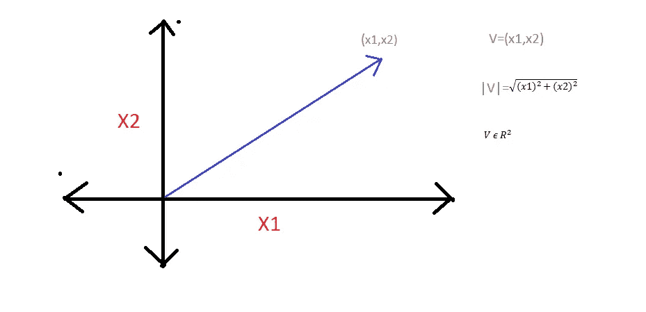
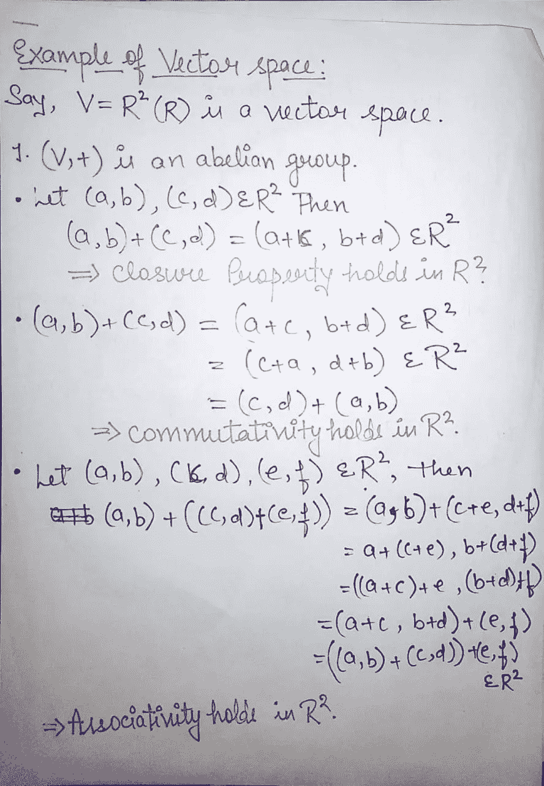
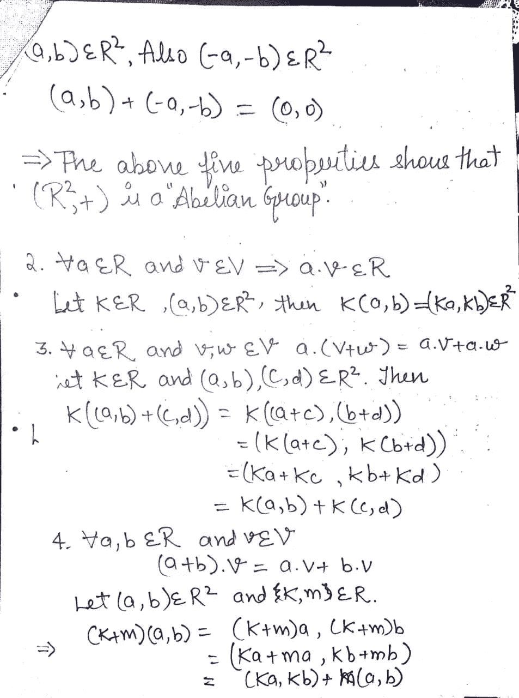
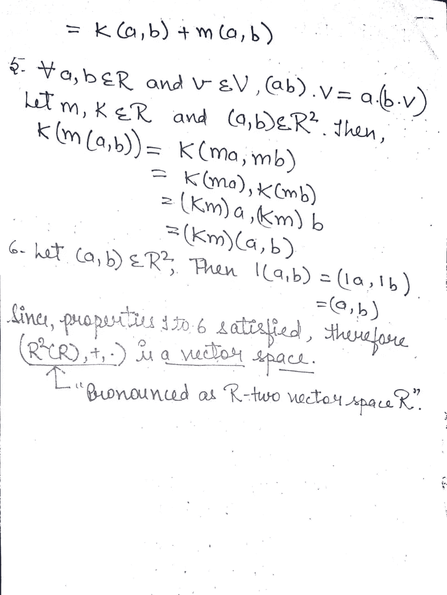
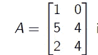

# 机器学习的基本数学概念-线性代数-第 1 部分

> 原文：<https://medium.com/analytics-vidhya/essential-mathematical-concepts-for-machine-learning-linear-algebra-part-1-2287e921c554?source=collection_archive---------11----------------------->

在这一系列文章中，我们将讨论机器学习的数学观点。我们将从基础开始，然后转向几种机器学习算法的统计复杂性。这是一个系列，建议按照发布的顺序阅读。为了方便读者，我将在我就这个主题发表的每篇文章中使用部件号(本文使用 1)。

在这篇文章中，我们将从线性代数基础开始。我可能会再贴 2 到 3 篇关于线性代数的文章，来涵盖那些与机器学习相关的主题。将讨论的主题如下

1.  向量
2.  向量空间和子空间
3.  线性跨度
4.  列空间
5.  零空间

**矢量:-** 它是一个既有大小又有方向的物体。几何学上，我们可以把一个矢量想象成一条有向线段，它的长度给出了矢量的大小，箭头给出了方向。

在机器学习中，我们使用向量来表示年龄、工资等输入数据的特征和标签。在这个例子中，V 是实数域中的一个二维向量。

**向量空间:-** 向量空间是向量的集合 V，在其上定义向量加法和向量乘法，

1.  (V，+)是阿贝尔群。
2.  实数和向量 V 之间的点积是这样定义的，对于所有的“a”属于实数，V 属于向量空间 V，这样 a.v 应该属于向量空间 V。
3.  对于所有‘a’属于实数(R)和 V，w 属于 V(向量空间)，a(v+w)=a.v+a.w
4.  对于所有 a，b 属于 R，V 属于 V，(a+b)。v = a.v+b.v
5.  对于所有 a，b 属于 R，V 属于 V，(ab)。v=a.(b.v)
6.  (酉律)1 属于 R 而 V 属于 V，1.v 属于 V。

向量空间的更多例子可以是:

所有实函数的向量空间，变量 x 中所有多项式的集合以及来自 R 的系数等。

注意:-V = n 次多项式的集合不形成 R 上的向量空间，因为向量加法不是封闭的。

**子空间:-** 子空间可以认为是满足向量空间所有性质的向量空间的子集。

定理:设 S 是 Rn 的子集。那么 S 是 Rn 的子空间当且仅当下列条件成立:

1.  0 属于 s。
2.  s 在向量加法下是闭的。
3.  s 在标量乘法下是闭的。

例，S={(x1，x2，x3)属于 R3 | x1-x2+x3=0}是 R3 的子集。

**线性跨度:-** 设 V(F)为向量空间。

让 S={v1，v2，v3，…..，vn}是 v 的非空子集。

L(S)={c1v1+c2v2+c3v3+……..+cnvn| ci 属于 R，1≤ i≤n}

属性:-

1.  L(S)是包含 S 的最小子空间。
2.  L(S)是 S 所跨越的 V(F)的子空间。

为了说明这一点，让我们考虑 S={(2，5，3)，(1，1，1)}是 R3 的子空间，两个向量 v1=(2，5，3)和 v2=(1，1，1)。

现在说 c1，c2 属于 R 使得 L(S)={(c1*v1)+(c2*v2)| c1，c2 属于 R}。所以，L(S)= {c1(2，5，3) + c2(1，1，1)} = {(2c1+c2)，(5c1+c2)，(3c1+c2)| c1，c2 属于 R}。设 2c1+c2=x1，5c1+c2=x2，3c1+c2=x3。

通过很少的计算，我们可以得出 x1、x2 和 x3 之间的关系，即 2x1+x2=3x3 是三者之间的关系(9c1+3c2=9c1+c2)。

因此，L(S)可以写成，

L(S)= {(x1，x2，x3)属于 R3 | 2x1+x2=3x3}，这给出了 S 的线性跨度的数学定义，即在 R3 内其元素满足导出关系的任何向量线性地跨越 S。

**范围或列间距:-** 矩阵的列间距或范围 A 是其列向量的跨度。换句话说，设 A 为 A，

A 的列间距是其列向量的跨度，即(1，5，2)和(0，4，4)。它被表示为 R(A)。

**零空间:**它是一组向量，当乘以 A 时等于 0，即

N(A) ={ x 属于 R3 | Ax=0}。

如果你试图找出给定矩阵 a 的列空间和零空间的维数，这将是一个很好的练习。