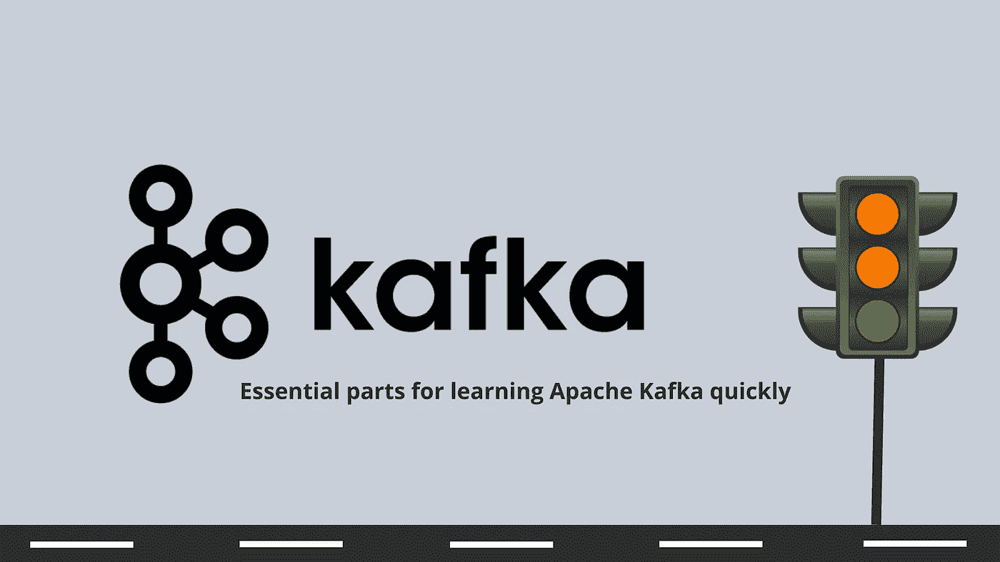
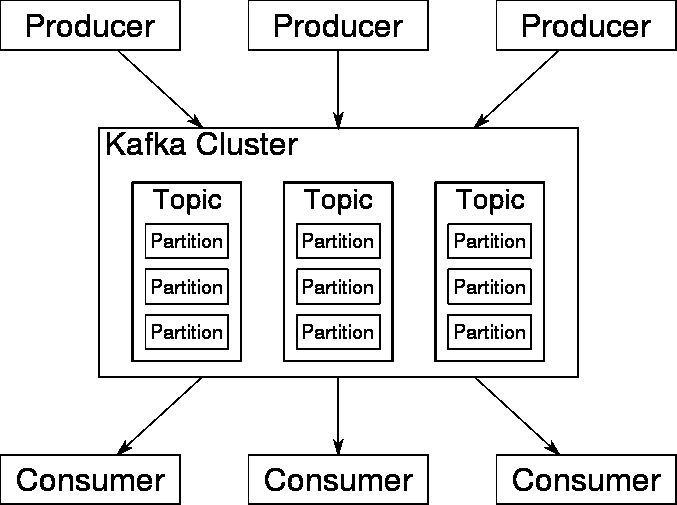

# 快速学习阿帕奇卡夫卡的必备部分

> 原文：<https://medium.com/analytics-vidhya/essential-parts-for-learning-apache-kafka-quickly-8290991fdf77?source=collection_archive---------19----------------------->

> 在这篇文章中，我将简单扼要地描述一下我们必须知道的所有要点，以了解卡夫卡是什么，它是如何工作的。

Kafka 是用 Java 和 Scala 语言开发的。它的开发始于 2009 年 Linkedin，并于 2011 年捐赠给阿帕奇基金会。2012 年 10 月，它通过了阿帕奇基金会的孵化阶段。

Kafka 的目标是为数据源的实时操作提供一个统一、高性能、低延迟的平台。

## 下面，我描述一下卡夫卡操作中必不可少的部分:
动物园管理员

是一个为分布式应用程序提供高性能协调服务的软件，Kafka 中 zookeeper 的功能是连接代理以相互交互，它负责负载平衡、代理之间的元数据交换、生产者和消费者的配置。
当一个新的代理被集成到配置中时，当代理死亡时，当一个新的主题被添加时，它识别分区的健康状况。简而言之，它集中了所有的配置管理。

## 经纪人

代理是 Kafka 的服务器，负责接收来自制作者的消息，分配偏移量，并委托或交付存储在磁盘上的消息

## 抵消

偏移量指示每个分区的状态及其消耗顺序。它通过惟一的键惟一地标识每条消息，并允许我们控制消费者在主题中的位置，即消息是如何被消费的。

## 主题和消息

关于卡夫卡的信息被分类成主题。此外，每个主题被分成许多部分。
消息被写在一个单独的附加中，并从头到尾按顺序读取。
分区也是卡夫卡提供冗余和可伸缩性的方式。每个分区可以托管在不同的服务器上，这意味着一个主题可以跨多个服务器水平扩展，以提供远远超出单个服务器能力的性能
简而言之，主题就是存储消息的类别。每个主题都包含分区和偏移量

## Kafka 有许多不同的 API，使其更易于使用和配置:

[https://kafka.apache.org/](https://kafka.apache.org/)

*   **生产者 API:** 允许应用程序发布一个或多个 Kafka 主题的记录序列。
*   **消费者 API:** 允许应用程序订阅一个或多个主题，并处理为它们生成的记录序列。
*   **Streams API:**允许应用程序充当流处理器，从一个或多个主题消费输入流，并向一个或多个输出主题产生输出流，有效地将输入流转换为输出流。
*   **连接器 API:** 允许连接到现有 Kafka 主题系统、应用程序或数据的可重用生产者或消费者的构建和操作。例如，关系数据库的连接器可以捕获表中的每个变化。
*   **管理 API:** 允许你管理和检查 Kafka 主题、中介和其他对象。

## 生产者

制作者发布他们选择的主题的数据。生产者负责为他或她将要写的记录选择适当的分区。这可以通过循环来分配负载，也可以通过在关键字上应用语义函数来实现。

## 消费者和消费者群体

消费者被分组在消费者组的概念下，因此关于一个主题发布的每个记录将被给予订阅该主题的消费者组中的一个消费者。消费者可以是独立的进程，也可以是不同的机器。
如果所有的消费者属于同一个组，负载共享(分区)将在他们身上完成。如果所有的消费者都属于不同的组，那么每条记录都将发给所有的消费者。

生产者、消费者、主题和分区之间的交互示例[https://kafka.apache.org/](https://kafka.apache.org/)

## KSQL

ksqlDB 是一个流事件数据库，专门用于帮助开发人员在 Apache Kafka 上构建流处理应用程序。KSQL 是一个开源的流媒体引擎，通过 Apache Kafka 实时分发，允许用 SQL 编写流，避免了代码编程。KSQL 提供了大量的处理操作，比如聚合、连接、会话等等

我希望这篇文章是有帮助的。

**参考文献**:

[https://kafka.apache.org/](https://kafka.apache.org/)