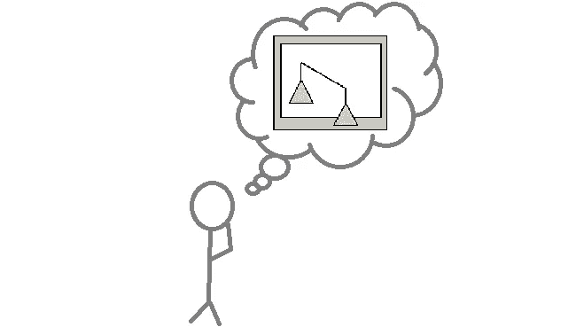
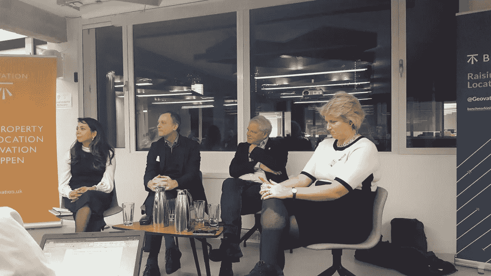
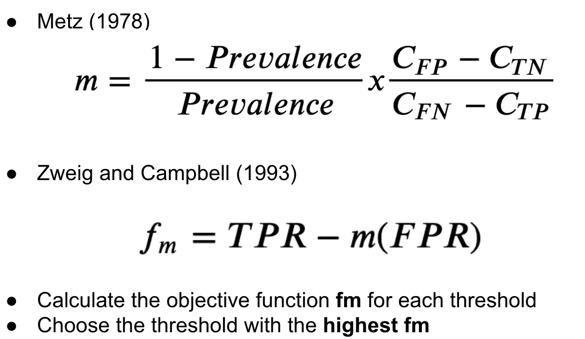

# 数据科学中的伦理、公平和代表性偏见——一扇窗

> 原文：<https://medium.com/analytics-vidhya/ethics-fairness-inequity-and-representational-bias-in-data-science-a-window-4611598810ad?source=collection_archive---------19----------------------->

这篇文章将为这个巨大的主题提供一个窗口，关注:
-代理数据的使用
-数据中的偏差
-思考并在你的模型中包含“真实成本”

数据科学家考虑模型的公平性

道德是你的数据集中的一个特征吗？你记得什么是伦理吗？作为熨斗学校数据科学专业的一名学生，我被告知以道德的方式思考和工作是多么重要。很快就要毕业了，我将被释放到在许多重要方面塑造我们生活的工作数据科学挂毯中。从制定政策、改变生活的决策到医疗保健和广告宣传。我们到底有没有在思考潜在的伦理含义？

> 伦理/ˈɛθɪks/
> 管理一个人的行为或一项活动进行的道德原则。

活动小组成员(左起):Noor Mo'alla、Alistair Edwardes 和 Jonathan Cave 博士，由 Miranda Sharp 主持

今年早些时候，我参加了一个由 Benchmark Initiative 主办的活动。他们有一个包括努尔·莫拉和乔纳森·凯夫博士在内的杰出小组。我也很兴奋地见证了一个聚焦于地理定位数据的代表性、偏见和不平等的事件，变成了一场关于所有**数据的讨论。房间里气氛热烈，有人举手向博学的小组成员提问。所有的问题都很有深度，似乎很难回答，给我留下了深刻的印象。**

在活动中，我了解到人们**关心道德。这很有意思，因为它暗示我不知道人们会在意！而我没有。当没人谈论它的时候，你怎么知道人们关心它？然而，尽管这是必要的，但似乎“许多人还没有准备好就此进行艰难的对话。”— Noor Mo'alla，Doteveryone 的商务总监**

> 公平/ˈfɛːnəs/没有偏袒或歧视的公正的待遇或行为。

# 代理数据

越来越多地用于数据科学，为无法获得的数据提供替代品。当数据的可用性不可获得且有时间限制时，这是有用的，例如在古生物学中，科学家将利用保存的物理数据来重建过去的气候条件。事实证明，在法规具有限制性并阻止“实际”数据积累的情况下，它也很有用。这一点很重要，因为它与伦理学的理念相联系。

索马里的一个山羊部落。信贷:粮农组织

我想起了 Noor Mo'alla 的一个故事，她听说过一个项目。利用山羊的价格，一组研究人员能够跟踪埃塞俄比亚多洛阿多流离失所者的行动。这一点尤其引人入胜。这里的代理数据是山羊的价格。他们使用数据科学中所谓的“嵌套行为”来给出即将发生的信息，并通知他们的人工智能模型。当数据无法获取或不道德时，使用代理数据可能是答案，在未来的法规可能会拒绝我们访问普通形式的数据的世界中，开始探索如何在我们的模型中获取和包含代理数据可能是明智的。

> 对某人或某团体的倾向或偏见，尤指被认为是不公平的。

# 偏见

偏见出现在数据之旅的每一步，数据的收集、存储、共享和使用。Noor Mo'alla 的另一个故事解释说，难民营的卫生设施被破坏是由于工人在接触到数据后存在偏见。工人们会四处收集水进行消毒，并会注意到一些收集的水比其他的多得多。在这些地方，他们必须做更多的工作才能达到每天的配额。工人们只是简单地询问了他们在这些地方从谁那里取水的信息，并得到了一份文件中的数据。该文件确定这些地方属于女性难民，男性工作人员最终避免为难民营中的女性地点收集物品，以使自己的工作更容易。

对我来说，数据可能会产生意想不到的后果。重要的是，在我们收集或分享数据之前，要考虑到潜在的意想不到的后果，以避免产生偏见。

# 思考真实成本

这是在计算分类模型的最佳阈值时使用的一个基本公式。我震惊地发现，在执行分类任务时，人们没有使用 Zweig 和 Metz 公式来计算他们的实际成本，并将其反馈到阈值选择中。这太荒谬了。观察下面的公式。

用于获得 m 的梅斯公式和用于获得目标函数fm 的茨威格和坎贝尔公式。

第一步。用梅斯公式求 m:
其中， **TP** (真阳性)， **TN** (真阴性)， **FP** (假阳性)， **FN** (假阴性)

**患病率= (TP + FN)/(TP+TN+FN+FP)**

C=成本。所以 FP(误报)的成本就是**你的模型做出误报** **预测**的成本。

第二步。用茨威格/坎贝尔公式得到***FM***:
其中 TPR(真阳性率)和 FPR(假阳性率)
**TPR = TP/(TP+FN)
FPR = FP/(FP+TN)**

一旦有了目标函数 ***fm*** 对于所有阈值选择阈值最高的 ***fm*** 。

如果有帮助的话，你可以从货币成本的角度考虑成本，但从其他角度考虑也有帮助。例如，在一些医疗场景中，计划生育成本可以是医疗成本，相比之下，FN(假阴性)的成本可以从人类生命的角度来看**。**

> 不公平/ɪnˈɛkwɪti/缺乏公平或正义

# 总结想法

现在可能已经很清楚，为什么应该考虑这些成本并将其包括在模型的阈值选择过程中，为什么应该在数据生命周期之前和期间彻底考虑偏见和不公平。考虑到这一点，我想结束发言。

对数据的管理越来越严格。随着《2018 年数据保护法》和《GDPR 法案》的出台，我们可能会看到更多的监管规定。人们正在考虑隐私问题，随着时间的推移，我相信以数据为中心的受众对道德的讨论范围将会扩大。通过使用代理数据，我们可以避免不道德地使用或收集数据，为我们的模型提供对其学习至关重要的变量。在整个数据生命周期中都可以看到偏差，在某些情况下，通过一些预先考虑可以很容易地避免偏差。乔纳森·凯夫博士提出，最难处理的算法偏见不是与特定特征有关的偏见，因为这可以被识别，而是更微妙的影响，人们基于多种因素受到歧视。最后，将实际成本应用于分类模型中的阈值选择将提高模型的产出和价值，无论是货币价值还是其他价值。

鉴于如此多的机器学习正被应用于重要的现实世界应用，如[司法系统和医疗领域](https://hdsr.mitpress.mit.edu/pub/56lnenzj)交谈的话题变得越来越重要。我今天提供的讨论是我个人认为需要更多的讨论。

来源和跟进链接:

1.  [基准计划](https://benchmarkinitiative.com/) —提高位置完整性的标准
2.  Jetson 项目(Project Jetson)——追踪山羊的价格可以作为流离失所者的替代数据。
3.  [做每一个人](https://www.doteveryone.org.uk/)——专注于让所有的技术负责，而不仅仅是[技术 4 好](https://www.tech4goodawards.com/about/)。
4.  我们应该相信算法吗？ —哈佛数据科学出版社出版，作者大卫·施皮格尔哈尔特