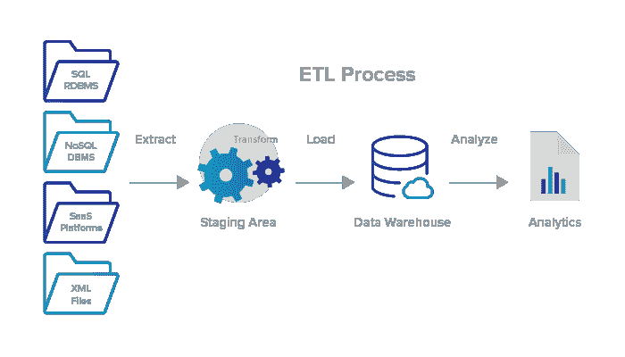
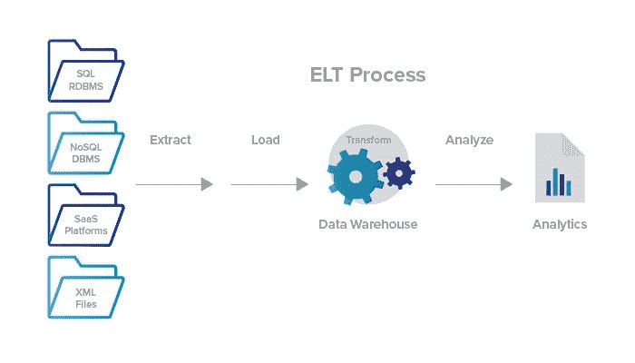

# ETL 和 ELT

> 原文：<https://medium.com/analytics-vidhya/etl-and-elt-3377f55f96ab?source=collection_archive---------14----------------------->

## ETL 和 ELT

1.  ETL 代表数据的提取、转换和加载过程。ELT 代表数据的提取、加载和转换过程。
2.  在 ETL 中，数据从数据源(操作数据库或其他源)移动到暂存区，然后进入数据仓库。
3.  ELT 利用数据仓库进行基本的转换。ETL 过程中不需要数据暂存。

## 概观

商业智能的 ETL 和 ELT 过程在数据科学中是必不可少的，因为信息源。这些数据源可以使用结构化的 SQL 数据库或非结构化的 NoSQL 数据库。在将数据源存储到特定位置之前，我们已经清理了它们。这样，只有 tableau 这样的商业智能平台才能理解数据，从而获得洞察力。

这两个过程包含三个过程，即提取、转换和加载。

# ETL 过程

ETL 过程

OLAP 数据仓库—可以是基于云的，也可以是现场的—需要使用基于关系 SQL 的数据结构。因此，装载到 OLAP 数据仓库中的任何数据都必须转换成关系格式，数据仓库才能接收这些数据。作为数据转换过程的一部分，数据映射对于根据相关信息组合多个数据源也是必要的。

转换是贯穿 ETL(提取、转换和加载)过程的一个必须的过程

*   一个(ETL)定义良好的工作流:ETL 首先从同构或异构数据源中提取数据。接下来，它将数据存放到临时区域。从那里，数据经过清洗过程，得到丰富和转换，并最终存储在数据仓库中。
*   数据仓库中手工编码 ETL 转换的老方法花费了大量的时间。即使在设计了流程之后，在用新信息更新数据仓库时，数据也需要花时间经历每个阶段。

现代 ETL，尤其是基于云的数据仓库，速度要快得多。

## ETL 的优势

OLAP 数据仓库的预结构化性质。在结构化/转换数据之后，ETL 允许更快、更有效、更稳定的数据分析。

# ELT 过程

ELT 过程

ELT 代表“提取、加载和传输”在这个过程中，数据通过数据仓库得到利用，以便进行基本的转换。这意味着不需要数据暂存。ELT 针对所有不同类型的数据使用基于云的数据仓库解决方案，包括结构化、非结构化、半结构化甚至原始数据类型。

ELT 过程也与数据湖密切相关。“数据湖”是特殊类型的数据存储，与 OLAP 数据仓库不同，它接受任何类型的结构化或非结构化数据。数据湖不要求您在加载数据之前转换数据。您可以立即将任何类型的原始信息加载到数据湖中，不管是什么格式。

在使用商业智能平台分析数据之前，数据转换仍然是必要的。但是，数据清理和转换发生在将数据加载到数据湖之后。下面是一些关于 ELT 和数据湖的详细信息:

*   **基于高速云服务器的新技术:** ELT 是一项相对较新的技术，它之所以成为可能，是因为现代基于云的服务器技术。基于云的数据仓库提供了永无止境的存储能力和可扩展的处理能力。例如:像 Amazon Redshift 和 Google BigQuery 这样的平台使 ELT 管道成为可能，因为它们具有令人难以置信的处理能力。
*   **在数据可用时接收任何内容:** ELT 与数据湖配合使用，可以在原始数据可用时立即接收不断扩展的原始数据池。在将数据保存到数据湖之前，不需要将数据转换成特殊的格式。
*   **仅转换您需要的数据:** ELT 仅转换特定分析所需的数据。虽然它会减慢分析数据的过程，但它提供了更大的灵活性，因为您可以动态地以不同的方式转换数据，以生成不同类型的指标、预测和报告。相反，使用 ETL，如果先前决定的结构不允许新类型的分析，那么整个 ETL 管道——以及 OLAP 仓库中的数据结构——可能需要修改。
*   ELT 不如 ETL 可靠:需要注意的是，ELT 的工具和系统仍在发展中，所以它们不如 ETL 和 OLAP 数据库那样可靠。尽管设置起来需要更多的努力，但 ETL 在处理大量数据时提供了更准确的见解。还有，懂得如何使用 ELT 技术的 ELT 开发人员比 ETL 开发人员更难找。

## 英语教学的优势

1.  高速的
2.  低维护
3.  更快装载