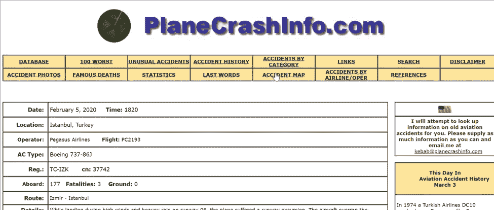
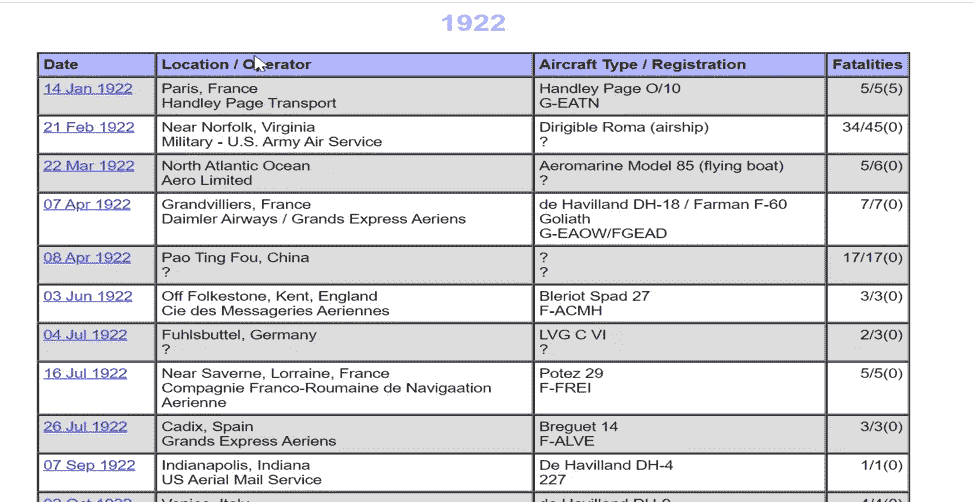
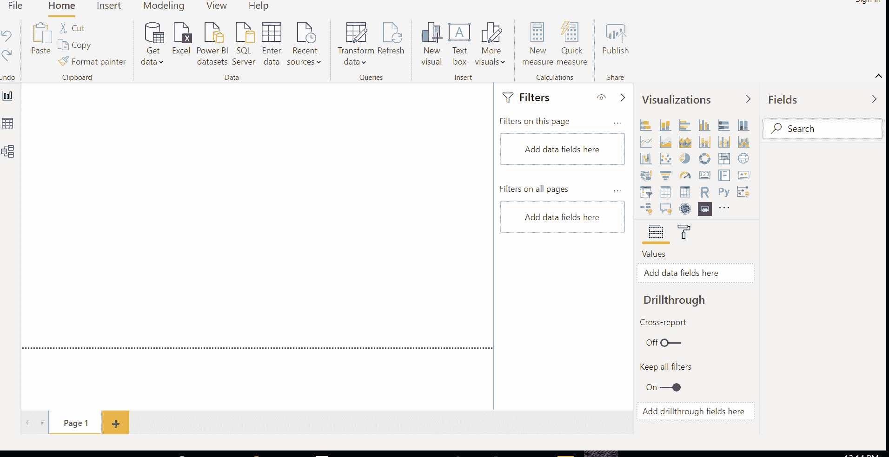
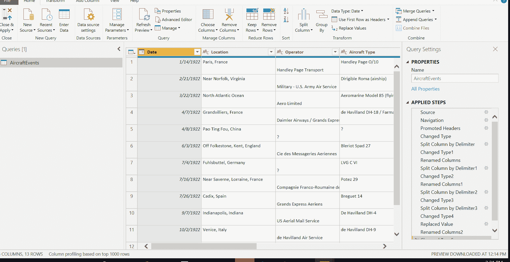
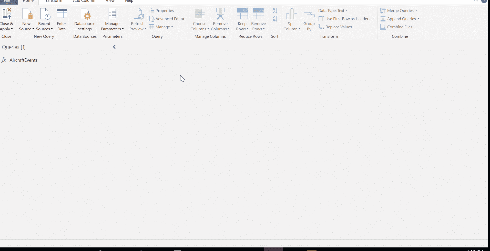
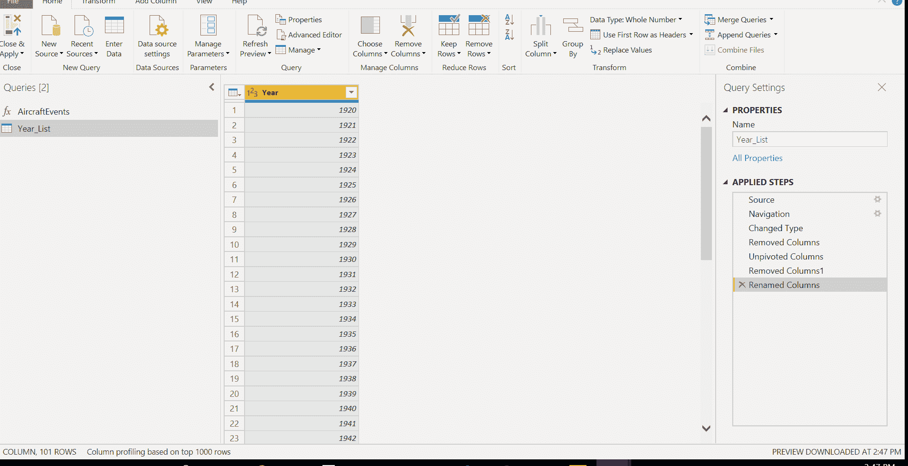

# 在 Power BI 中通过网站的多个页面进行 ETL

> 原文：<https://medium.com/analytics-vidhya/etl-by-looping-through-a-website-in-power-bi-a0553dcfe353?source=collection_archive---------27----------------------->

在本文中，我们将通过一个例子来执行 ETL(提取、转换、加载)功能，方法是在一个网站的多个页面之间循环。

为此，我们将使用一个名为 planecrashinfo.com 的网站，该网站拥有自 1920 年以来所有飞机失事的历史数据。

首先，我们将随机打开其中一个页面，并在 Power BI 中提取该网页的数据，在本例中，我选择 1922

下一步是打开 Power BI Desktop 并加载它(见下图)

在 Power BI 桌面中获取数据

下一步，我们将对这些数据进行一些转换，

*   用换行符[#(cr)]将位置/操作符拆分成两列，即位置和操作符。
*   用换行符[#(cr)]将飞机类型/注册拆分成两列，即位置和运营商。
*   用/和(将死亡人数列分成三列，即空中死亡人数、空中死亡人数和地面死亡人数。

下一步是定义参数，我们可以使用查询编辑器中的**管理参数**选项来定义参数，但是，这里我们将使用高级编辑器并使用 M 代码来定义我们的参数。

使用高级编辑器传递参数

为了测试这一点，我们可以触发 AircraftEvents 函数并手动输入一些年份，这将在查询编辑器中创建一个包含该特定年份数据的表

现在，由于我们需要该网站上所有年份的数据，我们将从该网站上导入年份列表，删除不需要的列，并将多个列拆分为一列，将其重命名为“year”

从网站提取年份列表

现在我们有两个查询，第一个是 AircraftEvents，这是一个功能查询，第二个是网站上所有年份的列表。我们需要找到一种方法将年份列表传递给 AircraftEvents 函数。

为此，我们将在 Year_List 查询中添加一个自定义列，并使用参数[Year]调用函数 AircraftEvents，其中[Year]是 Year_List 表中列的名称。

=飞机事件([年份])

这将为我们提供一个包含许多表的自定义列，每年一个表，一旦我们扩展该表，我们将得到一个合并的数据表，其中包含所有年份的飞机失事数据。

调用 Year_List 表中的 AircraftEvents 表

您的数据集已经准备好，可以进行很酷的可视化了。在下一篇文章中，我将分享我的 PowerBI 仪表板视觉效果。

照片由 [PhotoMIX 有限公司](https://www.pexels.com/@wdnet?utm_content=attributionCopyText&utm_medium=referral&utm_source=pexels)从 [Pexels](https://www.pexels.com/photo/black-samsung-tablet-computer-106344/?utm_content=attributionCopyText&utm_medium=referral&utm_source=pexels) 拍摄

文章转载自[http://blog.pragmaticworks.com/topic/](https://www.youtube.com/redirect?q=http%3A%2F%2Fblog.pragmaticworks.com%2Ftopic%2Fpower-bi&redir_token=Au3RwWxmBCtmqBTFzLZkfMa5nwZ8MTU4MzMxOTA5MUAxNTgzMjMyNjkx&v=-rQhqKZM0OM&event=video_description)