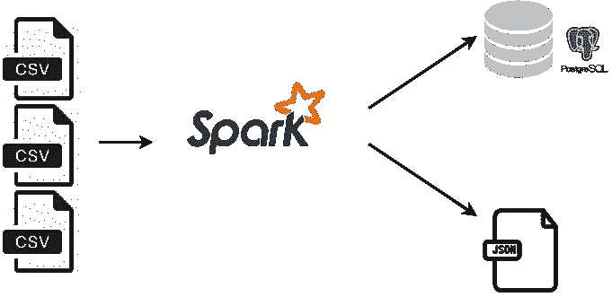
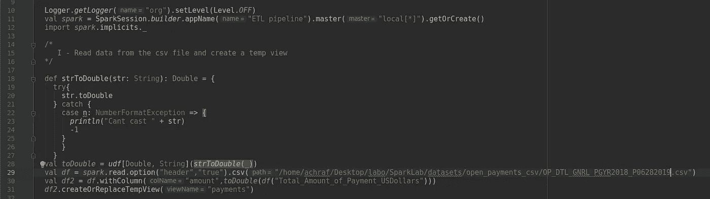
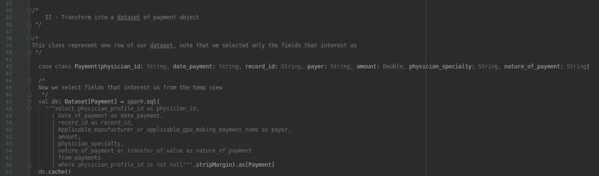
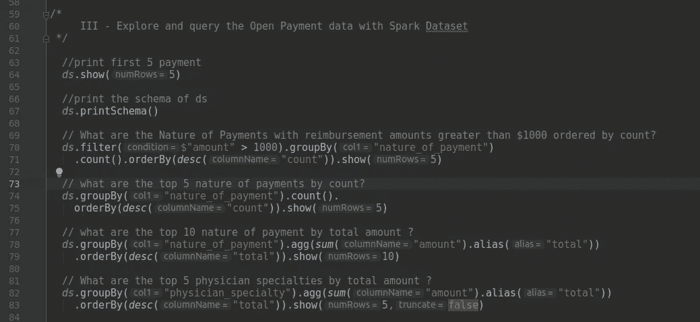
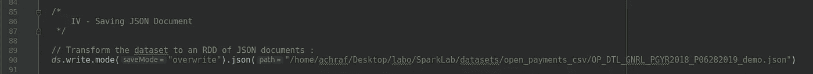
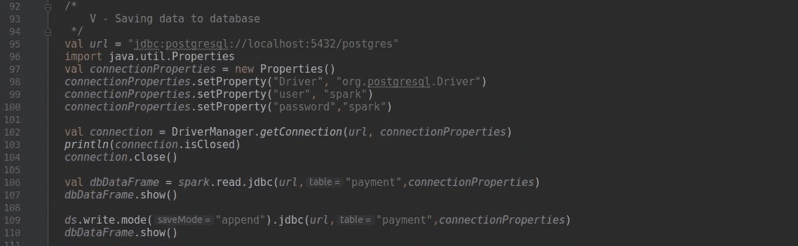

# 使用 Spark SQL 的 ETL 管道

> 原文：<https://medium.com/analytics-vidhya/etl-pipeline-using-spark-sql-746bbfae4d03?source=collection_archive---------0----------------------->

在本教程中，我们将创建一个 ETL 管道来读取 CSV 文件中的数据，转换它，然后将其加载到关系数据库(在我们的例子中是 postgresql)和 JSON 文件格式。我们将向您展示使用 sprak DataFrameReader 和 DataFrameWriter 从不同来源读取和写入数据是多么简单。

## 以下是我们将在本教程中遵循的步骤:

*   将数据集(csv)加载到 Apache Spark
*   用 Spark SQL 分析数据
*   将数据转换成 JSON 格式并保存到数据库中
*   查询并将数据加载回 Spark



Spark ETL 管道

# 数据集描述:

自 2013 年以来， [Open Payments](https://www.cms.gov/openpayments/) 是一项联邦计划，收集药物和设备公司向医生和教学医院支付的费用信息，如差旅费、研究费、礼品费、演讲费和餐费。

**文件:OP _ DTL _ GNRL _ pgyr 2018 _ p 06282019 . CSV:**

该文件包含 2018 计划年度报告的一般支付的数据集。一般付款是指支付给受保人(医生或教学医院)的款项或其他价值转移，但与研究协议或研究方案无关。

## 文件头:

```
$ head -1 OP_DTL_GNRL_PGYR2018_P06282019.csvChange_Type,Covered_Recipient_Type,Teaching_Hospital_CCN,Teaching_Hospital_ID,Teaching_Hospital_Name,Physician_Profile_ID,Physician_First_Name,Physician_Middle_Name,Physician_Last_Name,,
{..}
,Indicate_Drug_or_Biological_or_Device_or_Medical_Supply_5,Product_Category_or_Therapeutic_Area_5,Name_of_Drug_or_Biological_or_Device_or_Medical_Supply_5,Associated_Drug_or_Biological_NDC_5,Program_Year,Payment_Publication_Date
```

## 第一行:

```
"NEW","Covered Recipient Physician",,,,"258145","HOWARD",,"SADINSKY",,"321 BOSTON POST RD",,"MILFORD","CT","06460-2574","United States",,,"Doctor of Osteopathy","Allopathic & Osteopathic Physicians|Pediatrics","CT",,,,,"Mission Pharmacal Company","100000000186","Mission Pharmacal Company","TX","United States",13.78,"04/13/2018","1","In-kind items and services","Food and Beverage",,,,"No","No Third Party Payment",,"No",,,"No","521226951","No","Yes","Covered","Drug","Adrenocorticosteroid","Prednisolone 25","0178-0582-08",,,,,,,,,,,,,,,,,,,,,"2018","06/28/2019"
```

## 在我们的示例中，我们将仅使用以下字段:

```
{"physician_id":"258145","date_payment":"04/13/2018 ","record_id":"521226951","payer":"Mission Pharmacal Company","amount":13.78,"Physician_Specialty":"Allopathic & Osteopathic Physicians|Pediatrics ","Nature_of_payment":"Food and Beverage"}
```

# 将 csv 文件中的数据读入数据帧:



首先，我们使用 SparkSession.builder 函数创建一个 SparkSession 对象，然后我们对 spark session 对象调用 read 函数，这样我们就可以获得 DataFrameReader 对象。如您所见，我们使用函数 csv 来加载 csv 文件，而不是调用[ format("csv ")。load(paths:)，因为这个函数是在我们这里完成的，如果您检查这个函数的文档，就可以验证这一点:

```
@scala.annotation.varargs
def csv(paths: String*): DataFrame = format("csv").load(paths : _*)
```

我们创建了一个 UDF 函数来 Double，以确保列 amount 只包含 double 值，这样我们就可以将它转换为 payment 对象类型的数据集。

# 转换成支付对象的数据集:



在这里，我们使用 spark sql 函数在 payment 视图上执行 sql 查询，我们也可以直接使用 dataframe df2 来执行相同的查询，然后我们将其转换为 payment 数据集，注意，为了使用该语法，我们必须导入 spark implicits。付款类也应该是一个案例类

```
import *spark*.implicits._
```

最后，我们缓存新创建的数据集。

# 使用 spark 数据集探索和查询未结支付数据:



# 将数据集保存到 json 文件:



将数据集导出到外部文件就像读取过程一样简单。这一次，我们调用 write 方法来获取 DataFrameWriter，而不是 read 方法，我们指定写模式(这里我们指定 overwrite 来重新创建文件，如果它已经存在)，然后我们调用 json 方法并提供输出路径，同样，json 与调用:

```
format("json").save(path)
```

# 将数据集保存到数据库:



# 源代码:

```
import java.sql.DriverManager

import org.apache.log4j.{Level, Logger}
import org.apache.spark.sql.{Dataset, SparkSession}
import org.apache.spark.sql.functions.{*desc*, sum, udf}

object ETL extends App {

  Logger.*getLogger*("org").setLevel(Level.*OFF*)
  val *spark* = SparkSession.*builder*.appName("ETL pipeline").master("local[*]").getOrCreate()
  import *spark*.implicits._

  /*
     I - Read data from the csv file and create a temp view
  */

  def strToDouble(str: String): Double = {
    try{
      str.toDouble
    } catch {
      case n: NumberFormatException => {
        *println*("Cant cast " + str)
        -1
      }
      }
    }
  val *toDouble* = *udf*[Double, String](*strToDouble*(_))
  val *df* = *spark*.read.option("header","true").csv("/home/achraf/Desktop/labo/SparkLab/datasets/open_payments_csv/OP_DTL_GNRL_PGYR2018_P06282019.csv")
  val *df2* = *df*.withColumn("amount",*toDouble*(*df*("Total_Amount_of_Payment_USDollars")))
  *df2*.createOrReplaceTempView("payments")

/*
    II - Transform into a dataset of payment object
 */

/*
This class represent one row of our dataset, note that we selected only the fields that interest us
 */

  case class Payment(physician_id: String, date_payment: String, record_id: String, payer: String, amount: Double, physician_specialty: String, nature_of_payment: String)

  /*
  Now we select fields that interest us from the temp view
   */
  val *ds*: Dataset[Payment] = *spark*.sql(
    """select physician_profile_id as physician_id,
      | Date_of_payment as date_payment,
      | record_id as record_id,
      | Applicable_manufacturer_or_applicable_gpo_making_payment_name as payer,
      | amount,
      | physician_specialty,
      | nature_of_payment_or_transfer_of_value as nature_of_payment
      | from payments
      | where physician_profile_id is not null""".stripMargin).as[Payment]
  *ds*.cache()

/*
     III - Explore and query the Open Payment data with Spark Dataset
 */

  //print first 5 payment
  *ds*.show(5)

  //print the schema of ds
  *ds*.printSchema()

  // What are the Nature of Payments with reimbursement amounts greater than $1000 ordered by count?
  *ds*.filter($"amount" > 1000).groupBy("nature_of_payment")
    .count().orderBy(*desc*("count")).show(5)

  // what are the top 5 nature of payments by count?
  *ds*.groupBy("nature_of_payment").count().
    orderBy(*desc*("count")).show(5)

  // what are the top 10 nature of payment by total amount ?
  *ds*.groupBy("nature_of_payment").agg(*sum*("amount").alias("total"))
    .orderBy(*desc*("total")).show(10)

  // What are the top 5 physician specialties by total amount ?
  *ds*.groupBy("physician_specialty").agg(*sum*("amount").alias("total"))
    .orderBy(*desc*("total")).show(5,false)

  /*
      IV - Saving JSON Document
   */

  // Transform the dataset to an RDD of JSON documents :
  *ds*.write.mode("overwrite").json("/home/achraf/Desktop/labo/SparkLab/datasets/open_payments_csv/OP_DTL_GNRL_PGYR2018_P06282019_demo.json")

  /*
      V - Saving data to database
   */
  val *url* = "jdbc:postgresql://localhost:5432/postgres"
  import java.util.Properties
  val *connectionProperties* = new Properties()
  *connectionProperties*.setProperty("Driver", "org.postgresql.Driver")
  *connectionProperties*.setProperty("user", "spark")
  *connectionProperties*.setProperty("password","spark")

  val *connection* = DriverManager.*getConnection*(*url*, *connectionProperties*)
  *println*(*connection*.isClosed)
  *connection*.close()

  val *dbDataFrame* = *spark*.read.jdbc(*url*,"payment",*connectionProperties*)
  *dbDataFrame*.show()

  *ds*.write.mode("append").jdbc(*url*,"payment",*connectionProperties*)
  *dbDataFrame*.show()

}
```

# 总结:

在这篇博文中，您了解了如何将 Open Payments CSV 文件数据 ETL 到 JSON，使用 SQL 进行探索，并使用 Spark 数据集存储到关系数据库。