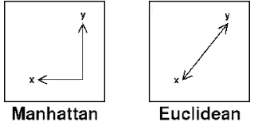
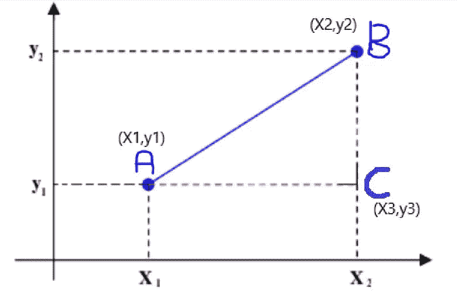
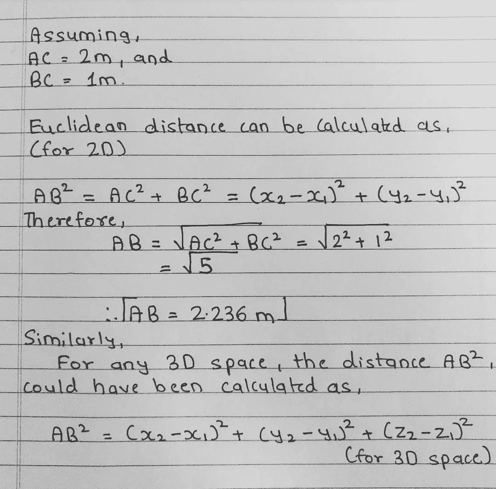
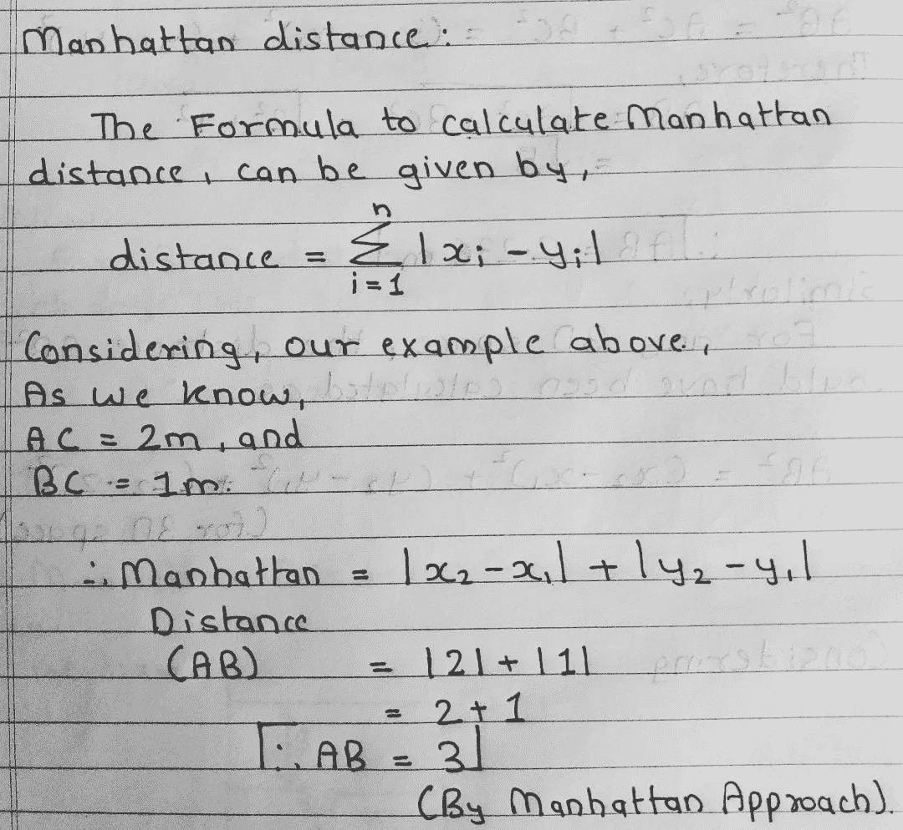
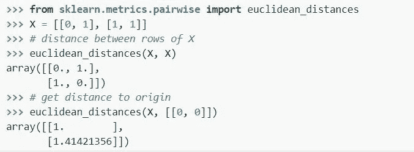
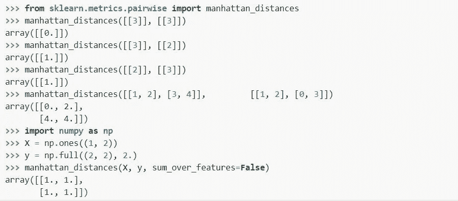

# 机器学习中的欧几里德和曼哈顿距离度量。

> 原文：<https://medium.com/analytics-vidhya/euclidean-and-manhattan-distance-metrics-in-machine-learning-a5942a8c9f2f?source=collection_archive---------5----------------------->

任何有监督和无监督的机器学习模型，例如 K-最近邻和 K-Means，都依赖于两个数据点之间的距离来预测输出。因此，我们用来计算这些距离的度量在这些特定的模型中起着重要的作用。

> ***距离度量使用距离函数来提供数据集中每个元素之间的关系度量。***

良好的距离度量有助于显著提高分类、聚类和信息检索过程的性能。在本文中，我们将讨论不同的距离度量，以及它们如何帮助机器学习建模。

因此，在这篇博客中，我们将深入了解距离度量，如机器学习模型中使用的欧几里德距离和曼哈顿距离。

**欧几里德距离度量:**

> ***欧几里得距离代表两点间的最短距离。***

两个物体之间的“欧几里得距离”是你在“平面”或“欧几里得”空间中所期望的距离；它是以欧几里得的名字命名的，他提出了平面上的几何规则。

欧几里德距离通常是“默认”距离，用于例如 K-最近邻(分类)或 K-均值(聚类)来寻找特定样本点的“K 个最近点”。“接近度”由每个变量标度上的差异(“距离”)定义，该差异被转换为相似性度量。这个距离被定义为[欧几里德距离](https://www.sciencedirect.com/topics/computer-science/euclidian-distance)。

这只是测量两个矢量/数据对象之间距离的许多可用选项之一。然而，如上所述，许多分类算法使用它来训练分类器或决定测试观察的类成员资格，并且聚类算法(例如 K-means、K-medoids 等)使用它来将成员资格分配给不同聚类中的数据对象。

数学上，是用毕达哥拉斯定理计算出来的。两个物体之间的总距离的平方是沿着每个垂直坐标的距离的平方之和。

**曼哈顿距离度量:**

> ***曼哈顿距离是跨越所有维度的点之间的绝对差异之和。***

曼哈顿距离是一种度量，其中两点之间的距离是它们的笛卡尔坐标的绝对差之和。简单地说，它是 x 坐标和 y 坐标之差的总和。

这种曼哈顿距离度量也称为曼哈顿长度、直线距离、L1 距离或 L1 范数、城市街区距离、闵可夫斯基 L1 距离、出租车-出租车度量或城市街区距离。

曼哈顿距离度量的应用包括，

1.  **回归分析**:在线性回归中使用，寻找一条符合给定点集的直线
2.  **压缩感知**:在求解欠定线性方程组时，参数向量的正则项用曼哈顿距离表示。这种方法出现在称为压缩感知的信号恢复框架中
3.  **频率分布**:用于评估离散频率分布的差异。

现在，

我们将从下面给出的例子中计算欧几里得距离和曼哈顿距离，这将给出关于两者的直觉。

考虑到下面给出的数字，

对于两种距离度量计算，我们的目标是计算 A 和 B 之间的距离，

让我们看看计算距离 AB 的欧几里得方法。

图 1:欧几里德方法

现在，考虑同样的曼哈顿方法，

图 2:曼哈顿方法

我们看到的方法，是寻找欧几里德距离和曼哈顿距离的数学方法。

让我们用机器学习的方式，用著名的 Sklearn 库，用 python 代码的形式来实现这两者。

现在，除了这些距离度量，我们还有其他流行的距离度量，

1.  **汉明距离**:用于计算二元向量之间的距离。
2.  **闵可夫斯基距离**:欧几里德距离和曼哈顿距离的推广。
3.  **余弦距离:余弦相似度**度量内积空间的两个向量之间的**相似度**。

这些都是我的观点，如果你真的喜欢这个博客，请鼓掌，这激励我写新的博客，作为我对数据科学社区贡献的一部分。

