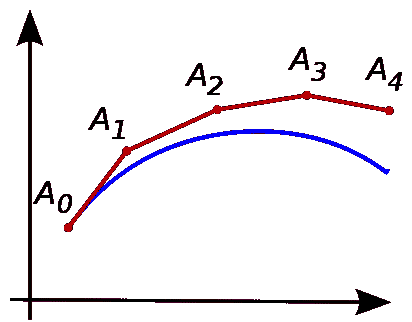

# Matlab 中的欧拉积分

> 原文：<https://medium.com/analytics-vidhya/euler-integration-in-matlab-7f9f6caaccff?source=collection_archive---------14----------------------->



来源:维基共享[[https://commons.wikimedia.org/wiki/File:Euler_method.svg]](https://commons.wikimedia.org/wiki/File:Euler_method.svg)

积分是加法的高级形式。求和就像在一个小的区间内执行有限次**加法**。积分就像在一个无限小的(非常小(实际上为 0))间隔上执行**加法**几乎无限次。

我们显然不是来听数学讲座的。但是从上面的陈述中可以清楚地看出，整合**不可能**在计算机上完成。这是因为计算机不像数学家那样理解无限。我们做加法有限次，但仍称之为积分，因为我们使用与积分相同的公式。

现在让我们集成一个非常基本的函数。既然我们的目的只是学习积分，那么让我们选择一个可预测的函数

```
f(x) = x^3 where integral of f(x) at x = 1 is 0.25 (Initial Condition)We know the integration of f(x) = (x^4) / 4
The value of the integral at x = 10 is (10^4) / 4 = 2500
**This 2500 is the value that we aim to find out**
```

我们从初始条件开始

```
clear all;
clc;x = zeros(1,10);
y = zeros(1,length(x));
x(1) = 1;
y(1) = 0.25;
h = 0.5; % Step size
```

选择大小为 10 的行矩阵“x”。但它真的可以是任何东西。只要它被定义为一个矩阵，它可以被选择为任何大小。**当然，如果您知道需要多少个元素才能得到答案，那么给出“x”的确切大小可以提高执行速度**。函数 y 是对 x 积分后的答案，所以，初始条件作为 y 矩阵中的第一个元素给出。h 是步长。步长越小，答案就越准确，但需要的时间就越长。

欧拉积分的思想就是应用公式。我们从 x = 1，y = 0.25(这些家伙动态变化)和 h = 0.5(这个家伙是常数)开始。

```
y(x+h) = y(x) + h*f'(x)
```

一旦得到 y(1.5)，我们就把 x=1 增加到 x = x+h = 1+0.5 = 1.5。然后再次应用上述公式，得到 y(1.5)。因此，我们用 h 递增 x，直到达到所需的值。显然，这必须放在一个循环中。

```
clear all;
clc;x = zeros(1,10);
y = zeros(1,length(x));
x(1) = 1;
y(1) = 0.25;
h = 0.5; % Step size
for i = 1:i_have_to_reach_my_destination_here
  x(i+1) = x(i) + h;
  y(i+1) = y(i) + h*(x(i))^3;
endlength of loop = (destination - starting point) / h
               =  (10 - 1) / 0.5
               =   18
```

最后，通过将值打印为答案来添加一些收尾工作

```
clear all;
clc;x = zeros(1,10);
y = zeros(1,length(x));
x(1) = 1;
y(1) = 0.25;
h = 0.5; % Step size
for i = 1:(10-1)/h
  x(i+1) = x(i) + h;
  y(i+1) = y(i) + h*(x(i))^3;
end
fprintf('If dy = x^3 with IC y(1) = 0.25 then y(x = %f) = %f \n', x(length(x)),y(length(x)));
```

显然，当你执行上述代码时，你得到的答案是 **2256.4375** 而我们的目标是 **2500** 。尝试将步长改为 **h = 0.005** ，您将立即得到一个更令人满意的答案 **2497.5**