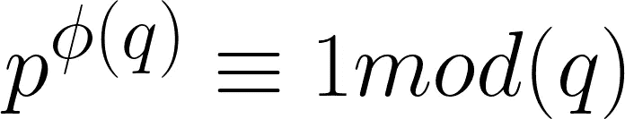
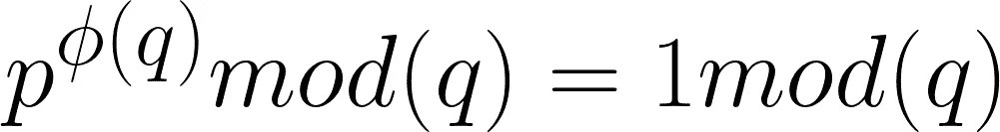
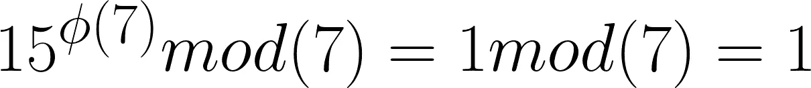
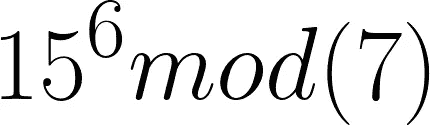

# 核心是欧拉定理！

> 原文：<https://medium.com/analytics-vidhya/euler-theorem-in-its-core-9ae020fd1a41?source=collection_archive---------5----------------------->

## 在密码学中，欧拉定理是基于欧拉函数的，我在之前的博客中已经提到过。欧拉定理也是费马定理&密码学中其他一些算法的基础！这个博客旨在解释欧拉定理的核心。

[**来源**](https://www.google.com/url?sa=i&url=https%3A%2F%2Finterestingengineering.com%2Fwhat-is-cryptography&psig=AOvVaw3I_G8oIi4filBeFOv5TS-Z&ust=1602501722240000&source=images&cd=vfe&ved=0CAIQjRxqFwoTCPCN4Ky2rOwCFQAAAAAdAAAAABAD)

我建议在阅读这篇文章之前，先浏览一下我的关于欧拉函数的博客，因为欧拉定理完全基于此。因此，为了更好的理解，如果你还没有读过我以前的关于欧拉函数的博客的话，先读一读吧。

 [## 欧拉函数在其核心！

### 这个博客旨在解释关于欧拉函数的一切，从它的内部覆盖每个概念…

medium.com](/@harshitdawar/euler-totient-funciton-in-its-core-e1f1a661098f) 

欧拉通过向这个世界提供他在多个领域的伟大研究工作，在多个领域建立了自己的名字。这个定理代表了他在密码学领域的惊人工作之一。

# 欧拉定理的定义和意义！

它指出，如果有两个互质数，比如说 p & q，那么

**欧拉定理！【作者图片】**

**其中 phi(q)是欧拉函数。**

上述方程的简化方程为:

**欧拉定理的简化版！【作者图片】**

欧拉定理涉及素数、模/余数和同余的概念。*它旨在提供一个概念，互质数可以以某种方式相关联，以提供一个值，该值可以在以后用作哈希值或密码学中的加密密钥。*

# 欧拉定理的求解例子！

让我们取两个数 15 和 7，因为它们互为互质。设 p = 15 & q = 7。

**欧拉定理的例题方程！【作者图片】**

因为，1mod(7) = 1，所以才会在上图中提到。

现在，让我们验证 LHS phi(7)= 6，它将上述等式的 LHS 转换如下所示:

**【作者图片】**

其中 15 ^ 6 = 11390625 = >(15 ^ 6)mod(7)=(11390625)mod(7)= 1

因为它是 1，也是 1 mod(7)也是 1，因此，LHS = RHS，因此定理得到验证。

***我希望我的文章用所有深刻的概念和解释来解释与主题相关的每一件事。非常感谢你花时间阅读我的博客&来增长你的知识。如果你喜欢我的作品，那么我请求你为这个博客鼓掌！***