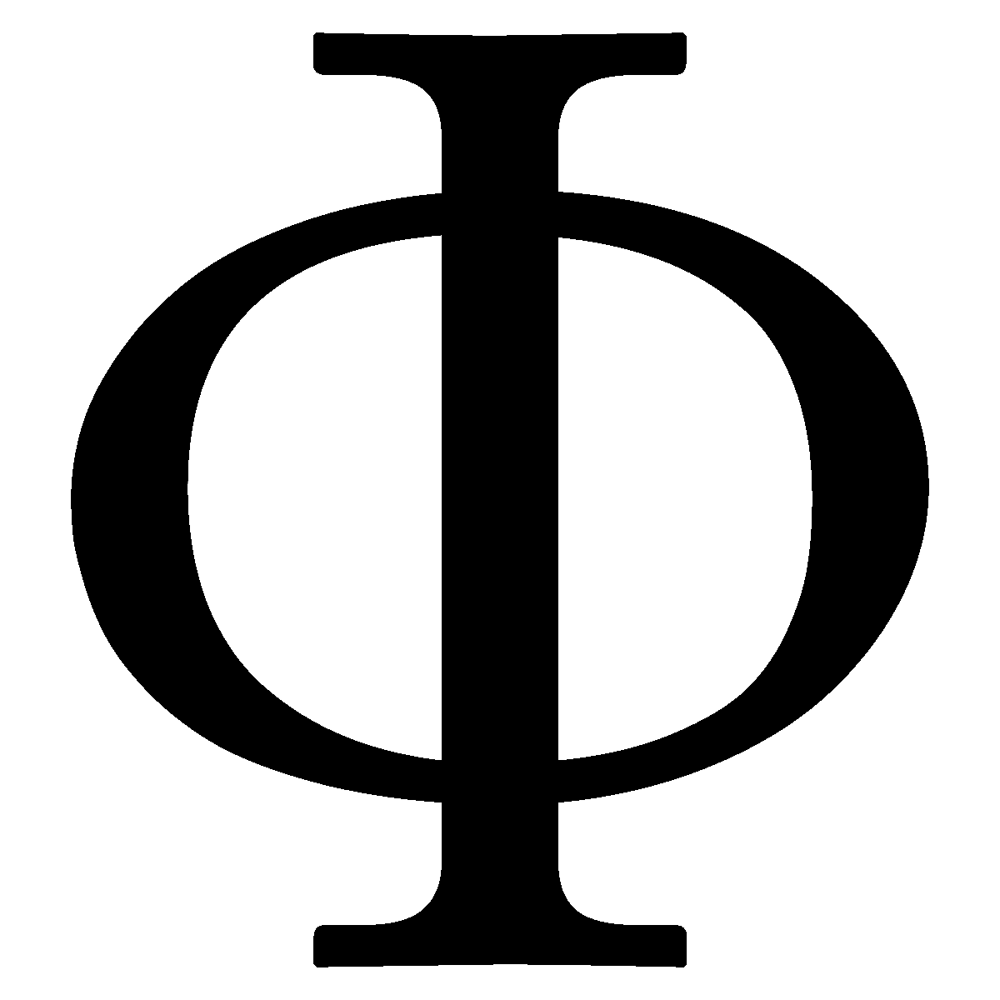

# 欧拉函数在其核心！

> 原文：<https://medium.com/analytics-vidhya/euler-totient-funciton-in-its-core-e1f1a661098f?source=collection_archive---------18----------------------->

## 本博客旨在解释关于欧拉函数的一切，涵盖从其内部工作原理(甚至数系中的用例)到其在密码学领域的实际应用的每一个概念！

[**来源**](https://towardsdatascience.com/the-basics-of-cryptography-80c7906ba2f7)

我敢肯定，你们都一定在不同的场合听过欧拉这个名字。这里也有一个不同的上下文，欧拉的名字在那里&它在那里提供一个函数，或者它也可以被理解为一个定理，作为多个其他定理和领域的构建块。

这个术语**【欧拉函数】**主要与**【密码学】有关。**也可以用在数系概念中，就是上面的函数在涉及到性向部分的时候，可以在某种程度上帮助数系中的一些概念。

# **欧拉函数是干什么用的？**

欧拉函数处理的主要概念是质数**。它的主要目的是提供一个给定数的互质/相对质/互质数的总数。**

## **什么是互质/相对质数/互质数？**

**这些数字的 gcd(a，n) = 1，其中“n”是实际数字，在“a”的位置可以有多个数字。例如，设 n = 7。现在所有那些 gcd 为 n 为 1 的数，将被称为 m 的互质/互质/互质。**

**在这个例子中，与 n 互质的数是:{1，2，3，4，5，6}。**

**让我们取 n = 9，在这种情况下互质数是:{1，2，4，5，7，8}。**

## **欧拉函数的符号！**

***用“phi”符号表示。***

****

****欧拉函数的符号！** [**来源**](https://www.google.com/imgres?imgurl=https%3A%2F%2Fupload.wikimedia.org%2Fwikipedia%2Fcommons%2Fthumb%2F9%2F96%2FGreek_letter_uppercase_Phi.svg%2F1200px-Greek_letter_uppercase_Phi.svg.png&imgrefurl=https%3A%2F%2Fen.wiktionary.org%2Fwiki%2F%25CE%25A6&tbnid=sYjgtmh8ufWBtM&vet=12ahUKEwiBra75majsAhXMg2MGHUFkD_oQMygAegUIARC5AQ..i&docid=-v5daYL0VQxxbM&w=1200&h=1200&q=phi%20symbol&ved=2ahUKEwiBra75majsAhXMg2MGHUFkD_oQMygAegUIARC5AQ)**

**对于任意数“n”，欧拉函数将表示为 phi(n)。它表示与 n 互质的数的总数。在上面的例子中，n = 7，φ(n)= 6，当 n = 9 时，φ(n)= 6。**

## **素数情况下计算 phi(n)的捷径！**

**当数是质数时，**那么 phi(n) = n -1 总是**。可以通过取任意素数来验证，让我们取上面给出的例子，其中 n = 7，那么 phi(n) = 6，取 n = 5，那么到 5 的互质数是{1，2，3，4}，这意味着 phi(n) = n -1 = 5 -1 =4。**

## **欧拉函数的惊人性质！**

**如果需要计算 phi(n)的数非常大，那么有一个性质可以打破它，这个性质如下。**

****

****图片作者！****

**上图表示的是当 n 很大时用来破数的属性。例如，如果 n = 3127，那么它可以被分解成 53 & 59 的 2 个倍数。**

****

****图片作者！****

**众所周知，53 和 59 都是质数，那么前面提到的快捷方式可以很容易地应用于计算 phi(53)和 phi(59)的值。**

**phi(53)和 phi(59)的值分别为 52 和 58。**

****

****图片作者！****

## **欧拉函数的使用案例！**

**它在密码学中大量使用各种算法和方法。它甚至是密码算法工作的基础。**

**应用它的一些示例算法是:**

*   **欧拉/欧拉-费马定理。**
*   **费马定理。**
*   **南非共和国(Republic of South Africa)**

*****上面提到的是其用例的几个例子。虽然它也可以用于数系中的各种情况，其中要为一个数找到互质数的计数。*****

*****我希望我的文章用所有深刻的概念和解释来解释与主题相关的每一件事。非常感谢你花时间阅读我的博客&来增长你的知识。如果你喜欢我的作品，那么我请求你为这个博客鼓掌！*****