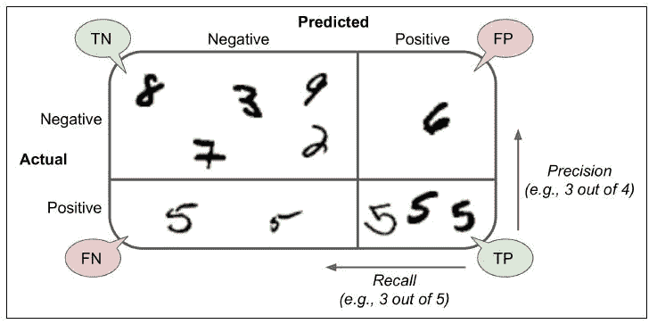
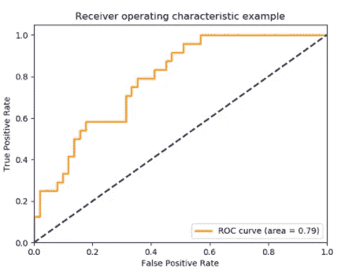

# 数据科学:机器学习模型评估和选择

> 原文：<https://medium.com/analytics-vidhya/evaluating-a-machine-learning-model-38529bb27001?source=collection_archive---------14----------------------->


(图片来源:[https://main.edc.org/services/evaluation](https://main.edc.org/services/evaluation))

在创建机器学习模型之后，解释模型结果和评估是机器学习工作流的重要方面。在本帖中，我们将讨论不同的评估矩阵，帮助我们量化预测的质量。

## **评估回归模型**

对于回归模型，有几种方法可以评估 ML 模型的结果。以下是一些广泛使用的指标:

*   ***R-square***—R-square 也称为决定系数，捕捉因变量的原始方差中有多少被拟合值/预测值捕捉或解释。R 平方越高，模型拟合越好(最佳 R 平方为 1.0，在最差情况下也可能为负)。R-square 是 ESS/TSS，即解释平方和(预测值的方差)除以总平方和(实际值的方差)。但是如果增加更多的预测因子，即使新增加的预测因子不相关，R-square 也会增加。
*   **调整的 R-square 考虑了样本大小和独立变量的数量。为了理解这一点，考虑如果只有 2 个样本，线性回归线将完美地拟合数据，导致 R2=1，即使事实上，没有线性关系。因此，为了避免错误的印象，决定系数调整自由度(调整 R2)使用。如果我们去除不重要的预测因素，调整后的 R 平方增加。**
*   ***残差*** —对于回归模型，最佳拟合线是残差/误差长度的平方和(即|实际预测|)最小的线。因此具有较小的*平均绝对误差(****MAE****)*或*均方误差(MSE)* 的线是更好的拟合。你也可以使用均方根误差(***)RMSE*)**作为另一个模型评估度量。RMSE 是广泛使用的回归模型性能指标，但在某些情况下可以使用 MAE(例如，有很多异常值)。RMSE 对应于*欧几里德范数或 L2 范数*(如乌鸦锉)，而梅对应于*曼克顿范数或 L1 范数*(如蛇移动)。

```
**from** **sklearn.metrics** **import** mean_absolute_error
**from** **sklearn.metrics** **import** mean_squared_error
from math import sqrt
**from** **sklearn.metrics** **import** r2_scorermse = sqrt(mean_squared_error(y_actual, y_predicted))
mae = mean_absolute_error(y_actual, y_predicted)
R2 = r2_score(y_actual, y_predicted)
### If n=number of sample size & p=number of independent variables
Adj_R2 = 1-(1-R2)*(n-1)/(n-p-1)
```

## **评估分类模型**

为了评估分类模型，以下是通常使用的性能测量:

*   ***混淆矩阵*** —它是实际与预测标签的表格表示。(【https://en.wikipedia.org/wiki/Confusion_matrix】T4)

基于实际标签和预测标签之间的比较，以下是基于混淆矩阵的重要术语。考虑我们的分类模型预测机器是否会发生故障。

真阳性(TP) —实际阳性标签=预测阳性标签。[模型准确预测故障将会发生]

真阴性(TN) —实际阴性标签=预测阴性标签[模型准确预测故障不会发生]

假阳性(FP)/I 型错误—当零假设(H0)为真，但被拒绝时(模型称给定条件存在，但实际上并不存在)。[不存在故障，但模型预测到故障]

假阴性(FN)/第二类错误—当零假设(H0)为假，但未能被拒绝(模型称给定条件不存在，而实际存在)。[当实际故障存在时，模型未能检测到故障]

*   ***准确度*** —比较预测标签和实际标签。所以匹配越多，准确度越高。精确度越高，模型越好，但在许多情况下，不推荐仅将精确度作为评估标准。因此，我们将研究其他指标。准确度=*(TP+TN)/(TP+TN+FP+FN)*
*   ***Precision***—Precision 捕获多少预测的故障实际上是正确的。*精度表示:实际上正确的肯定识别的比例是多少？*

精度= *TP/(TP+FP)*

*   ***灵敏度/召回率/真阳性率*** —故障实际存在时的准确性。回忆表示:*正确识别的实际阳性比例是多少？*

敏感度/召回率= *TP/(TP+FN)*



《汉顿 ML》一书中 MNIST 数据的混淆矩阵图

我们的目标是捉鱼而不是石头，湖里总共有 100 条鱼。如果你抓了 80 条鱼和 80 块石头，那么召回率是 80%，准确率是 50%。如果你抓了 20 条鱼和 0 块石头，那么召回率是 20%，而准确率是 100%。例如，在垃圾邮件检测系统中，如果目标是找到尽可能多的垃圾邮件，那么召回是重要的，而如果目标是在不阻止其他邮件的情况下捕捉肯定是垃圾邮件的邮件，那么精确度是重要的。

如果置信度阈值较高，则它会提高精确度并降低召回率，而置信度阈值较低，则它会降低精确度并提高召回率。零阈值表示召回率为 100%，精确度为 0%。如果阈值为 1，则召回率为 0%，精确度为 100%。

预测只有一个实例是肯定的并且碰巧是正确的分类器将达到完美的精度，而将所有实例分类为肯定的分类器将具有 1 的召回率。这就是为什么在精确度和召回率之间总会有一个权衡，因为增加一个会减少另一个。因此，基于用例，您需要在两者之间进行权衡，重视其中一个。

*   *——*【TN/(TN+FP)**
*   ****F1-得分*** —它是精度和灵敏度的调和平均值(给低值更多的权重)。*

**F1=(2TP)/(2TP+FP+FN)**

*因此，具有完美精确度和召回分数的模型将获得 1 的 f 1 分数，而具有完美精确度分数和召回分数为 0 的模型将获得 0 的 F1 分数。有时使用 F0.5 和 F2 分数来评估模型，这两个分数分别偏向精度而非召回和召回而非精度。基于用例，你需要重视精确度或召回率。例如，在 YouTube Kids 的情况下，您需要一个具有高精度的儿童安全视频分类器，即模型应该识别对儿童安全的视频，并且召回率较低是可以的，即模型可以拒绝许多好的视频。在信用卡欺诈检测系统的情况下，您需要高召回率，也就是说，您可能会得到错误的警报，但您会发现所有的欺诈交易。*

*   ****增益和提升图*** —增益图和提升图通过比较使用和不使用模型获得的结果，提供了评估分类模型性能的直观方法。*
*   ****ROC 曲线/AUC*** —受试者操作特征(ROC)曲线通过在 Y 轴上绘制回忆/灵敏度，在 X 轴上绘制(1-特异性)/偏离所有阈值，来可视化分类器的性能。AUC 是 ROC 曲线下的面积。对于随机猜测，AUC 将为 0.5。因此，曲线越靠近左上角，AUC 就越高，我们模型的性能就越好。ROC 曲线仅限于*二元分类评价*。*

**

*ROC 曲线(回忆对 FPR，即敏感性对特异性)*

```
***from** **sklearn.metrics** **import** accuracy_score
**from** **sklearn.metrics** **import** confusion_matrix
**from** **sklearn.metrics** **import** classification_report
**from** **sklearn** **import** metrics
**from** **sklearn.metrics** **import** roc_curve
**from** **sklearn.metrics** **import** roc_auc_scoreAccuracy = accuracy_score(y_true, y_pred)
Conf_matrix = confusion_matrix(y_true, y_pred)
Precision = metrics.precision_score(y_true, y_pred)
Recall = metrics.recall_score(y_true, y_pred)
F1 = metrics.f1_score(y_true, y_pred)
fpr, tpr, thresholds = roc_curve(y, scores, pos_label=2)
AUC = roc_auc_score(y_true, y_scores)
print(classification_report(y_true, y_pred, target_names=target_names))*
```

## ***评估聚类模型***

*对于聚类机器学习任务，没有标记数据(在大多数情况下)或指定的因变量可用。因此，我们在聚类中的主要目标是最小化类间相似性或最大化类内相似性。换句话说，同一簇中的用户之间的距离应该尽可能小，而不同簇中的用户之间的距离应该尽可能大。*

*如果标记数据可用，则可以应用不同的评估度量，例如*同质性*(每个聚类仅包含单个类的成员)、*完整性*(给定类的所有成员都被分配到同一个聚类)、 *V-measure* (同质性和完整性的调和平均值)、*调整后的 Rand 指数、Fowlkes-Mallows 得分*(成对精度和召回的几何平均值)等。*

*但由于在实践中，我们没有可用的标记数据集，因此我们将使用*剪影评分或戴维斯-波尔丁指数*或*卡林斯基-哈拉巴斯指数*。*

*轮廓分数测量样本与其自身聚类中的样本的紧密程度或相似程度，以及与不同聚类中的对象的不同程度，即不同创建的聚类之间的分离程度。一组样本的轮廓系数是每个样本的轮廓系数的平均值。分数将在-1 和 1 之间，1 表示非常差的聚类，1 表示密集且分离良好的聚类。*

```
*from sklearn import metrics
from sklearn import datasets
from sklearn.cluster import KMeansdataset = datasets.load_iris()
X = dataset.dataclustering_model = KMeans(n_clusters=4, random_state=123).fit(X)
labels = clustering_model.labels_
metrics.silhouette_score(X, labels, metric=’euclidean’)
0.49745518901737446metrics.davies_bouldin_score(X, labels)
0.7757009440067052metrics.calinski_harabasz_score(X, labels)
530.4871420421675*
```

*因此，您可以在保留/测试数据集上选择任何评估指标来调整您的模型，或者从使用不同算法创建的大量 ML 模型中选择一个模型。*

*仅在单个训练和测试数据集上评估您的模型是不够的。因此，您应该使用*交叉验证*技术，如 K-fold、留一(LOO)、分层 K-fold(以防标签不平衡)等。在交叉验证中，我们将训练数据集分成 k 个分割(折叠)，在 k-1 个折叠上训练模型，并在剩余数据上评估模型。我们对所有的褶皱进行这一过程，并对评估指标进行平均，以获得模型的最终性能。*

## *模型校准和调整*

*创建基线模型后，下一步是使用各种算法创建多个模型，调整超参数，最后根据*评估指标选择一个模型并使用验收*。超参数是控制整个训练过程的模型算法的属性，例如优化算法的学习速率或随机森林中的树的数量。理想超参数的选择是一个迭代过程，您可以使用以下方法使其易于实施:*

*网格搜索—*

*随机搜索—*

*超立方体拉丁语—*

*贝叶斯优化—*

## *型号选择*

*有时 F1-score/R-Square 或任何上述指标可能不是模型选择的唯一评估标准。根据*业务要求、资源、审计、合规性、风险模型、法规和可用的基础设施*，您可能还需要考虑其他标准，如:*

*   **量化的业务价值/影响，如节省的人工工作小时数或节省的美元或节省的流程时间(以小时计)等。**
*   **训练模型和预测未知数据所需的执行时间**
*   **模型的可解释性或可解释性**
*   **模型公平性，即模型不应基于性别、种族、地点、民族等进行描述。**
*   **数据和模型参数的安全性和隐私性**
*   **预期 SLA(延迟和每单位时间的点击次数)**
*   **模型的尺寸和能耗**
*   **对人工智能伦理的尊重**
*   **模型部署策略，例如，在某些用例中，模型需要部署在边缘设备上，因此模型的大小和推理时间会有限制。**
*   **模型可以生产/产业化吗？**
*   **基础设施可用例如，如果没有可用的 GPU/TPU，那么复杂的神经网络就不是一个好的选择。**
*   **模型和输出的稳定性**
*   **组织、机构和国家层面的审计、合规和监管要求，例如监管要求可以是在银行用例中不使用任何黑盒模型**

*因此，为了评估和确定机器学习模型，你应该考虑统计以及商业评估和选择标准。作为一名数据科学家，在将模型投入生产之前，您还需要获得业务/最终用户、架构、模型风险管理团队和安全团队的批准。*