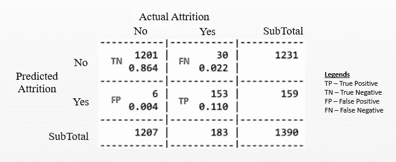
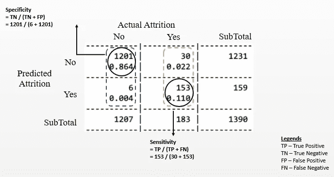
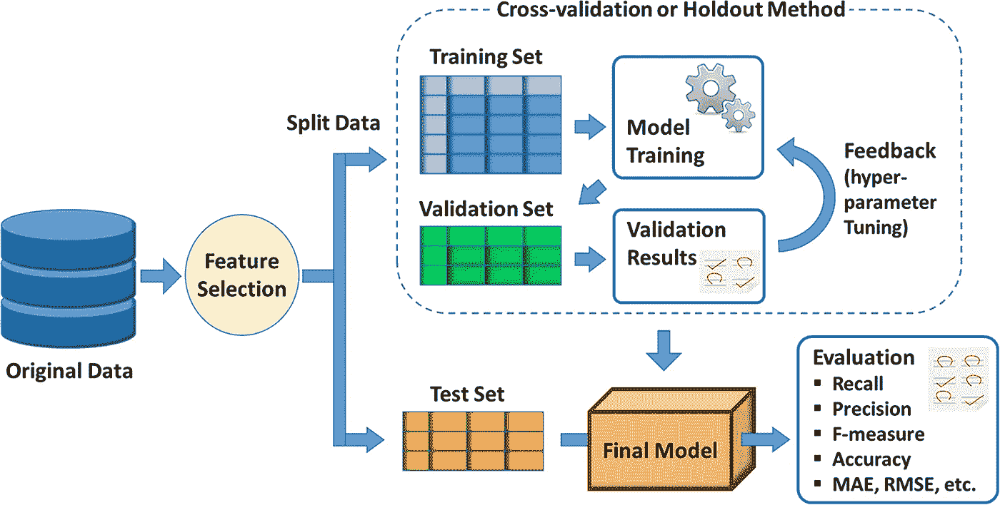

# 评估机器学习分类器:磨损预测视角

> 原文：<https://medium.com/analytics-vidhya/evaluating-machine-learning-classifiers-an-attrition-prediction-perspective-f4839929a5b6?source=collection_archive---------14----------------------->

虽然有不少关于如何评估机器学习分类器的通用文章/博客，但几乎没有任何文章/博客在特定用例的上下文中解释模型评估，例如流失预测。我想用这篇文章来做到这一点。话虽如此，高级原则可以扩展到任何用例。

为什么知道如何评估一个 ML 模型对每个人(甚至不是开发人员/数据科学家的人)都很重要？

随着预测解决方案越来越多地被采用，你或你的组织很有可能会评估一个声称支持 AI/ML 的产品或一个声称提供预测能力的顾问。除了高度复杂(或不透明——如神经网络),预测模型还需要通过多个监管机构的检验，这些机构认为它们存在固有的偏见，难以解释。

请记住这一点，这些服务的最终用户(包括非技术背景的人)必须知道在推介此类解决方案时要问什么问题，以及如何在上线后持续跟踪产品/服务的有效性。

让我们从基础开始。如果我们试图评估一个预测流失可能性为“是”或“否”的模型，我们如何衡量模型的准确性？一个简单的方法是——“模型正确预测了多少次？”(这将包括是和否的预测)。在 [R](https://www.r-project.org/) 中，可以使用“CrossTable”函数轻松生成该视图。

让我们假设在 1390 名员工中，有 183 人实际上已经辞职。下面给出了预测值与实际值的对比，称为“[混淆矩阵](https://towardsdatascience.com/understanding-confusion-matrix-a9ad42dcfd62)”。下面给出了示例。

混淆矩阵

模型的“准确性”将是 97.4%，即 86.4%(正确预测为不会辞职的员工— 1201) + 11%(正确预测为将辞职的员工— 153)。

虽然准确性听起来像是一个相当稳健的衡量标准——它有一些缺点，其中之一是——T4 阶级不平衡问题。

假设你在一个流失率很低的组织/业务单位，例如，在 1390 名员工中，只有 140 人辞职(约 10%)。如果整个模型的准确率是 85%——关于谁会退出的预测很有可能是错误的(因为误差幅度是 15%)！另一个更实际的问题是，过于依赖“准确性”并不能给出诸如“实际辞职的员工中有多少是被正确预测的”这样的粒度输入。在这种情况下，数字是 153，占总流失的 84%(即 183)。

考虑到这些限制，对模型性能有更细致的理解是很重要的。这里有几个需要考虑的指标—

1) **假阳性(FP)和假阴性(FN)** —在上图中，FP (0.4%的总体概率)是预测某人可能退出(“阳性”事件)但她没有退出的模型。FN (2.2%的总体概率)是预测某人不太可能退出(“负面”事件)但她退出的模型。

您希望关注哪个错误取决于您组织的整体保留策略。例如，如果你的组织给予*经济奖励*，海外机会等来鼓励员工放弃辞职，保持低 FP 是很重要的，因为它有直接的经济影响。另一方面，如果流失的*成本*过高(即关键员工的离开可能会对底线产生直接影响)，那么我们需要保持较低的 FN，以防止影响组织的绩效。

在这些用例中部署的所有 ML 模型都具有引入“**误差成本**的能力，该误差成本对模型不利(在学习阶段)，即如果我们引入 FP 的误差成本，那么它会修改变量以降低 FP，但这几乎总是对 FN 有不利影响。因此，组织必须仔细决定哪种错误类型更严重。

2) **灵敏度/特异性**:延续上述主题，在假阳性和假阴性检测之间建立权衡很重要。

*敏感度*是正确预测阳性案例(即退出)的能力，是正确预测的退出案例(153)与实际退出案例(183)的比率，为 83.6%。同样,*特异性*是正确预测负面案例(即不愿意离开)的能力，即正确预测的不愿意离开案例(1201)与没有离开的员工总数(1207)之比，即 99.5%。

在这种情况下，特异性明显高于敏感性，这有利于积极发现表现出辞职意向的员工，但相对较低的敏感性也意味着您的组织可能会在保留措施上投入大量资金。这两个衡量标准需要不断审查，以便对您组织的整体保留策略进行中期修正。

3) **其他指标**:除此之外，还有其他指标可以提供更细致的理解。例如**精度/召回**(测量预测中的噪音程度) **ROC 曲线**(用于通过检查灵敏度/特异性权衡来直观地比较多个模型的有效性)和 **F 测量**(合并精度和召回指标来比较多个模型)

最后要注意的是，虽然 ML 模型创建和测试过程通常与将数据分为训练和测试数据相关(75/25 或 67/33 分割)，但如果我们要比较从相同数据创建的多个模型的性能，如果所有模型都在相同的“测试”数据上进行测试，则存在得到有偏差的输出的风险。这就是**验证数据集**进入画面的地方。总体数据分成三部分:训练(50%):验证(25%):测试(25%)数据。在建模阶段，75%的数据以多种方式分为训练和验证数据，以创建和调整多个模型。在最后一个阶段，所有的模型都根据相同的测试数据进行检查。

我希望这篇文章能够清楚地说明如何有效地评估 ML 分类器，并让您有信心与提供 ML 产品的供应商进行有意义的合作。

请随时提供反馈。